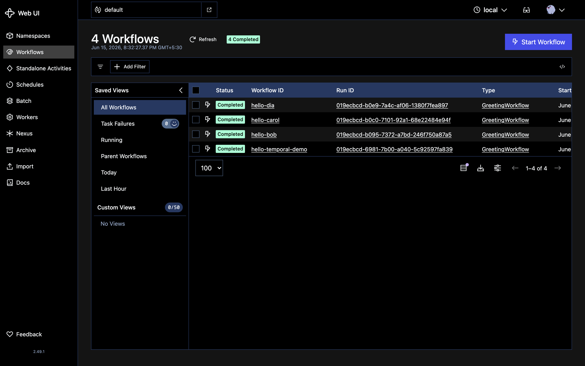
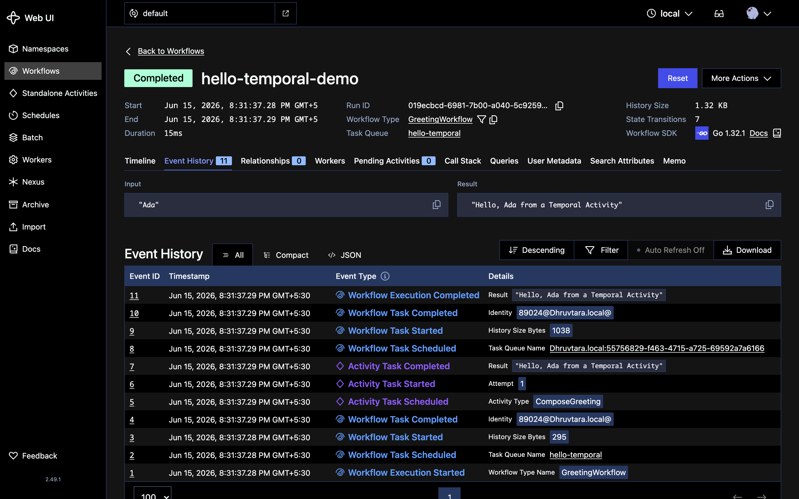
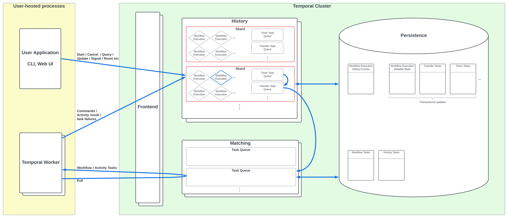
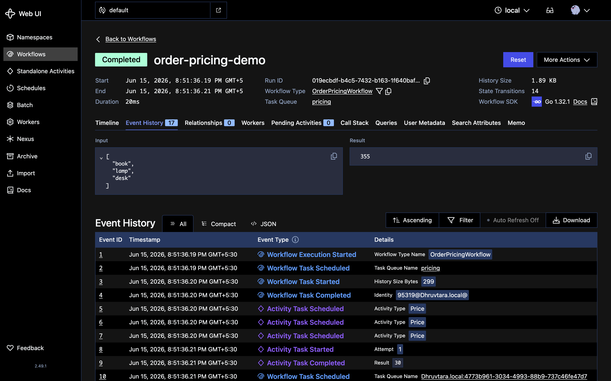
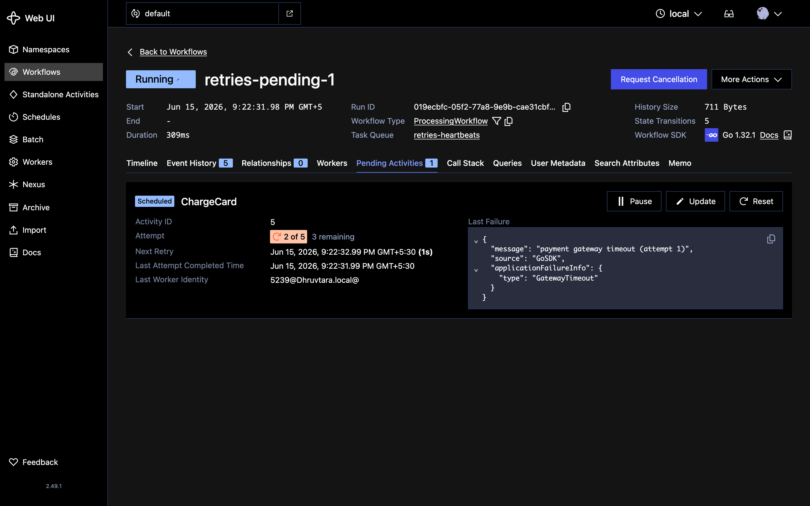
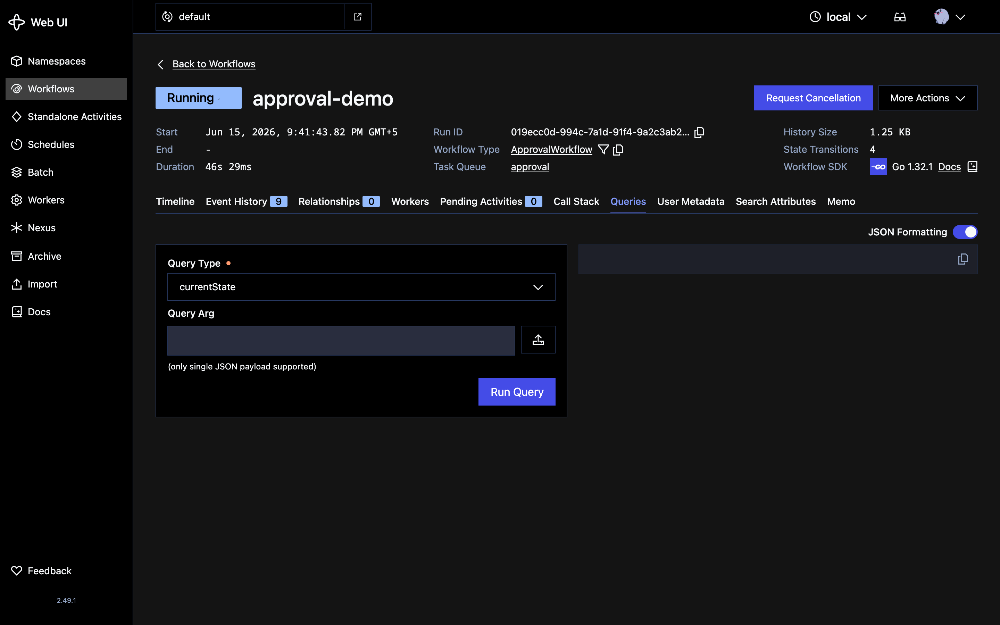
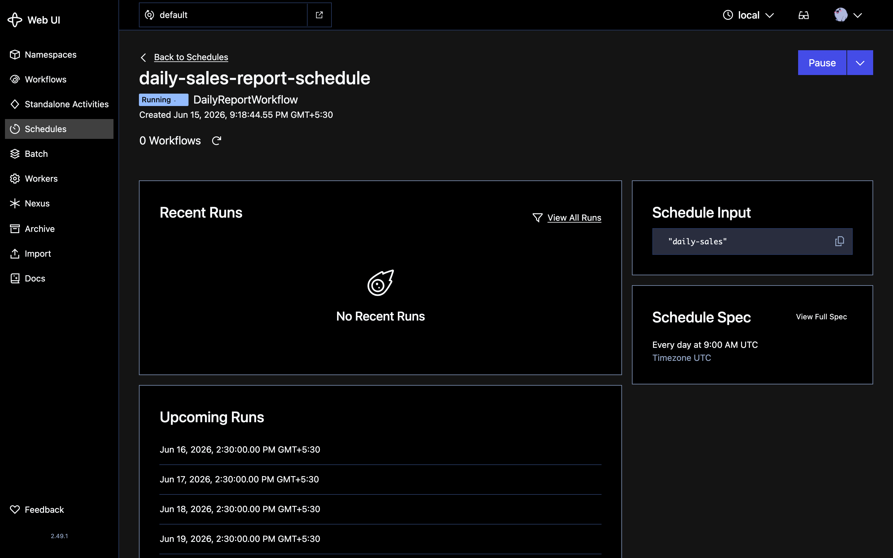
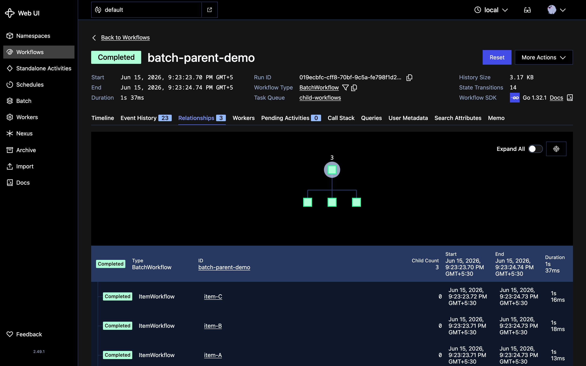
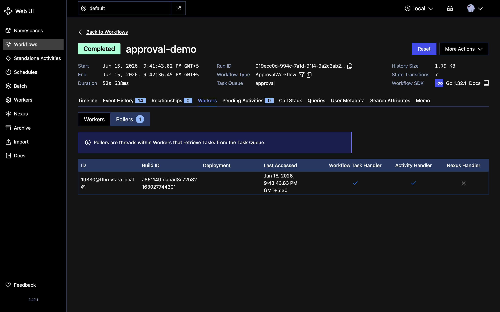
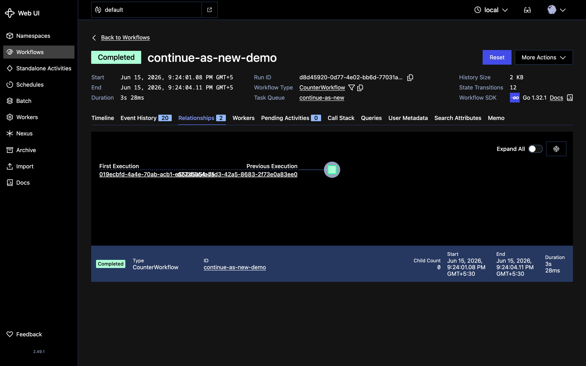

<!-- _class: title -->
<!-- _transition: coverflow 0.7s -->

###### Fundamentals

# Temporal Fundamentals

###### Gaurav Agarwal

<!--
6 days × 4 hours.

Each day mirrors a day in lecture_notes/Day-XX.md.

Lab slides are marked - laptops out, fingers on keyboards.

Pace check: end of Day 1 should leave the room with one Workflow running.
-->

---

# Course Agenda

| Day | Topic | Lab focus |
| --- | --- | --- |
| 1 | Foundations - durable execution mental model | Hello Temporal, Event History |
| 2 | Reliability + interactions | Signals, Updates, Schedules |
| 3 | Kafka integration | End-to-end Kafka pipeline, DLQ |
| 4 | Production engineering | Replay tests, dashboards |
| 5 | Saga + Spring Boot + capstone | Capstone Workflow |
| 6 | AWS migration + containers | Glue, K8s, KEDA |

Build-it-yourself labs (starter code, no solutions) live in [`challenges/`](https://github.com/codermana/Temporal-Training/tree/master/challenges) — each lab slide links its own challenge.

<!--
Quick orientation slide.

Don't dwell - each Day cover slide opens the detailed agenda for that block.
-->

---

<!-- _class: day -->
<!-- _transition: zoom 0.6s -->

###### Day 1

# Foundations

Rethinking orchestration as durable application code.

<!--
4 hours. Morning interleaves concepts with the first hands-on labs;
afternoon goes deeper on the event history.

Get everyone's environment green before teaching anything else.
-->

---

<!-- _class: lab -->

###### Lab · Day 1

# Local dev setup

Challenge → [`day-01-foundations/lab-1-local-dev-setup`](https://github.com/codermana/Temporal-Training/blob/master/challenges/day-01-foundations/lab-1-local-dev-setup.md)

```bash
make check          # verify required tools
make temporal       # start dev server (in this terminal)

# in another terminal
open http://127.0.0.1:8233
temporal operator namespace list
```

> Goal: every laptop shows the `default` namespace in the Web UI.

<!--
Wait until every laptop is green.

Pair the stragglers.

Don't proceed without this; the rest of the day depends on it.
-->

---

<!-- _class: section -->
<!-- _transition: slide 0.5s -->

###### Day 1

# Why Temporal exists

The failure modes of cron- and DAG-based orchestration.

<!--
Open in VSCode: examples/01-foundations/airflow_dag_vs_temporal_workflow.java + .py - DAG shape vs durable code, side by side.
-->


---

<!-- _class: onramp -->
<!-- _transition: slide 0.5s -->

###### Day 1 · on-ramp

# Why Temporal exists

- **Where this fits** — Your first hour: before any API, the *problem* every orchestrator you've used leaves on your plate.
- **Why it matters** — If the failure modes don't land, the rest of the week looks like needless ceremony.
- **By the end** — You'll name the work cron, Airflow, Step Functions and Kafka each leave to *you*.

---


# Every backend has these

* "Charge the card, ship the order, send the receipt."
* "Pull from S3, transform with Spark, write to Snowflake."
* "Wait for the human approval, then provision the tenant."
* "Retry the flaky API for an hour, then page the on-call."

These are **workflows**. They look easy until one step fails.

<!--
Read in different voices.

Each shape will resonate with someone in the room.
-->

---

# What goes wrong

* The third call timed out. Did it succeed?
* The Lambda was killed at minute 14 of 15.
* The Kafka consumer crashed *between* the DB write and the publish.
* The cron didn't fire. Nobody noticed for two days.
* The retry loop never had a budget.

> Recovery is a **runbook**, not a button.

<!--
The slogan to repeat across the day: runbook, not a button.
-->

---

<!-- _class: dense -->

# Tools you've shipped with

| Stack | What it solves | What it leaves to you |
| --- | --- | --- |
| Cron + scripts | Triggering on a schedule | All state, retries, recovery |
| Airflow | Scheduling DAGs | Cross-system state, retries on top |
| Step Functions | State machines in JSON | Code review, Lambda 15-min cap |
| Kafka alone | Transport between systems | Per-key state, idempotency |

Drift across all of them = the 2 AM page.

<!--
Don't bash any tool.

Each solves a real problem.

The point is the seam each leaves open, not that any is bad.
-->

---

<!-- _class: dense -->

# DAGs vs durable execution

| | Apache Airflow | Temporal |
| --- | --- | --- |
| Paradigm | A **DAG** of tasks you wire up | Idiomatic code that runs top-to-bottom |
| Trigger | **Schedule-driven** — hourly, midnight, quarter-end | **Event-driven** — API call, webhook, message |
| Recovery | Retry a task by its position in the graph | Replay history; resume mid-function |
| Sweet spot | Move + transform data on a schedule | Coordinate microservices & business logic |

> Airflow moves data A→B. Temporal runs a **durable function** that survives crashes.

<!--
This is the paradigm shift, stated once, early. Everything on Day 1 builds on
"durable function," not "graph of tasks."

Airflow is schedule-first and polls; Temporal reacts to events with sub-second
latency - that's why it fits user-facing flows Airflow can't serve.
-->

---

<!-- _class: section -->
<!-- _transition: slide 0.5s -->

###### Day 1

# Core concepts

Workflows, Activities, Workers, Task Queues.

<!--
Open in VSCode: examples/01-foundations/core_primitives.java - all four roles in one file.
Run: make run-hello
-->


---

<!-- _class: onramp -->
<!-- _transition: slide 0.5s -->

###### Day 1 · on-ramp

# Core concepts

- **Where this fits** — You've seen what breaks; these are the four pieces Temporal gives you to fix it.
- **Why it matters** — Every Workflow, saga and pipeline later this week is built from just these four.
- **By the end** — You'll read Workflow, Activity, Worker and Task Queue in one file and run them.

---


<!-- _class: cards -->

# The four primitives

| Workflow | Activity | Worker | Task Queue |
| --- | --- | --- | --- |
| Durable function. State is the event history. Deterministic. | Arbitrary code with side effects. Retried independently. | Long-lived process polling one or more Task Queues. | A string name. Routes work to a Worker pool. |

<!--
Four cards, four primitives.

Task Queue is JUST A STRING.

Not Kafka.

Not a DB.

It's a routing key.
-->

---

# Workflow

```java
@WorkflowInterface
public interface OrdersWorkflow {
  @WorkflowMethod
  void run(String batchDate);
}
```

- Annotated Java interface + impl.
- The impl is your **durable function**.
- State lives in event history; the impl is replayable.

<!--
This is just a Java interface.

The SDK uses the @WorkflowInterface annotation to identify it via reflection.
-->

---

# Activity

```java
@ActivityInterface
public interface OrdersActivities {
  String extract(String batchDate);
  String transform(String rawUri);
  void load(String cleanUri);
}
```

- Unrestricted code: HTTP, DB, files, anything.
- Retried independently of the Workflow.
- 95% of your real production code lives here.

---

# Worker + Task Queue

```java
WorkerFactory factory = WorkerFactory.newInstance(client);
Worker worker = factory.newWorker("orders");
worker.registerWorkflowImplementationTypes(OrdersWorkflowImpl.class);
worker.registerActivitiesImplementations(new OrdersActivitiesImpl());
factory.start();
```

- Worker = long-lived JVM polling `orders` Task Queue.
- The Task Queue **string** routes work to a Worker pool.

> Javadoc: [`WorkerFactory`](https://javadoc.io/doc/io.temporal/temporal-sdk/latest/io/temporal/worker/WorkerFactory.html) · [`WorkerFactoryOptions`](https://javadoc.io/doc/io.temporal/temporal-sdk/latest/io/temporal/worker/WorkerFactoryOptions.html) · [`WorkerOptions`](https://javadoc.io/doc/io.temporal/temporal-sdk/latest/io/temporal/worker/WorkerOptions.html)

<!--
factory.start() kicks off the long-poll loop.

Workers connect outbound.
-->

---

# One Worker hosts many types

- A single Worker registers **n Workflow** types **+ m Activity** types.
- That one process can run any of the **n × m** combinations.
- Registration is just a lookup table: type name → your code.
- The two calls build it: `registerWorkflowImplementationTypes` → the **n**, `registerActivitiesImplementations` → the **m**.

> One Worker, one Task Queue, the whole catalogue of work it knows how to do.

<!--
The mental trap is "one Worker = one Workflow". It isn't.

A Worker is a process that holds a registry. Whatever shows up on its Task Queue,
if the type is registered, it runs it.

Start here: the simplest topology is a single Worker that knows everything.
-->

---

# Many Workers split the work

- Scale out to **l Workers** across the fleet.
- Each Worker registers **some(n)** Workflows **; some(m)** Activities — same two `register…` calls, a subset each.
- Partition by Task Queue: route each subset to the pool that registers it.

> Same model, more processes. You choose how to slice the catalogue.

<!--
Why slice it instead of running l identical Workers?

Different work has different needs: a GPU box registers only the inference
Activity; a lightweight pool registers the orchestration Workflows.

A Worker only pulls work it has registered. Mismatched Task Queue = task sits
unhandled. This is a config bug people hit on day one.
-->

---

# Why split: Compute & I/O

- **Workflows** — orchestration. Cheap, deterministic, mostly waiting.
- **Activities** — the real work: **compute**-heavy or **I/O**-bound.
- Isolate them: CPU-bound and I/O-bound Activities starve each other on one pool.
- Separate Workers → tune slots, scale, and hardware per workload.

> Splitting the fleet isn't bureaucracy — it's matching processes to the shape of the work.

<!--
This is the "so what" behind the l-Workers slide.

A workflow task is microseconds of decision-making. An Activity might pin a core
for a minute or block on a slow API.

Put them on the same Worker and the slow ones eat all the slots. Separate Task
Queues let you size each pool independently — more activity slots here, a bigger
box there. Tie back to WorkerOptions on the previous slide.
-->

---

<!-- _class: dense -->

## Routing Activities by Task Queue

An Activity runs on the Task Queue its stub names (`ActivityOptions.setTaskQueue`) — default is the Workflow's own queue. The unit of "who registers what" is the **Task Queue**, not the Worker.

| Variant | Topology | Each Worker registers |
|---|---|---|
| **One Worker, everything** | 1 queue, 1 pool | all **n** Workflows **+ m** Activities |
| **Split by Task Queue** | k queues, k pools | the **subset** routed to its queue |
| **Same queue, l replicas** | 1 queue, l identical pods | the **same** full set — pods interchangeable |
| **Mismatch (bug)** | route to a queue no pool serves | nothing runs it → task retries until timeout |

> Subset registration is legal **across** Task Queues; **within** one queue every Worker must be homogeneous.

<!--
The rule in one line: route by Task Queue, register the subset that queue needs.
The failure mode is the day-one bug - an Activity routed to a queue no Worker
serves just sits there retrying. Homogeneous within a queue, heterogeneous across.
-->

---

<!-- _class: code -->

## One Workflow, three pools

```text
                   Task Queue        Worker pool (registers)
  OrderWorkflow ─▶ "orders"   ─────▶ Orchestrator [OrderWorkflow]
       │
       ├ charge ─▶ "payments" ─────▶ Payments pool [PaymentActivities]
       └ render ─▶ "media"    ─────▶ Media pool    [MediaActivities]  (GPU)
```

> No single pool registers everything. Each stub's `setTaskQueue` picks the pool — scale and hardware follow the queue.

---

<!-- _class: code -->

## Routing in code

<!-- Open in VSCode: examples/01-foundations/activity_task_routing.java · Run: make run-routing -->

```java
// Workflow runs on "orders"; each Activity stub routes to its own pool.
PaymentActivities pay = Workflow.newActivityStub(PaymentActivities.class,
    ActivityOptions.newBuilder()
        .setTaskQueue("payments")                       // payments pool
        .setStartToCloseTimeout(Duration.ofSeconds(30)).build());
MediaActivities media = Workflow.newActivityStub(MediaActivities.class,
    ActivityOptions.newBuilder()
        .setTaskQueue("media")                          // media / GPU pool
        .setStartToCloseTimeout(Duration.ofMinutes(5)).build());

String charged = pay.charge(orderId);     // runs on the payments Worker
String receipt = media.render(orderId);   // runs on the media Worker
```

> The payments Worker registers only `PaymentActivities`; the media Worker only `MediaActivities`. Neither knows the other exists.

<!--
Demo: make run-routing (one Worker process, 3 pools) + make run-routing-starter.
The two pools log independently - each Activity lands on the queue its stub
named, and no single Worker registered the full set. Runnable end-to-end in
examples/runnable/15-task-queue-routing (Java/Python/Go).
-->

---

<!-- _class: dense -->

# Airflow → Temporal map

| Airflow | Temporal |
| --- | --- |
| DAG | Workflow |
| Operator / Task | Activity |
| Worker | Worker (long-lived JVM) |
| `default_queue` | Task Queue |
| XCom | A normal Java return value |
| `ExternalTaskSensor` | Signal / `signalWithStart` |
| `BranchPythonOperator` | `if` / `switch` in Java |
| Sensor poll loop | `Workflow.await(predicate)` |

> You stop describing shape. You start writing behavior.

<!--
For Airflow rooms, this slide is the moment of recognition.

XCom-becomes-a-return-value gets the biggest reaction.
-->

---

<!-- _class: dense -->

# At a glance

| Feature | Apache Airflow | Temporal |
| --- | --- | --- |
| Primary domain | Data engineering & batch | App development & microservices |
| State management | Central metadata DB of task status | Event-sourced history, replayed |
| Latency | High — polling, seconds to start | Low — gRPC, sub-second |
| Waiting / sleep | Costs a worker slot or a sensor | Native & cheap — sleep for a year |
| Scaling limit | Scheduler + metadata DB | Workflow history size |

> Not better-or-worse — different problems. Match the tool to the shape of the work.

<!--
The scaling-limit row is the honest one: Temporal isn't free of limits, it just
moves them. History size is the constraint you design around (continue-as-new on
Day 5).

Pair this with the migration framework on Day 4 - "migrate where Temporal earns
its keep."
-->

---

<!-- _class: section -->
<!-- _transition: slide 0.5s -->

###### Day 1

# The Temporal SDK

The library that turns ordinary code into durable executions.

<!--
The cluster is language-agnostic; the SDK is how YOUR language speaks to it. Every
primitive from the last section (Workflow, Activity, Worker, Task Queue) is a type
in this library. Java is our working language; Python and Go appear at the end so
the room knows the same model ships everywhere.

Reference throughout: javadoc.io/doc/io.temporal/temporal-sdk/latest
-->

---

<!-- _class: onramp -->
<!-- _transition: slide 0.5s -->

###### Day 1 · on-ramp

# The Temporal SDK

- **Where this fits** — You've met the primitives; now the library that turns ordinary Java into a durable execution.
- **Why it matters** — Knowing which package does what heads off the "why won't this compile or replay" confusion later.
- **By the end** — You'll know where `Workflow`, `WorkflowClient` and the annotations live, and what each is for.

---


# What the SDK actually does

One dependency, two jobs. It's how you *talk to* the cluster, and it's how you *run* your code under the cluster's rules:

* **Client side** — connect to Frontend over gRPC; start, signal, query, and update Workflows.
* **Worker side** — long-poll Task Queues, dispatch Workflow & Activity tasks, replay history.
* **Determinism runtime** — the `Workflow.*` toolkit (time, random, sleep, threads) that survives replay.
* **Plumbing** — payload (de)serialization, retries, interceptors, metrics, TLS.

> You write annotated classes and plain methods; the SDK makes them durable.

<!--
The headline: you don't call a REST API to "do durable execution." You link a
library, and the library both reaches the cluster AND hosts your code under the
replay contract. The four bullets map 1:1 to the packages on the next slide.
-->

---

<!-- _class: dense -->

# Java SDK — the packages

| Package | You use it for | Key types |
| --- | --- | --- |
| `io.temporal.client` | Start / signal / query from outside | `WorkflowClient`, `WorkflowStub`, `WorkflowOptions` |
| `io.temporal.worker` | Host & poll | `Worker`, `WorkerFactory`, `WorkerOptions` |
| `io.temporal.workflow` | Write Workflow code | `Workflow`, `Async`, `Promise`, `Saga`, `@WorkflowInterface` |
| `io.temporal.activity` | Write Activities | `Activity`, `ActivityOptions`, `@ActivityInterface` |
| `io.temporal.common` | Shared config | `RetryOptions`, converters, interceptors |
| `io.temporal.serviceclient` | The gRPC connection | `WorkflowServiceStubs`, `WorkflowServiceStubsOptions` (TLS / API-key) |

> Javadoc: [`WorkflowClient`](https://javadoc.io/doc/io.temporal/temporal-sdk/latest/io/temporal/client/WorkflowClient.html) · [`Worker`](https://javadoc.io/doc/io.temporal/temporal-sdk/latest/io/temporal/worker/Worker.html) · [`Workflow`](https://javadoc.io/doc/io.temporal/temporal-sdk/latest/io/temporal/workflow/Workflow.html) · [`Activity`](https://javadoc.io/doc/io.temporal/temporal-sdk/latest/io/temporal/activity/Activity.html) · [`WorkflowServiceStubs`](https://javadoc.io/doc/io.temporal/temporal-serviceclient/latest/io/temporal/serviceclient/WorkflowServiceStubs.html) · [full index](https://javadoc.io/doc/io.temporal/temporal-sdk/latest/index.html)

<!--
Don't read every cell - point at the split: client+serviceclient are the OUTSIDE
(your HTTP handler / starter), worker is the HOST, workflow+activity are the CODE
you write, common is the shared knobs. This is the whole API surface in one frame;
the Javadoc index has this exact package list.
-->

---

<!-- _class: code -->

# `Workflow` — the deterministic toolkit

Inside Workflow code, reach for the `Workflow` statics, never the JDK equivalents:

```java
Workflow.sleep(Duration.ofDays(30));        // durable timer, not Thread.sleep
long now = Workflow.currentTimeMillis();    // recorded, not System.*
UUID id  = Workflow.randomUUID();           // seeded, replay-safe
Workflow.await(() -> approved);             // park until a predicate flips

var act  = Workflow.newActivityStub(OrdersActivities.class, opts);
var child = Workflow.newChildWorkflowStub(ChildWorkflow.class);
Workflow.getLogger(getClass()).info("replay-aware logging");
```

> Every value the Worker can't reproduce on replay comes from `Workflow.*`.

<!--
This is the single most-used class in the SDK and the bridge back to the
non-determinism slides coming next. The rule: if the JDK version would give a
different answer on replay, there's a Workflow.* that records it instead.
-->

---

<!-- _class: code -->

# `WorkflowClient` — the way in from outside

```java
// connect to Frontend over gRPC
WorkflowClient client = WorkflowClient.newInstance(
    WorkflowServiceStubs.newLocalServiceStubs());
// typed stub bound to your Workflow interface
GreetingWorkflow wf = client.newWorkflowStub(GreetingWorkflow.class,
    WorkflowOptions.newBuilder()
        .setWorkflowId("hello-temporal-demo")
        .setTaskQueue("hello-temporal").build());
String result = wf.greet("Ada");   // start & block; .start(...) is async
```

> The same `client` signals, queries, updates, and describes running Workflows.

> Javadoc: [`WorkflowClient`](https://javadoc.io/doc/io.temporal/temporal-sdk/latest/io/temporal/client/WorkflowClient.html) · [`WorkflowServiceStubs`](https://javadoc.io/doc/io.temporal/temporal-serviceclient/latest/io/temporal/serviceclient/WorkflowServiceStubs.html) · [`WorkflowOptions`](https://javadoc.io/doc/io.temporal/temporal-sdk/latest/io/temporal/client/WorkflowOptions.html)

<!--
This is the starter side from the Hello lab. Three steps: connect, make a stub,
call it. A direct method call blocks for the result; WorkflowClient.start(wf::greet,
"Ada") returns immediately with a WorkflowExecution handle - the async path.
-->

---

<!-- _class: code -->

# Add it to your build

```xml
<!-- Maven — pom.xml -->
<dependency>
  <groupId>io.temporal</groupId>
  <artifactId>temporal-sdk</artifactId>
  <version>1.32.1</version>   <!-- check Maven Central for latest -->
</dependency>
```

```groovy
// Gradle — build.gradle
implementation 'io.temporal:temporal-sdk:1.32.1'
implementation 'io.temporal:temporal-testing:1.32.1'  // replay & time-skip tests
```

> `temporal-sdk` is the only runtime dependency; add `temporal-testing` for Day 4.

<!--
One artifact gets you everything on the package slide. temporal-testing (the
TestWorkflowEnvironment + replay harness) lands on Day 4 - flag it now so the
dependency is already familiar.
-->

---

<!-- _class: code -->

# Serialization — your data becomes Payloads

Every value crossing the boundary is converted to a **`Payload`** (bytes + metadata) by the **`DataConverter`**, then converted back on the other side. That includes Workflow args & result, Activity args & result, Signals, Queries, and Updates.

```text
greet("Ada")  ──DataConverter──▶  Payload {
                                    metadata: { "encoding": "json/plain" }
                                    data:     "Ada"           ← UTF-8 bytes
                                  }  ──▶ stored in Event History
```

- Default chain tries converters **in order**: `null` → `byte[]` → Protobuf → **JSON (Jackson)**. Your POJOs/records land on JSON.
- The `encoding` metadata tells the *receiver* how to decode — both sides must run a **compatible** converter.

> You pass objects; the SDK ships bytes. Keep them JSON-friendly and both ends agree.

> Javadoc: [`DataConverter`](https://javadoc.io/doc/io.temporal/temporal-sdk/latest/io/temporal/common/converter/DataConverter.html) · [`DefaultDataConverter`](https://javadoc.io/doc/io.temporal/temporal-sdk/latest/io/temporal/common/converter/DefaultDataConverter.html) · [`PayloadConverter`](https://javadoc.io/doc/io.temporal/temporal-sdk/latest/io/temporal/common/converter/PayloadConverter.html)

<!--
The bullet from "What the SDK actually does" (payload (de)serialization) cashed
out. The mental model: nothing custom crosses the wire - it's all Payloads.
DefaultDataConverter is a chain of PayloadConverters; JSON is the catch-all that
handles records/POJOs, which is why "make it JSON-serializable" is the rule.
Override the converter at WorkflowClientOptions (Day 6 codec slide stacks a
PayloadCodec on top to encrypt). Limits are the next slide - the "so what".
-->

---

<!-- _class: dense -->

# Serialization — the limits

The "so what" of shipping bytes through history:

- **Must serialize cleanly** — default JSON needs fields/getters and a no-arg constructor. No live handles: sockets, threads, streams, `Connection`s.
- **Size** — one payload hard-caps at **2 MB** (the gRPC message limit). The SDK **warns at ~256 KB**. The whole history caps at **50 MB / 51,200 events**.
- **Replay cost** — every arg & result is stored in history, then re-read on every replay. Big payloads mean slow replay and a bloating history.
- **Schema evolution** — a payload outlives the code that wrote it. **Add** fields and tolerate unknown ones. Don't repurpose or remove a field: an in-flight Workflow will fail to deserialize old history.

> History is a **control plane, not a data bus**. Keep payloads small, stable, and JSON-clean. Big blobs go to S3 — pass a **URI**, not the bytes *(Day 6)*.

<!--
This is the slide they asked "limits?" about. Four kinds of limit, not just size:
serializability, size, replay cost, and schema evolution - the last is the
sneaky one. Tie size back to the 2 MB / 256 KB figures and the 50 MB / 51,200
event history cap from the event-sourcing section. The fix for big data (S3
reference payload) and for sensitive data (PayloadCodec encryption) both land on
Day 6 - this slide plants the rule, Day 6 shows the pattern. Jackson default:
unknown properties are ignored, so additive changes are safe; renaming a field
is a breaking change for any open Workflow whose history holds the old name.
-->

---

<!-- _class: section -->
<!-- _transition: slide 0.5s -->

###### Day 1 · optional

# Other SDKs — same model

Python and Go ship the identical primitives in idiomatic form.

<!--
Optional / awareness only - the room is Java-first. The point of these three
slides: the mental model is the product, not the Java API. A polyglot shop runs
Workflows in one language and Workers in another against the same cluster.
-->

---

<!-- _class: onramp -->
<!-- _transition: slide 0.5s -->

###### Day 1 · on-ramp

# Other SDKs — same model

- **Where this fits** — A short detour: the same primitives you just learned, in Python and Go.
- **Why it matters** — Your platform is polyglot — a Go Worker and a Java Worker can share one Workflow contract.
- **By the end** — You'll recognize the identical model across all three SDKs and read each in idiomatic form.

---


<!-- _class: code -->

###### Optional

# Python SDK — `temporalio`

```python
from temporalio.client import Client
from temporalio.worker import Worker

client = await Client.connect("localhost:7233", namespace="default")
handle = await client.start_workflow(
    GreetingWorkflow.run, "Ada",
    id="hello-temporal-demo", task_queue="hello-temporal")
print(await handle.result())
worker = Worker(client, task_queue="hello-temporal",
                workflows=[GreetingWorkflow], activities=[greet])
await worker.run()
```

> `pip install temporalio` — async-native: `@workflow.defn` / `@activity.defn`, `workflow.*` toolkit.

<!--
Same three moves - connect, start, run a worker - in async Python. The Workflow.*
toolkit becomes the workflow module (workflow.sleep, workflow.now, workflow.uuid4).
-->

---

<!-- _class: code -->

###### Optional

# Go SDK — `go.temporal.io/sdk`

```go
// go get go.temporal.io/sdk  →  import "go.temporal.io/sdk/client"
c, _ := client.Dial(client.Options{HostPort: "localhost:7233"})
defer c.Close()

we, _ := c.ExecuteWorkflow(ctx,
    client.StartWorkflowOptions{ID: "hello-temporal-demo", TaskQueue: "hello-temporal"},
    GreetingWorkflow, "Ada")

var result string
we.Get(ctx, &result)   // block for the result
```

> A Workflow is a plain `func(ctx workflow.Context, ...)`; the `workflow` package holds the determinism toolkit.

<!--
No annotations - Go uses function signatures and the workflow.Context. Same shape:
Dial, ExecuteWorkflow, Get. worker.New(c, "queue", opts).Run() hosts it.
-->

---

<!-- _class: dense -->

###### Optional

# Cross-SDK at a glance

| Concept | Java | Python | Go |
| --- | --- | --- | --- |
| Package | `io.temporal:temporal-sdk` | `temporalio` (pip) | `go.temporal.io/sdk` |
| Connect | `WorkflowClient` | `Client.connect` | `client.Dial` |
| Define Workflow | `@WorkflowInterface` | `@workflow.defn` | `func(ctx, …)` |
| Run a Worker | `WorkerFactory` / `Worker` | `Worker(...).run()` | `worker.New(...).Run()` |
| Determinism API | `Workflow.*` | `workflow` module | `workflow` package |
| Call an Activity | typed Activity stub | `workflow.execute_activity` | `workflow.ExecuteActivity` |

> Different syntax, one runtime contract — pick the language, keep the model.

<!--
The takeaway slide for the optional block: the columns differ, the rows don't.
This is why a team can adopt Temporal without a language rewrite.
-->

---

<!-- _class: section -->
<!-- _transition: slide 0.5s -->

###### Day 1

# Event sourcing & deterministic replay

The single concept that breaks the most Airflow brains.

<!--
Open in VSCode: examples/01-foundations/deterministic_replay_bad.java vs deterministic_replay_good.java - diff them side by side.
-->


---

<!-- _class: onramp -->
<!-- _transition: slide 0.5s -->

###### Day 1 · on-ramp

# Event sourcing & deterministic replay

- **Where this fits** — The one idea under everything: how a Workflow survives a crash and resumes mid-flight.
- **Why it matters** — This is the concept that most often breaks Airflow intuition — get it now, debug less later.
- **By the end** — You'll explain why Workflow code re-executes while Activity results are replayed from history.

---


# The replay rule

When a Worker resumes a Workflow:

1) It re-runs the Workflow code from the start.
2) Replays recorded events to reconstruct local state.
3) Reaches the next undecided point.
4) Continues from there.

> Different decision than the recorded history = non-determinism error.

<!--
Whiteboard moment.

Walk through with arrows.

"Replay" doesn't re-execute side effects - Activity results are READ from history.
-->

---

<!-- _class: dense -->

# Five families of non-determinism

```java
// 1. Time
long now = System.currentTimeMillis();         // NO
long now = Workflow.currentTimeMillis();       // YES

// 2. Random
int n = new Random().nextInt(10);              // NO
int n = Workflow.newRandom().nextInt(10);      // YES

// 3. I/O
Files.writeString(path, "x");                  // NO - move to Activity

// 4. Concurrency
Thread.sleep(60_000);                           // NO
Workflow.sleep(Duration.ofMinutes(1));         // YES

// 5. Iteration order
for (var e : hashMap.entrySet()) { ... }       // risky
```

<!--
Reference card. The throughline: anything whose value the Worker can't reproduce
on replay must be sourced from history, not recomputed. Walk each family:

1. TIME - System.currentTimeMillis() returns a new value every replay. The first
   run records 10:00:00; a replay tomorrow recomputes 10:00:01 and the code
   branches differently. Workflow.currentTimeMillis() returns the value recorded
   in history, so every replay sees the same instant.

2. RANDOM - same trap. new Random() reseeds from the system clock; replay gets a
   different number. Workflow.newRandom() seeds deterministically from the run and
   records the seed, so the sequence is reproducible. (Use this for jitter, IDs,
   A/B bucketing - not java.util.Random.)

3. I/O - reading a file, calling an HTTP endpoint, or hitting a DB gives a
   different answer each replay AND fires the side effect twice. There is no
   Workflow.* substitute - the fix is to MOVE it into an Activity. Activities run
   once and their result is recorded; replay reads the result from history.

4. CONCURRENCY - the biggest aha. Thread.sleep blocks a Worker thread for the full
   duration; Workflow.sleep records a timer and the Worker FORGETS the Workflow
   entirely (lead-in to the next slide). Same rule for threads/locks: use
   Workflow.newThread / Async / Workflow primitives, never raw java.lang.Thread,
   so the SDK controls scheduling deterministically.

5. ITERATION ORDER - HashMap/HashSet have no guaranteed order, and it can differ
   across JVM versions or runs. If you iterate one to make a decision (pick first,
   sum in order, branch on order) replay can diverge. Fix: use a TreeMap /
   LinkedHashMap or sort the keys before iterating. "risky," not "always wrong" -
   it only breaks if order affects a recorded decision.

Tie it back to the replay rule slide: every one of these makes the re-run reach a
DIFFERENT decision than history = non-determinism error, Workflow stuck/failed.
-->

---

# Durable sleep

```java
Workflow.sleep(Duration.ofDays(30));
```

- The Worker *forgets* this Workflow.
- The server fires a timer in 30 days.
- Some Worker - maybe a different one - picks it up and continues.

> No JVM stays alive. Survives every deploy in between.

<!--
Ask: "how would you wait 30 days for an email opt-in today?" Compare to one line.
-->

---

# The Event History

A Workflow's state **is** an append-only log of events — what the server
persists and the Worker replays. A one-Activity run records:

```text
WorkflowExecutionStarted                  ← input, Task Queue
WorkflowTaskScheduled / Started / Completed
ActivityTaskScheduled / Started / Completed
WorkflowTaskScheduled / Started / Completed
WorkflowExecutionCompleted                ← result
```

> If it isn't an event, it didn't happen — this log is the source of truth.

<!--
This is the artifact event sourcing produces. Don't dissect every event yet
(that's Lab 1.3) - the goal is that when they open the UI in the next lab, the
list isn't a wall of noise: they can spot the lifecycle bookends and the
Activity trio. Each Workflow Task = one "the Worker woke up, decided, recorded."
-->

---

<!-- _class: cols-figure -->

## Web UI — Workflows list

<div class="cols">
<div class="col-media">



</div>
<div class="col-body">

`localhost:8233` → **Workflows**. Every execution, newest first.

- **Status** — `Completed`, `Running`, `Failed`, `Timed Out`, `Terminated`.
- **Workflow ID** — the ID *you* chose (here, `hello-temporal-demo`).
- **Run ID** — one server-assigned *attempt* of that ID.
- **Type** — the Workflow function (`GreetingWorkflow`).
- **Add Filter** queries by status / type / time.
- **Start Workflow** launches one straight from the UI.

> Workflow ID is yours and reusable over time; Run ID is one physical execution.

</div>
</div>

<!--
`localhost:8233` opens here. The left rail (Workflows, Schedules, Workers,
Batch...) is the whole product; Workflows is where you live on Day 1. The
columns are named on the right, beside the screen.
-->

---

<!-- _class: cols-figure -->

## Web UI — Event History

<div class="cols">
<div class="col-media">



</div>
<div class="col-body">

Click a Workflow → the **Event History** tab.

- **Summary header** — status, Task Queue, **Input** and **Result**, History Size, State Transitions, SDK version.
- **Event table** — every event numbered (Event ID) with its type and details.
- The arc runs `WorkflowExecutionStarted` → … → `WorkflowExecutionCompleted`, with the **`ActivityTask*` trio** in the middle.
- Toggle **All / Compact / JSON**; **Download** the raw history.
- Same data from the CLI: `temporal workflow show --workflow-id <id>`.

> This is the lab: run Hello Temporal, then find these exact events.

</div>
</div>

<!--
Click any row on the previous screen to land here. Point at Input "Ada" and the
Result up top, then the numbered event list beside it. The parts are named on
the right.
-->

---

<!-- _class: dense -->

## Event History retention

- While a Workflow is **open**, its Event History is the live source of truth.
- After a Workflow **closes**, history is kept for the Namespace **retention period**.
- Cleanup is automatic: Temporal schedules a retention timer when the execution closes.
- The default CLI-created Namespace retention is **3 days**; the minimum is **1 day**.
- Changing retention affects **newly closed** executions only, not already-closed ones.

> Retention prunes closed histories. It does not shrink a running Workflow's history.

---

<!-- _class: dense -->

## Pruning a growing history

- You do not delete individual events from an open Workflow.
- Use **Continue-As-New** to checkpoint state and start a fresh Run.
- Same Workflow ID, new Run ID, new Event History.
- Use it for long-running Workflows, entity Workflows, and high-event loops.
- Temporal warns around **10,240 events / 10 MB**; hard limit is **51,200 events / 50 MB**.

> Continue-As-New prunes live history by starting the next run with only the state you pass forward.

---

<!-- _class: dense -->

## Limits you design around

Per **Run** (one Workflow execution) — the caps that decide when to Continue-As-New:

| What | SDK warns | Hard cap | Escape hatch |
|---|---|---|---|
| Events in the history | 10,240 | **51,200** | Continue-As-New |
| History size | 10 MB | **50 MB** | Continue-As-New |
| A single payload | ~256 KB | **2 MB** | S3 reference *(Day 6)* |
| Pending Activities / Child Workflows | — | **~2,000** each | bounded batches, not all at once |

- **Open Runs** — exactly **one** per Workflow ID per Namespace; the ID frees up once that run closes.
- These are server **defaults** (dynamic config), but the event and size caps are real stops. Blow past **51,200 events / 50 MB** and the server **terminates** the Workflow.

> The history caps are the true ceiling. **Continue-As-New** is how every unbounded Workflow stays under them.

<!--
The consolidated "limits?" reference — pairs with the retention/pruning slides
above and the serialization-limits slide in the SDK section. Two kinds of limit:
SIZE/COUNT (the table — hit the hard cap and the server terminates the run) and
STRUCTURAL (one open run per ID; ~2,000 pending activities/children before the
Workflow Task fails). All numbers are dynamic-config defaults: historyCount
warn/error 10,240/51,200, historySize 10/50 MB, blobSize ~256 KB/2 MB,
NumPendingActivities/ChildExecutions 2,000. Escape hatches: Continue-As-New
(Day 5) for history growth, S3 reference payloads (Day 6) for big blobs, bounded
fan-out for pending-work caps. Say out loud: you never tune these up — you design
under them.
-->

---

<!-- _class: lab -->

###### Lab · Day 1

# Hello Temporal

Challenge → [`day-01-foundations/lab-2-hello-temporal`](https://github.com/codermana/Temporal-Training/blob/master/challenges/day-01-foundations/lab-2-hello-temporal.md)

```bash
make run-hello           # terminal 1: the Worker (stays up, polls the queue)
make run-hello-starter   # terminal 2: the starter — starts one Workflow
```

Worker and starter are **separate processes**, just like in production. They share only the Task Queue name. Order doesn't matter — start the Workflow first and the server holds it on the queue until a Worker polls.

<!--
This is the real production topology, not a toy wiring: the Worker is a
long-lived deployment; the starter is whatever fires work - an HTTP handler, a
cron, a CLI. Both only ever talk to the server.
-->

---

<!-- _class: lab -->

###### Lab · Day 1

# Hello Temporal — read the history

1. Workflow appears in the Web UI under `default` namespace.
2. Click into it; open the Event History tab.
3. Identify `WorkflowExecutionStarted` and the `ActivityTask*` events.

> Restart the Worker mid-run; the Workflow resumes. That's the lesson.

<!--
Have one person KILL the Worker mid-run on purpose.

The Workflow completes when the Worker restarts.

This is the most important moment of Day 1.
-->

---

<!-- _class: code -->

## Wait — two Task Queues in one history?

Each `WorkflowTaskScheduled` event records the Task Queue it was dispatched on — and they differ:

```json
// event 2 — the first Workflow Task
"taskQueue": { "name": "hello-temporal", "kind": "TASK_QUEUE_KIND_NORMAL" }

// event 8 — a later Workflow Task
"taskQueue": {
  "name":       "Dhruvtara.local:0506aff1-295c-4b05-bf85-1c362f3fffec",
  "kind":       "TASK_QUEUE_KIND_STICKY",
  "normalName": "hello-temporal"
}
```

- **`name`** — for a *sticky* queue, an auto-generated, per-Worker `host:uuid`.
- **`normalName`** — the real queue *you* named; what sticky falls back to.

<!--
This is the #1 "huh?" when people first read a history. They set the queue to
hello-temporal but see a hostname:uuid on later Workflow Tasks. The next slide
explains why. JSON is from the Event History "JSON" toggle / `workflow show -o json`.
-->

---

## Normal vs Sticky Task Queues

- **`NORMAL`** — the durable queue you name. Every Worker on that name competes for its tasks. **All Activities** and the **first** Workflow Task of each run land here.
- **`STICKY`** — an ephemeral, per-Worker queue the SDK creates automatically. After a Worker runs a Workflow Task, it **caches the run in memory**. The server then routes that run's *next* Workflow Tasks back to the **same** Worker, which continues **without replaying** the whole history.

> Sticky is pure Worker optimisation (the "Workflow cache"). You never name one, and Activities are never sticky.

---

## Sticky execution — and its fallback

- Later Workflow Tasks for a run go to its sticky queue **first**.
- If that Worker is **gone or busy** past `StickyScheduleToStartTimeout` (~5s default), the task **falls back to the normal queue**.
- Another Worker then picks it up and **replays from event 1** to rebuild state — correctness is never at risk, only the replay shortcut is lost.

> This is exactly why the Workflow survives when you kill the Worker mid-run (the Hello lab's lesson). The sticky cache is an optimisation; the normal queue plus history is the guarantee.

---

<!-- _class: dense -->

## Workflow ID vs Run ID

| | **Workflow ID** | **Run ID** |
|---|---|---|
| Who sets it | **you** | the **server** |
| Example | `hello-temporal-demo` | `019ecbcd-6981-7b00-…` |
| Means | the Workflow's **business identity** | **one execution attempt** |
| Reuse | reusable over time | unique, immutable |
| New one on | — | retry · continue-as-new · reset |

- Signal / query / cancel / describe target the **Workflow ID** (latest run by default).
- One Workflow ID → a **chain of Runs**; only **one open** at a time per namespace.

<!--
The classic Day-1 confusion. Workflow ID is yours and reusable; Run ID is one
physical attempt. continue-as-new keeps the ID, mints a new Run - the Day-5 lab.
-->

---

<!-- _class: dense -->

## If starting a Workflow fails

`StartWorkflowExecution` is a client RPC. Failure means different things:

| Case | What happened |
|---|---|
| Server rejects request | No Workflow started: bad Namespace, auth, invalid options, ID conflict |
| Connectivity / timeout | Ambiguous: the request may never have reached Temporal, or the response was lost after a successful start |
| Start accepted | `WorkflowExecutionStarted` is persisted; Workflow is durable from that point |
| First Workflow Task fails | Start still succeeded; the running Workflow now follows retry/failure rules |

- Use a stable **Workflow ID** for business idempotency.
- On retry after an ambiguous client error, handle `AlreadyStarted` / `Use Existing` deliberately.
- A Worker does **not** need to be online for start to succeed; the first Workflow Task waits on the Task Queue.

> The commit point is the `WorkflowExecutionStarted` event, not the client's HTTP/gRPC response.

---

<!-- _class: code -->

## Start retry pattern

```java
String workflowId = "order-" + orderId;            // stable business id
OrderWorkflow wf = client.newWorkflowStub(OrderWorkflow.class,
    WorkflowOptions.newBuilder().setWorkflowId(workflowId).setTaskQueue("orders").build());

try {
  WorkflowClient.start(wf::run, orderId);
} catch (WorkflowExecutionAlreadyStarted e) {
  // a prior attempt started it before the response came back — treat as success
}
```

> Retry the start with the same Workflow ID. A duplicate start becomes "already exists," not duplicate business work.

---

<!-- _class: dense -->

## Three names you'll conflate

| Name | What it is | Here |
|---|---|---|
| **Workflow Type** | the Workflow **function / class** | `GreetingWorkflow` |
| **Workflow ID** | the **instance** you started | `hello-temporal-demo` |
| **Task Queue** | the **routing** name Workers poll | `hello-temporal` |

- **Type** is recorded from your code as `WorkflowExecutionStarted.workflowType` — the function name (Go) or `@WorkflowMethod` interface (Java).
- **ID** you pick per run; **Task Queue** wires Workers to work.

> Three independent strings — changing one doesn't touch the others.

<!--
On the Workflows list: Type column = GreetingWorkflow, Workflow ID column =
hello-temporal-demo. People assume the Type is the ID, or that the Task Queue
must match one of them. It doesn't - they're orthogonal.
-->

---

<!-- _class: dense -->

## "…Completed" — which one?

Three events end in *Completed*; don't conflate them:

| Event | Means |
|---|---|
| `WorkflowTaskCompleted` | a **Worker** finished *deciding* — ran your code to the next await |
| `ActivityTaskCompleted` | one **Activity** returned its result |
| `WorkflowExecutionCompleted` | the **whole Workflow** finished — the terminal event |

- **Many** `WorkflowTaskCompleted` (one per decision) + one per Activity.
- Exactly **one** `WorkflowExecutionCompleted`, always last.

> WorkflowTask = "the Worker thought"; ActivityTask = "real work ran."

---

<!-- _class: section -->
<!-- _transition: slide 0.5s -->

###### Day 1

# Architecture

What's inside the box.

<!--
Run: make run-hello, then read the Web UI event history. Dump it from the CLI with examples/01-foundations/history_cli.sh.
-->


---

<!-- _class: onramp -->
<!-- _transition: slide 0.5s -->

###### Day 1 · on-ramp

# Architecture

- **Where this fits** — You've used Temporal from the outside; now a look inside the box you've been talking to.
- **Why it matters** — Knowing the services and task flow demystifies timeouts, sticky queues and "stuck" Workflows.
- **By the end** — You'll trace one Workflow start through Frontend, History, Matching and your Worker.

---


<!-- _class: code -->

## The cluster

```
                    ┌──────────────┐
   SDK / CLI  ───▶ │   Frontend   │   gRPC API
                    └──────┬───────┘
                    ┌──────▼───────┐
                    │   History    │   workflow state machine
                    └──────┬───────┘
                    ┌──────▼───────┐
                    │   Matching   │   Task Queue dispatch
                    └──────┬───────┘
                    ┌──────▼───────┐
                    │ Persistence  │   PostgreSQL / Cassandra
                    └──────────────┘
```

Your Workers connect **outbound** to Frontend on `:7233`.

<!--
Simplified mental model first - the next slide shows the real topology.

Trace one Workflow start: SDK → Frontend → History (write
WorkflowExecutionStarted) → Matching → Worker polls.
-->

---

<!-- _class: image image-credit -->

## The cluster: four services + persistence



Temporal Technologies — [temporal/docs/architecture](https://github.com/temporalio/temporal/blob/main/docs/architecture/README.md)

<!--
Frontend is a gateway in front of three peer services; History and Matching both
own persistence. Your Workers live OUTSIDE this box and connect outbound to
Frontend on :7233. Keep the source credit on the slide.
-->

---

<!-- _class: cards -->

# The four services

| Frontend | History | Matching | Worker |
| --- | --- | --- | --- |
| Stateless gRPC gateway. Auth, rate-limiting, routing, request validation. Every SDK/CLI call lands here. | Owns Workflow Execution state. Writes the event history, runs the state machine, enqueues tasks. Sharded. | Hosts Task Queues. Matches tasks from History to Workers polling by queue name. | Internal background service: replication, archival, schedules, batch ops, cleanup. **Not** your Worker. |

> Your application Worker is a *client* of this cluster, not part of it.

<!--
The naming trap: "Worker Service" inside the cluster is internal background work.
The Worker YOU write and deploy is a separate process polling Matching via Frontend.
-->

---

<!-- _class: dense -->

# History Service & shards

- Workflow state is partitioned into **shards** (e.g. 512 / 4096); each shard owns a slice of executions by hashed Workflow ID.
- A shard is owned by exactly **one** History host at a time. That means a single writer and no per-workflow contention.
- Each shard drives its executions and processes internal **task queues**:

| Internal queue | Drives |
| --- | --- |
| Transfer tasks | Push Workflow/Activity tasks to Matching; start child workflows |
| Timer tasks | Fire durable timers, `Workflow.sleep`, timeouts, retries |
| Visibility tasks | Update the searchable/visibility store |
| Replication tasks | Ship events to other clusters (multi-cluster) |

> Scaling History = more shards spread across more History hosts.

---

<!-- _class: dense -->

# Three task types

| Task | Worker does | Result |
| --- | --- | --- |
| **Workflow Task** | Resume Workflow code until it blocks or completes | Commands back to History (schedule activity, start timer, complete) |
| **Activity Task** | Execute your Activity code (side effects allowed) | Success/failure reported to History |
| **Query Task** | Run a read-only query over current state | Value returned; history **not** advanced |

> History produces tasks; Matching dispatches them; your Worker pulls and runs them.

---

<!-- _class: code -->

## Lifecycle: one Workflow start

```
1  Client  StartWorkflowExecution → Frontend → History (owning shard)
2  History  persist [WorkflowExecutionStarted, WorkflowTaskScheduled]
            + transfer task → Matching enqueues on the Task Queue
3  Worker   PollWorkflowTask (Frontend→Matching); Matching pings History
            → persist WorkflowTaskStarted, hand the events to the Worker
4  Worker   run code until it blocks → RespondWorkflowTaskCompleted
            command: ScheduleActivityTask
            → persist [WorkflowTaskCompleted, ActivityTaskScheduled] → Matching
5  Worker   PollActivityTask → persist ActivityTaskStarted → run Activity
6  Worker   RespondActivityTaskCompleted
            → persist [ActivityTaskCompleted, WorkflowTaskScheduled] → Matching
7  Worker   final Workflow Task → command: CompleteWorkflowExecution
            → persist [WorkflowTaskCompleted, WorkflowExecutionCompleted]  ✓
```

Nothing the Worker does is durable until **History persists the resulting Event**. Every arrow above is a write that happens before any Worker sees it.

<!--
Walk this slowly on the whiteboard. Two services the Worker never talks to
directly: it polls through Frontend, Matching dispatches, History owns the
record. Matching → History RecordWorkflowTaskStarted is the easily-missed hop:
the Worker pulling a task is itself an event (WorkflowTaskStarted) before code
runs.

The key insight: nothing the Worker does is trusted until History has written
the resulting event. Crash anywhere and replay rebuilds from the persisted
history. Next slide turns this trace sideways into the ledger it produces.
-->

---

<!-- _class: code -->

## …and the Event History it leaves

```
 1  WorkflowExecutionStarted     ← the client's StartWorkflowExecution
 2  WorkflowTaskScheduled
 3  WorkflowTaskStarted       ┐ Workflow Task #1
 4  WorkflowTaskCompleted     ┘ → command: ScheduleActivityTask
 5  ActivityTaskScheduled
 6  ActivityTaskStarted
 7  ActivityTaskCompleted
 8  WorkflowTaskScheduled
 9  WorkflowTaskStarted       ┐ Workflow Task #2
10  WorkflowTaskCompleted     ┘ → command: CompleteWorkflowExecution
11  WorkflowExecutionCompleted
```

- The Worker issues **Commands**; the Service records each as an **Event**.
- This append-only history **is** the Workflow's state — not the Worker's memory.
- Replay feeds these Events back; the code's regenerated Commands must match, in order.

<!--
This is the "not just an interaction diagram" payoff: same run, turned 90° into
the durable record. Eleven events, eleven state transitions.

Point out the rhythm: every Workflow Task is a Scheduled→Started→Completed
triple, and a Command (ScheduleActivityTask, CompleteWorkflowExecution) only
ever lands as an Event. The Worker proposes; History decides and records.

Tie forward to determinism: on replay the SDK re-runs the code and checks the
Commands it regenerates against events 4 and 10. Reorder your Activities and
event 4 won't match — that's the non-determinism error they'll meet on Day 3.
-->

---

<!-- _class: code -->

## Lifecycle: who acts, and when

```
Client   Frontend History  Matching Worker
│───────▶│───────▶│        │        │  StartWorkflowExecution
│        │        │───────▶│        │  persist WFExecStarted,WFTScheduled → Matching
│        │        │        │◀───────│  PollWorkflowTask
│        │        │◀───────│        │  RecordWorkflowTaskStarted
│        │        │────────────────▶│  persist WFTStarted; deliver task + events
│        │        │        │        │  Worker runs code → blocks
│        │        │◀────────────────│  RespondWFTCompleted [ScheduleActivity]
│        │        │───────▶│        │  persist WFTCompleted,ActivityTaskScheduled → Matching
│        │        │        │        │  … Activity task, then final WFT → Completed
```

The Worker addresses **neither History nor Matching directly** — it polls through Frontend, Matching dispatches, History owns the record.

<!--
Same seven steps as the trace, turned into lanes so the asymmetry is visible:
all the persistence and decisioning happens in the middle (History), the Worker
only ever talks to the edge (Frontend). The two left-pointing arrows into
History — RecordWorkflowTaskStarted and RespondWFTCompleted — are the moments a
poll/response turns into a persisted event.
-->

---

<!-- _class: dense -->

## Lifecycle: every Command becomes an Event

| Worker issues a Command | Service records Event(s) |
| --- | --- |
| `ScheduleActivityTask` | `ActivityTaskScheduled` |
| `StartTimer` | `TimerStarted` |
| `SignalExternalWorkflowExecution` | `SignalExternalWorkflowExecutionInitiated` |
| `StartChildWorkflowExecution` | `StartChildWorkflowExecutionInitiated` |
| `CompleteWorkflowExecution` | `WorkflowExecutionCompleted` |
| `ContinueAsNewWorkflowExecution` | `WorkflowExecutionContinuedAsNew` |

> The Worker only ever **proposes** Commands. History decides, records the matching Event, and dispatches the resulting task. On replay, the code re-derives the same Commands from these Events. That's the determinism contract.

<!--
The single rule behind every lifecycle diagram: a Command is intent; an Event is
fact. The names even rhyme — Schedule→Scheduled, Start→Started/Initiated. This is
why "do I/O in Activities, not Workflow code": only Commands round-trip through
History, so only Command-shaped effects are durable and replayable.
-->

---

<!-- _class: code -->

## Lifecycle: the Worker's inner loop

```
   ┌─▶ ① poll Task Queue → Workflow Task + history
   │   ② replay history → rebuild SDK state
   │   ③ run code from the cursor until it blocks
   │   ④ collect the Commands the code produced
   └── ⑤ RespondWorkflowTaskCompleted → History appends events
          (the next Workflow Task is scheduled; loop repeats)
```

- Every Workflow Task **replays the whole history so far**, then runs only the new tail.
- That loop is why a crash is a non-event: a fresh Worker re-enters at ① and rebuilds state at ②.

<!--
The mechanism under the trace. Step ② is the one that surprises people — the
Worker doesn't resume a paused thread, it re-runs the code from the top against
the recorded history every single Workflow Task. The Worker is stateless between
tasks; the history is the state. Sticky cache (mention WorkerOptions) is just an
optimization that skips ② when the same Worker holds the run in memory.
-->

---

<!-- _class: code -->

## Lifecycle: the states a run moves through

```
                      ┌─▶ Completed
                      ├─▶ Failed
   start ─▶ Running ──┼─▶ Timed Out
                      ├─▶ Canceled
                      ├─▶ Terminated
                      └─▶ Continued-As-New → new run, fresh history
```

- The whole event trace lives **inside** `Running`; every other box is terminal.
- **Failed / Timed Out** may be retried per the Workflow's Retry Policy — a new run.
- **Continue-As-New** ends this run and starts a fresh one: the trick for long-running Workflows that would otherwise grow history without bound.

<!--
Zoom all the way out. The previous slides were one trip through Running; this is
the shape of the whole execution. Worth naming the distinction now: Canceled is
cooperative (the code gets a chance to clean up), Terminated is forceful (the
server kills it, no cleanup). Continue-As-New seeds Day 2's long-running
patterns — same Workflow ID, brand-new Run ID and empty history.
-->

---

# What's on your laptop

`temporal server start-dev` bundles:

- Frontend + History + Matching + internal Worker
- PostgreSQL (or in-memory)
- Web UI on `:8233`
- Prometheus metrics on `:7234` with `--metrics-port`

> One binary today. Same gRPC contract as production.

---

<!-- _class: lab -->

###### Lab · Day 1 · optional

# Hello Temporal on Docker

Challenge → [`day-01-foundations/lab-2-hello-temporal-docker`](https://github.com/codermana/Temporal-Training/blob/master/challenges/day-01-foundations/lab-2-hello-temporal-docker.md)

Same Workflow, real cluster. Only the **environment** changes:

```bash
make stack-temporal       # auto-setup + Postgres + UI on :7233 / :8233
make run-connect          # terminal 1: env-driven Worker
make run-connect-starter  # terminal 2: start one Workflow
```

- Single binary → **four services + PostgreSQL**, each its own container.
- No env, no creds → the **plaintext** branch defaults to `127.0.0.1:7233`.
- State now survives restarts — **durable Postgres**, not in-memory.

<!--
Connections.fromEnv() is the shared base; Cloud (next) feeds it credentials and
takes the TLS branch. Worker and starter are separate processes, both reading
the same env.

Mirror of the Cloud slide and built on the SAME worker - here the plaintext
branch, Cloud the TLS branch. Stop 'make temporal' first; the stack binds :7233.
Good moment to restart the temporal container and show the Workflow survived.
-->

---

<!-- _class: lab -->

###### Lab · Day 1 · optional

# Hello Temporal on the Cloud

Challenge → [`day-01-foundations/lab-2-hello-temporal-cloud`](https://github.com/codermana/Temporal-Training/blob/master/challenges/day-01-foundations/lab-2-hello-temporal-cloud.md)

Same worker — Cloud creds make `Connections.fromEnv()` take the TLS branch:

```bash
export TEMPORAL_ADDRESS=...:7233   TEMPORAL_NAMESPACE=my-ns.acct
export TEMPORAL_API_KEY=...        # or TEMPORAL_TLS_CERT / _KEY
make run-connect           # Worker (terminal 1)
make run-connect-starter   # starter (terminal 2)
```

- Set the **namespace** explicitly (`my-ns.acct`), not `default`.
- Execution lands in the **Cloud** UI, not your laptop.

<!--
Punchline to say out loud: laptop -> Docker -> Cloud is all env, not a rewrite.

Optional - demo-only if attendees have no Cloud creds. Same shared module as the
Docker slide (examples/runnable/01b-hello-temporal-anywhere); with no creds it
falls back to plaintext, so it still compiles and runs against make temporal.
-->

---

<!-- _class: lab -->

###### Lab · Day 1

# Read the Event History

Challenge → [`day-01-foundations/lab-3-reading-event-history`](https://github.com/codermana/Temporal-Training/blob/master/challenges/day-01-foundations/lab-3-reading-event-history.md)

```bash
temporal workflow show \
  --workflow-id hello-temporal-demo --output json \
  | jq '.events[].eventType'
```

Identify in order:

- `WorkflowTaskScheduled` / `Started` / `Completed`  - the decision loop
- `ActivityTaskScheduled` / `Started` / `Completed`  - the work loop
- `WorkflowExecutionCompleted` - final outcome

<!--
This grep-able view is the production debugging starting point.

Show it now; it'll come back on Day 4 for replay tests.
-->

---

<!-- _class: middle -->
<!-- _transition: slide 0.5s -->

###### Day 1 · the whole picture

# How it all fits together

1. You **start a Workflow** by a business ID — your durable handle to it.
2. A **Worker** polling a **Task Queue** picks it up and runs your Workflow code.
3. Workflow code calls **Activities** for anything with side effects — retried for you.
4. Every step is appended to the **Event History** — the one source of truth.
5. Crash anywhere, and the Worker **replays that history**: Workflow code re-executes, Activity results are restored.

> Durable execution = your code, plus a history that lets it resume exactly where it left off.

---


<!-- _class: takeaway -->

# Day 1 takeaways

* One model: **Workflow code re-executes on replay; Activity results are recorded.**
* One discipline: keep Workflow code deterministic; do all I/O in Activities.
* One habit: pick Workflow IDs from business identity. They're durable handles.

<!--
The first slogan to repeat.

If only one thing sticks for Day 1, it's the re-execution-vs-recorded-results
distinction.
-->

---

<!-- _class: day -->
<!-- _transition: zoom 0.6s -->

###### Day 2

# Building reliable Workflows

Async, retries, heartbeats - and the ways you interact with running executions.

<!--
4 hours: morning is reliability mechanics; afternoon is signals/queries/
updates/schedules/children.

Lots of code.
-->

---

<!-- _class: section -->
<!-- _transition: slide 0.5s -->

###### Day 2

# Async and parallel Activity execution

Promises, not threads.

<!--
Open in VSCode: examples/02-reliability/async_activity.java, parallel_fanout_allof.java
Run: make run-async
-->


---

<!-- _class: onramp -->
<!-- _transition: slide 0.5s -->

###### Day 2 · on-ramp

# Async and parallel Activity execution

- **Where this fits** — Day 1 ran one Activity at a time; today you fan work out and wait on many.
- **Why it matters** — This is how a 10-minute serial pipeline becomes a 1-minute parallel one — safely.
- **By the end** — You'll start Activities concurrently with Promises and join them without threads.

---


## Blocking: the model you already have

Normal code runs **one line at a time**. A call *blocks* — the next line waits until it returns.

```java
String a = priceBook();   // wait here...
String b = priceLamp();   // ...only then start this, wait again
```

Two calls that don't depend on each other still run **back-to-back**. If each takes 1s, you wait 2s — for no reason.

> Blocking is the default everywhere you've coded. Async is just about *not* waiting when you don't have to.

<!--
Start from what they know. Everyone has written blocking code; name it so the
contrast on the next slides has something to push against. No Temporal yet -
this is pure "how code waits". For the non-async crowd, this slide is the floor.
-->

---

## A Promise is a claim ticket

Order at a coffee shop: you hand over the order, get a **number** on a receipt, and step aside. The receipt isn't the coffee — it's a *promise* of coffee, handed to you **instantly**.

- Placing the order = **`Async.function(...)`** — starts the work, returns a `Promise` right away.
- Walking up when your number is called = **`.get()`** — *this* is the only step that waits.

> Getting the ticket is instant; only `.get()` blocks. That gap is the whole idea.

<!--
The claim-ticket analogy is the load-bearing metaphor for the entire section.
A Promise is a receipt for a result that isn't ready yet. Async hands it back
immediately; .get() is the only thing that waits. Land this hard before any code.
-->

---

## Same calls, different timing

Order three coffees, *then* collect them — all three baristas work at once. Order-wait, order-wait, order-wait and you've tripled the time for the same drinks.

```text
Sequential:  order→wait  order→wait  order→wait     ~3 drinks of time
Async:       order order order  →  wait for all     ~1 drink of time
```

> Sequential vs parallel isn't a different API — it's *when* you collect. Start everything first, collect last.

<!--
The punchline that makes "parallel" cost nothing. Same orders, same counter -
the only variable is whether you wait between orders or after all of them.
No threads, no executor pools. Hold here until heads nod.
-->

---

<!-- _class: exercise -->

# Exercise · The coffee run

You're getting coffee for 3 teammates. Each order takes the barista 4 minutes.

On paper, order these 6 steps so all three are ready in **~4 minutes, not 12**:

1. Collect Dana's coffee · 2. Place Amir's order · 3. Collect Amir's coffee
4. Place Sam's order · 5. Place Dana's order · 6. Collect Sam's coffee

> Which steps are the `Async.function(...)` calls? Which are the `.get()`s?

<!--
Answer: place all three orders first (2, 4, 5 in any order), THEN collect all
three (1, 3, 6). Placing = Async.function; collecting = .get(). The trap answer
interleaves place/collect - that's the sequential 12-minute version.
2-minute solo, then reveal. Tie each step back to the API name out loud.
-->

---

## Why async — the mental model

An Activity call is a **durable async call**. It returns a **`Promise`** (a future result), not a blocked thread:

- **`Async.function(act::method, arg)`** schedules the Activity and hands back a `Promise` **immediately**.
- The Workflow **parks** on `.get()` — the Worker thread is freed. One JVM holds tens of thousands of parked Workflows as **heap state**, not threads.
- **The one rule:** start *every* Activity you want in parallel **before** you `.get()` any of them.

> Sequential vs parallel is just *when* you call `.get()` — same API, different timing.

<!--
The lead-in before any Async code. The whole section is one idea: a Promise lets
the Workflow wait without occupying a thread, so "parallel" costs nothing. Get
this and the fan-out code is obvious.
-->

---

# Sequential vs Async

```java
// Sequential - one Activity at a time
String rawUri = activities.extract(batchDate);
String cleanUri = activities.transform(rawUri);

// Async - two extracts run in parallel
Promise<String> rawUri   = Async.function(activities::extract, batchDate);
Promise<String> auditUri = Async.function(activities::extract, batchDate + "-audit");
String cleanUri      = activities.transform(rawUri.get());
String cleanAuditUri = activities.transform(auditUri.get());
```

> `Promise.get()` blocks the *Workflow loop*, not an OS thread.

---

<!-- _class: exercise -->

# Exercise · Predict the clock

Each `extract` takes **2s**; each `transform` takes **1s**.

```java
Promise<String> raw   = Async.function(activities::extract, a);
Promise<String> audit = Async.function(activities::extract, b);
String x = activities.transform(raw.get());
String y = activities.transform(audit.get());
```

1. How long does a fully **sequential** version (4 blocking calls) take?
2. How long does **this** version take — and why isn't it faster *everywhere*?

* **Hint** — the two `extract`s overlap; the two `transform`s still run one at a time.

<!--
Sequential: 2+2+1+1 = 6s. This version: the two extracts overlap (2s), then the
transforms run sequentially (1+1) = 4s total. Lesson: only the work you START
before waiting overlaps; anything you call sequentially after a .get() is still
sequential. Follow-up: "how would you parallelize the transforms too?" - start
both, then get both.
-->

---

## Fan-out / fan-in, in plain terms

A mailroom with 100 letters: hand all 100 out at once (**fan-out**), wait until the last clerk finishes (**join**), then stack every reply into one pile (**fan-in**).

- **Fan-out** — start N independent jobs without waiting between them.
- **Fan-in** — combine the N results once they're all back.

> Split → do in parallel → combine. The code on the next slides is just this sentence in Java.

*Java note: `list.stream().map(f).toList()` = "run `f` on each item, collect the results" — a for-loop in one line.*

<!--
Name the pattern with a physical picture before any stream()/Promise code. Many
in the room haven't met "fan-out/fan-in" as vocabulary - it's just split-work-
then-combine. The stream() gloss matters: half the room may not read Java streams
fluently, and the next slide leans on .stream().map(...).toList().
-->

---

## Fan-out / fan-in — the shape

The everyday parallel pattern: do N independent things, then combine. Three steps:

1. **Fan-out** — map each item to an `Async.function(...)` call, collecting the **`Promise`s into a list** (don't `.get()` yet).
2. **Join** — `Promise.allOf(list).get()` parks until *every* branch finishes.
3. **Fan-in** — reduce the resolved values (sum, merge, collect).

> The whole trick is step 1: build the list of Promises **before** you await any — that's what makes it parallel instead of a sequential loop.

<!--
This is the lead-in before the stream().map(Async.function).toList() one-liner.
If they get "collect all Promises, THEN join," the code reads itself. The classic
bug is calling .get() inside the map - that serializes it.
-->

---

<!-- _class: code -->

## Fan-out / fan-in

```java
import io.temporal.workflow.Async;
import io.temporal.workflow.Promise;

List<Promise<Integer>> counts =
    partitions.stream()
        .map(p -> Async.function(activities::processPartition, p))
        .toList();

Promise.allOf(counts).get();                 // wait for every branch
int total = counts.stream().mapToInt(Promise::get).sum();
```

All partitions run in parallel; the Workflow suspends across all of them.

> Javadoc: [`Async`](https://javadoc.io/doc/io.temporal/temporal-sdk/latest/io/temporal/workflow/Async.html) · [`Promise`](https://javadoc.io/doc/io.temporal/temporal-sdk/latest/io/temporal/workflow/Promise.html)

<!--
One JVM hosts tens of thousands of suspended Workflows.

Each one is just heap state, not a parked thread.
-->

---

<!-- _class: exercise -->

# Exercise · Spot the serial bug

This *looks* parallel but runs one Activity at a time. Find the line that kills the concurrency:

```java
int total = 0;
for (String p : partitions) {
  Promise<Integer> c = Async.function(activities::processPartition, p);
  total += c.get();          // <-- ?
}
```

> Pair up, 2 minutes. Then rewrite it so all partitions run at once.

<!--
The bug: .get() is INSIDE the loop, so each pass waits for its own Activity
before the next one starts - fully sequential despite Async.function. Fix:
collect every Promise first (stream().map(Async.function).toList()), THEN
allOf().get() and sum. This is THE classic mistake; seeing it once inoculates
them. Connect back to the coffee run - this is order-wait, order-wait.
-->

---

## More async shapes — procedure & race

Two variants on the same parking model:

- **`Async.procedure`** — for **void** Activities (no return); `Async.function` is for ones that return a value.
- **`Promise.allOf`** waits for **every** branch; **`Promise.anyOf`** wakes on the **first** to finish — a race.

> Pick `allOf` to gather all results, `anyOf` to act on the fastest and move on.

<!--
Lead-in before the procedure/anyOf code. Same idea as fan-out, two more tools:
void Activities, and racing N calls when you only need the first answer.
-->

---

<!-- _class: code -->

## Async.procedure & first-to-finish

```java
// void Activities use Async.procedure (Async.function is for return values)
List<Promise<Void>> sends =
    userIds.stream().map(id -> Async.procedure(notify::send, id)).toList();
Promise.allOf(sends).get();

// race two providers; continue when the FIRST returns
Promise<String> primary  = Async.function(notify::askPrimary, q);
Promise<String> fallback = Async.function(notify::askFallback, q);
Promise.anyOf(primary, fallback).get();
```

> `allOf` waits for every branch; `anyOf` wakes on the first.

<!--
Example: examples/02-reliability/async_procedure_and_race.java
-->

---

## When one branch fails

By default a failed branch's `.get()` **throws** — and an unhandled throw aborts the whole fan-out.

- To **survive partial failure**, wrap each branch's `.get()` in a try/catch and record a per-branch outcome.
- The other branches keep their results; *you* decide what a partial success means.

> All-or-nothing is the default; per-branch handling is a deliberate choice.

<!--
Lead-in before the try/catch-per-branch code. The question to pose: "3 of 4
priced fine, 1 failed - do you fail the order or price 3?" That's a design call.
-->

---

<!-- _class: code -->

## Partial failure in a fan-out

```java
Map<Integer, Promise<String>> futures = new LinkedHashMap<>();
for (int p : partitions)
  futures.put(p, Async.function(activities::processWithStatus, p));

Map<Integer, String> result = new LinkedHashMap<>();
for (var e : futures.entrySet()) {
  try { result.put(e.getKey(), e.getValue().get()); }
  catch (ActivityFailure failure) {
    result.put(e.getKey(), "FAILED: " + failure.getMessage());
  }
}
```

> One branch failing doesn't sink the others - collect per-branch outcomes.

<!--
Example: examples/02-reliability/partial_failure.java
-->

---

## Bounding a fan-out

Unbounded `Async.function` over 10k items schedules **all 10k at once** — fine for the Workflow loop, but it can flatten a fragile downstream that only tolerates ~20 in-flight calls.

- Gate the loop with an in-Workflow counter and `Workflow.await(() -> inFlight < max)` — the **deterministic** equivalent of a bounded thread pool.
- Don't reach for `java.util.concurrent.Semaphore`: blocking a real thread isn't replay-safe. `Workflow.await` is the durable wait.

> Keep the pipeline full without overwhelming the dependency — cap concurrency, not total work.

<!--
Lead-in before the bounded-fanout code. The naive fan-out is "all at once"; the
real-world constraint is a downstream QPS/connection cap. The counter + await is
the replay-safe way to throttle inside Workflow code - never a JDK Semaphore.
-->

---

<!-- _class: code -->

## Bounded fan-out

<!-- Open in VSCode: examples/02-reliability/bounded_fanout.java -->

```java
int[] inFlight = {0};
List<Promise<Void>> sends = new ArrayList<>();

for (String id : userIds) {
  Workflow.await(() -> inFlight[0] < maxInFlight);   // park until a slot frees
  inFlight[0]++;
  sends.add(Async.procedure(notify::send, id)
      .thenApply(ignored -> { inFlight[0]--; return null; }));  // release on done
}
Promise.allOf(sends).get();
```

> `thenApply` decrements as each branch finishes; `await` releases the next only when there's room.

---

<!-- _class: lab -->

###### Lab · Day 2

# Async + parallel activities

Challenge → [`day-02-reliability/lab-1-async-parallel-activities`](https://github.com/codermana/Temporal-Training/blob/master/challenges/day-02-reliability/lab-1-async-parallel-activities.md)

```bash
make run-async           # terminal 1: the Worker
make run-async-starter   # terminal 2: start one Workflow
```

In the Web UI:

1. Note that all `ActivityTaskScheduled` events appear with the *same* timestamp.
2. Compare to a sequential variant: events stagger.
3. Pair: predict what happens if one of three parallel Activities fails.

<!--
Have students sketch on paper before running.

Then run and verify their prediction was right (or wrong - even better).
-->

---

<!-- _class: cols-figure -->

## The fan-out, in the history

<div class="cols">
<div class="col-media">



</div>
<div class="col-body">

Read the history top-down (Ascending):

- **1–4** — the Workflow starts; the Worker runs its **first Workflow Task**.
- **5, 6, 7** — three `ActivityTaskScheduled` in a row. One Workflow Task emitted all three, so the fan-out is concurrent.
- **8 onward** — the activities start and complete. A final Workflow Task then closes the run with `WorkflowExecutionCompleted`.

A *sequential* version interleaves schedule, start, and complete for each item — one Workflow Task per item, staggered.

</div>
</div>

<!--
This is the proof for lab step 1. Read ascending so events 1-7 are on screen.
The three ActivityTaskScheduled in a row, under ONE WorkflowTaskCompleted, is the
whole point - image left, the parts named on the right.
-->

---

<!-- _class: section -->
<!-- _transition: slide 0.5s -->

###### Day 2

# Retries, timeouts, heartbeats

Know what each setting controls or you'll misuse all of them.

<!--
Open in VSCode: examples/02-reliability/retry_and_timeouts.java, heartbeat_long_activity.java
-->


---

<!-- _class: onramp -->
<!-- _transition: slide 0.5s -->

###### Day 2 · on-ramp

# Retries, timeouts, heartbeats

- **Where this fits** — Async got work running; now you make each step survive a flaky downstream.
- **Why it matters** — Pick the wrong timeout and you either hang forever or give up too soon — both page someone.
- **By the end** — You'll know what each of the three timeouts controls and when a heartbeat earns its keep.

---


<!-- _class: dense -->

# Three timeouts

| Setting | Controls |
| --- | --- |
| `startToCloseTimeout` | One attempt's wall-clock budget |
| `scheduleToCloseTimeout` | Total budget across **all** retry attempts |
| `scheduleToStartTimeout` | How long an Activity sits in the queue before pickup |
| `heartbeatTimeout` | Max gap between heartbeats; detects Worker death |

> If you can't say *why* a timeout is 5 minutes, it's wrong.

---

<!-- _class: code dense -->

## Setting them deliberately

```java
import io.temporal.activity.ActivityOptions;
import io.temporal.common.RetryOptions;

ActivityOptions.newBuilder()
    .setStartToCloseTimeout(Duration.ofMinutes(5))
    .setScheduleToCloseTimeout(Duration.ofMinutes(30))
    .setHeartbeatTimeout(Duration.ofSeconds(30))
    .setRetryOptions(
        RetryOptions.newBuilder()
            .setInitialInterval(Duration.ofSeconds(5))
            .setBackoffCoefficient(2.0)
            .setMaximumInterval(Duration.ofMinutes(1))
            .setMaximumAttempts(6)
            .build())
    .build();
```

6 × 5min attempts + 6 backoff waits ≈ 33min — set scheduleToClose to bound it.

> Javadoc: [`ActivityOptions`](https://javadoc.io/doc/io.temporal/temporal-sdk/latest/io/temporal/activity/ActivityOptions.html) · [`RetryOptions`](https://javadoc.io/doc/io.temporal/temporal-sdk/latest/io/temporal/common/RetryOptions.html)

<!--
The arithmetic is the lesson.

Bring a calculator if you don't trust the audience to do it on paper.
-->

---

<!-- _class: cols-figure -->

## Retries, live — the Pending Activities tab

<div class="cols">
<div class="col-media">



</div>
<div class="col-body">

While an Activity is retrying, the **Pending Activities** tab is the only place the attempts show up live:

- **Attempt 2 of 5** — the current try vs. `RetryOptions.MaximumAttempts`.
- **Next Retry** — when the backoff fires (`InitialInterval × BackoffCoefficient`, capped by `MaximumInterval`).
- **Last Failure** — the error thrown by the previous attempt (here a `GatewayTimeout` application error).

Once the Activity succeeds, the panel empties. The **history keeps only the final `ActivityTaskStarted`** — with its `attempt` count and last failure — not one event per retry.

</div>
</div>

<!--
This is the live view while an Activity is between attempts - the retry counter,
the next-retry countdown, and the last error. Captured mid-backoff from the
retries lab (ChargeCard fails twice, then succeeds). Fields named on the right.
-->

---

<!-- _class: dense -->

## Activity retry vs Workflow retry

Two different retry scopes — people set the wrong one:

| | **Activity `RetryPolicy`** | **Workflow `RetryPolicy`** |
|---|---|---|
| Set on | `ActivityOptions` | `WorkflowOptions` |
| Retries | one Activity attempt | the **whole Workflow run** |
| Default | **on** — unlimited attempts | **off** — no retry |
| For | transient I/O failures (the 99% case) | crash-only restart of an entire run |

- Almost all retry logic belongs on the **Activity** — that's where side effects and flakiness live.
- A Workflow retry restarts from **event 0** as a new Run — rarely what you want.

> The knob you reach for daily is the **Activity** RetryPolicy; Workflow retry is the rare exception.

<!--
The mix-up: people put MaximumAttempts on WorkflowOptions expecting their Activity
to retry. It doesn't - Activity retries are configured on ActivityOptions and are
ON by default (unlimited). Workflow retry is opt-in and restarts the whole run.
-->

---

## Heartbeats — why

A long Activity (export 1000 pages, transcode a video) has a problem: if the Worker dies at page 900, a plain retry restarts at **page 0**.

- A **heartbeat** is a periodic "still alive — at page N" ping from the Activity to the server.
- It buys two things. **Liveness**: miss the `heartbeatTimeout` and the server reschedules the Activity on another Worker. **Resumability**: the retry reads the last heartbeat detail and continues from **page N**.
- Only **long-running** Activities need it; short ones finish before any timeout.

> A heartbeat checkpoints an *Activity*, the way continue-as-new checkpoints a *Workflow*.

<!--
The lead-in before the loop. Without heartbeats a dead Worker is invisible until
startToClose fires, and the retry redoes everything. With them: fast failure
detection + resume-where-you-left-off.
-->

---

<!-- _class: code -->

## Heartbeats

<!-- Open in VSCode: examples/02-reliability/heartbeat_long_activity.java -->

```java
public String exportLargeTable(String tableName) {
  for (int page = 0; page < 1000; page++) {
    try {
      exportPage(tableName, page);
      Activity.getExecutionContext().heartbeat(page);
    } catch (ActivityCanceledException | ActivityPausedException stop) {
      cleanupPartialExport(tableName, page); throw stop;
    }
  }
  return "s3://exports/" + tableName;
}
```

> On retry, read the last heartbeat detail and *resume from page N*.

---

<!-- _class: code -->

## Resume from the last heartbeat

<!-- Open in VSCode: examples/02-reliability/heartbeat_resume_from_checkpoint.java -->

```java
public String backfill(String dataset) {
  ActivityExecutionContext ctx = Activity.getExecutionContext();

  // On a retry, read the detail from the previous attempt's last heartbeat.
  int startPage = ctx.getHeartbeatDetails(Integer.class).orElse(0);

  for (int page = startPage; page < 100_000; page++) {
    copyPage(dataset, page);
    ctx.heartbeat(page);            // checkpoint: this page is done
  }
  return "backfilled " + dataset;
}
```

> `getHeartbeatDetails(...).orElse(0)` is the resume API — empty on attempt 1, the last checkpoint on every retry.

<!--
The previous slide promised "resume from page N"; this is the call that delivers
it. heartbeat(page) writes the checkpoint; getHeartbeatDetails reads it back on
the next attempt. Without this read a retry silently restarts at page 0.
-->

---

## Racing an Activity against a deadline

Sometimes a long Activity must be **abandoned** if it overruns — but you still want it to clean up first.

- A **`CancellationScope`** wraps the Activity; cancelling the scope sends a cancellation to it.
- That cancellation arrives on the Activity's **next heartbeat**, which throws. The Activity catches it and deletes partial work before exiting.
- Drive it with `Workflow.await(deadline, …)` to enforce the time budget.

> Cancellation is cooperative — it rides the heartbeat, so only heartbeating Activities can be stopped mid-flight.

> Javadoc: [`CancellationScope`](https://javadoc.io/doc/io.temporal/temporal-sdk/latest/io/temporal/workflow/CancellationScope.html)

<!--
Lead-in before the CancellationScope code. Ties back to heartbeats: cancellation
reaches a running Activity the same way liveness does - via the heartbeat.
-->

---

<!-- _class: code -->

## CancellationScope - race against a deadline

```java
CompletablePromise<String> result = Workflow.newPromise();

CancellationScope scope = Workflow.newCancellationScope(
    () -> result.completeFrom(Async.function(exports::exportLargeTable, table)));
scope.run();

if (!Workflow.await(deadline, result::isCompleted)) {
  scope.cancel("export deadline exceeded");   // Activity's next heartbeat throws
  throw ApplicationFailure.newFailure("export timed out", "ExportTimeout");
}
return result.get();
```

> Cancellation flows to the Activity via heartbeat; it cleans up partial work.

<!--
Example: examples/02-reliability/cancellation_scope.java
-->

---

<!-- _class: section -->
<!-- _transition: slide 0.5s -->

###### Day 2

# Determinism, reinforced

The rules that keep replay honest.

<!--
Open in VSCode: examples/02-reliability/workflow_time.java - durable sleep records TimerStarted; no thread parks.
-->


---

<!-- _class: onramp -->
<!-- _transition: slide 0.5s -->

###### Day 2 · on-ramp

# Determinism, reinforced

- **Where this fits** — A checkpoint: the handful of rules that keep replay honest, now that you're writing real logic.
- **Why it matters** — These are the traps that pass code review and then fail on the first replay in production.
- **By the end** — You'll spot the common non-determinism bugs before the SDK does.

---


# Common traps

* `Map.Entry.getKey()` iteration over `HashMap` - JVM-version-dependent.
* `Instant.now()`, `LocalDateTime.now()`.
* `UUID.randomUUID()` → use `Workflow.randomUUID()`.
* `CompletableFuture`, `ExecutorService` → use `Async.function`, `Workflow.newPromise`.
* Throwing checked exceptions across the Workflow boundary - prefer `ApplicationFailure`.

> The replay tests on Day 4 catch all of these.

<!--
Reinforcement, not new content.

The students saw the families yesterday; this is the "what bites in production"
list.
-->

---

<!-- _class: section -->
<!-- _transition: slide 0.5s -->

###### Day 2

# Signals and Queries

Push data in. Pull data out.

<!--
Open in VSCode: examples/03-interactions/signals_queries.java
Run: make run-approval
-->


---

<!-- _class: onramp -->
<!-- _transition: slide 0.5s -->

###### Day 2 · on-ramp

# Signals and Queries

- **Where this fits** — So far Workflows ran start-to-finish alone; now you talk to one while it's running.
- **Why it matters** — This is how a long-running Workflow takes input and exposes state — without a database.
- **By the end** — You'll push a Signal in and pull state out with a Query, and read both in the history.

---


<!-- _class: dense -->

## Talking to a running Workflow — which one?

A Workflow is a **live object**, not a job you fire and forget. Three ways to interact, picked by *intent*:

| | **Signal** | **Query** | **Update** |
|---|---|---|---|
| Direction | push **in** | read **out** | call **in → out** |
| Synchronous? | no — fire-and-forget | yes | yes |
| Change state? | **yes** | **no** (read-only) | **yes** |
| In the history? | **yes** | no | **yes** |
| Can be rejected? | no | n/a | **yes** (validator) |

> Signal = "here's an event." Query = "what's your state?" Update = "do this and tell me the result."

> Javadoc: [`@SignalMethod`](https://javadoc.io/doc/io.temporal/temporal-sdk/latest/io/temporal/workflow/SignalMethod.html) · [`@QueryMethod`](https://javadoc.io/doc/io.temporal/temporal-sdk/latest/io/temporal/workflow/QueryMethod.html) · [`@UpdateMethod`](https://javadoc.io/doc/io.temporal/temporal-sdk/latest/io/temporal/workflow/UpdateMethod.html)

<!--
This is the lead-in BEFORE any annotation soup. Decide by intent first, then the
@SignalMethod / @QueryMethod / @UpdateMethod code is obvious. Queries never touch
history (read-only, served from the cached state); signals and updates do.
-->

---

<!-- _class: code -->

## Signals - push data in

```java
@WorkflowInterface
interface ApprovalWorkflow {
  @WorkflowMethod  String run(String requestId);
  @SignalMethod    void approve(String approver);
  @QueryMethod     String currentState();
}

@Override
public String run(String requestId) {
  Workflow.await(() -> state.startsWith("APPROVED"));
  return state;
}

@Override
public void approve(String approver) { state = "APPROVED by " + approver; }
```

<!--
Async, recorded in history, wakes any await predicate.
-->

---

# Queries - pull data out

```java
@Override
public String currentState() { return state; }
```

- Read-only function over **current in-memory state**.
- No history events. No Activities. No side effects.

> Synchronous and cheap. Routed to whichever Worker has the workflow cached.

---

<!-- _class: cols-figure -->

## Queries in the Web UI

<div class="cols">
<div class="col-media">



</div>
<div class="col-body">

The **Queries** tab runs a Query against the *live* Workflow, on demand:

- Pick a registered **Query Type** (`currentState`) and hit **Run Query**.
- The result is the Workflow's **current in-memory state**. A Worker that has the run cached rebuilds it by replaying to "now".
- **Nothing is written to history** — Queries are read-only, so you can poll them freely.

> Empty tab? No Worker is polling — a Query needs a live Worker with the run cached.

</div>
</div>

<!--
Demo: pick currentState, Run Query, read the result. Note Event History is 0 here
- a Query never appears in history. Empty tab = no Worker polling / run not cached.
-->

---

<!-- _class: lab -->

###### Lab · Day 2

# Signals + Queries

Challenge → [`day-02-reliability/lab-2-signals-and-queries`](https://github.com/codermana/Temporal-Training/blob/master/challenges/day-02-reliability/lab-2-signals-and-queries.md)

```bash
make run-approval           # terminal 1: the Worker (stays up)
make run-approval-starter   # terminal 2: start the approval-demo Workflow

# then drive it from the CLI
temporal workflow signal --workflow-id approval-demo \
  --name approve --input '"alice"'
temporal workflow query --workflow-id approval-demo \
  --type currentState
```

> Send the Signal before the Workflow starts; see what happens.

<!--
The "before workflow starts" twist: signalWithStart later in the day will make
this explicit.
-->

---

<!-- _class: section -->
<!-- _transition: slide 0.5s -->

###### Day 2

# Updates

Synchronous, validated, write-capable RPC into a running Workflow.

<!--
Open in VSCode: examples/03-interactions/update_completed.java, update_with_start.java
Run: make run-approval
-->


---

<!-- _class: onramp -->
<!-- _transition: slide 0.5s -->

###### Day 2 · on-ramp

# Updates

- **Where this fits** — Signals are fire-and-forget; an Update is the request/response version that can reject bad input.
- **Why it matters** — It replaces the "Signal, then poll a Query" dance with one validated, blocking call.
- **By the end** — You'll call into a running Workflow and get a result back, with a validator guarding the door.

---


## Updates — a validated, blocking call

An Update is the **request/response** way into a Workflow: the caller waits for a result, and the Workflow can **reject** bad input before recording anything.

- Mark the handler `@UpdateMethod`; add an optional `@UpdateValidatorMethod` that runs **first**.
- Validator throws → the Update is rejected and **never hits history** (cheap, no audit noise).
- Accepted → it mutates state and returns a value to the caller.

> Use an Update (not a Signal) when the caller needs the outcome, or you must validate before admitting.

<!--
Lead-in before the @UpdateMethod interface. The validator is the headline:
reject bad input synchronously without polluting history.
-->

---

<!-- _class: code -->

## @UpdateMethod + @UpdateValidatorMethod

<!-- Open in VSCode: examples/03-interactions/update_completed.java -->

```java
@WorkflowInterface
interface CartWorkflow {
  @WorkflowMethod  String checkout(String cartId);
  @UpdateMethod    int addItem(String sku, int quantity);

  @UpdateValidatorMethod(updateName = "addItem")
  void validateAddItem(String sku, int quantity);
}
```

- Caller blocks on `.getResult()`.
- Validator runs **before** the update is admitted to history.
- Reject cheaply; don't pollute the audit trail.

---

## Don't want to block? startUpdate

A typed `addItem(...)` call **blocks** until the Update finishes. When you'd rather fire it and keep working:

- **`startUpdate(...)`** returns a **handle** as soon as the Update reaches the stage you pick.
- The `WorkflowUpdateStage` is **required** — it says how far to wait before handing back the handle. Pick `ACCEPTED` or `COMPLETED`.
- Call `handle.getResult()` later, only when you actually need the value.

> Same Update; the only choice is *when* you block — now (typed call) or later (handle).

<!--
Lead-in before the startUpdate code. Parallels startUpdate to Async.function:
both hand back a handle so you can do other work before collecting the result.
-->

---

<!-- _class: code -->

## startUpdate - start now, get result later

```java
WorkflowStub stub = client.newUntypedWorkflowStub(workflowId);

WorkflowUpdateHandle<Integer> handle =
    stub.startUpdate("addItem", WorkflowUpdateStage.COMPLETED,
        Integer.class, "book", 2);

// ... do other work; the Update is already in flight ...
int itemCount = handle.getResult();   // block only when you need the value
```

- `WorkflowUpdateStage` is **required**: `ACCEPTED` or `COMPLETED`.
- A typed-stub `addItem(...)` call blocks outright; `startUpdate` hands back a handle.

<!--
Example: examples/03-interactions/update_completed.java
-->

---

## Start-or-signal — one idempotent entry

A Kafka consumer — or any event source — can't know whether the Workflow for a key already exists. So bare `start()` **throws** on the second event for that key.

- **`signalWithStart`** means: start the Workflow if absent, then deliver this Signal. It's atomic, every time.
- First event for `order-123` starts it; every later event just signals the running execution.

> The idempotent entry point for event-driven Workflows — never branch on "does it exist yet?"

<!--
Lead-in before the signalWithStart code. THE foot-gun fix - the Day-3 Kafka
bridge depends entirely on this. Bare start() crashes on event #2 for a key.
-->

---

<!-- _class: code -->

## signalWithStart

```java
BatchRequest batch = client.newSignalWithStartRequest();
batch.add(workflow::run, orderId);
batch.add(workflow::orderEvent, event);
client.signalWithStart(batch);
```

- First event for a key: workflow starts.
- Later events: signal the existing execution.

> Bare `start()` throws `WorkflowExecutionAlreadyStarted` on event #2.

<!--
This is THE foot-gun.

Every team copies bare WorkflowClient.start() from a tutorial and crashes on the
second Kafka message for the same key.
-->

---

## Create + update in one round trip

Sometimes you want to **start a Workflow and immediately ask it something**, in a single call:

- **`startUpdateWithStart`** creates the Workflow if absent, applies an Update, and returns its result — one round trip.
- The Update half is the same validated `@UpdateMethod` from before.

> The synchronous cousin of `signalWithStart`: start-or-reuse, but it hands back a result.

<!--
Lead-in before the startUpdateWithStart code. Use when the very first interaction
both creates the Workflow and needs an answer (e.g. submit-and-confirm).
-->

---

<!-- _class: code -->

## startUpdateWithStart

<!-- Open in VSCode: examples/03-interactions/update_with_start.java -->

```java
WithStartWorkflowOperation<String> start =
    WithStartWorkflowOperation.newBuilder(workflow::process)
        .setArguments(request.orderId()).build();

WorkflowUpdateHandle<String> update =
    client.startUpdateWithStart(
        start, "submit", WorkflowUpdateStage.COMPLETED, String.class, request);

return update.getResult();
```

> One round trip. Creates the Workflow if absent, applies the Update, returns.

---

<!-- _class: lab -->

###### Lab · Day 2

# Updates

Challenge → [`day-02-reliability/lab-3-updates`](https://github.com/codermana/Temporal-Training/blob/master/challenges/day-02-reliability/lab-3-updates.md)

```bash
make run-approval           # Worker stays up
make run-approval-starter   # start the approval-demo Workflow
```

```bash
# Sync update against the running workflow
temporal workflow update execute --workflow-id approval-demo \
  --name changeNote --input '"expedite before close of business"'
```

> Verify the response is the **new workflow state**, not a generic 202.

<!--
The blocking-call shape is what makes Updates the modern primitive.

Signal+Query is older and works against older clusters; Update is the right tool
when the caller wants the result.
-->

---

<!-- _class: cols-figure -->

## Signals & Updates in the history

<div class="cols">
<div class="col-media">


</div>
<div class="col-body">

Unlike Queries, **Signals and Updates are durable events** — they show up in history:

- **`WorkflowExecutionSignaled`** — the `approve` Signal that woke the `await`.
- **`…UpdateAccepted` → `…UpdateCompleted`** — `changeNote`: validator admitted it, then it ran.
- The **Result** reflects both; **no Query events** — reading state leaves no trace.

> Replay re-applies these events, so Signal/Update effects survive restarts; a Query you just re-run.

</div>
</div>

<!--
Capstone for the section: the SAME run, after a Query (not shown - leaves no
trace), an Update (changeNote), and a Signal (approve). Point at the Signaled
event and the Update Accepted/Completed pair, named on the right.
-->

---

<!-- _class: section -->
<!-- _transition: slide 0.5s -->

###### Day 2

# Schedules

Replacing Airflow's scheduler.

<!--
Open in VSCode: examples/03-interactions/schedule_interval.java, schedule_cron_overlap.java
Run: make run-schedules
-->


---

<!-- _class: onramp -->
<!-- _transition: slide 0.5s -->

###### Day 2 · on-ramp

# Schedules

- **Where this fits** — This is the piece that directly replaces Airflow's scheduler.
- **Why it matters** — Cron specs, catchup and overlap policy live in Temporal now — one less system to babysit.
- **By the end** — You'll define a recurring Workflow and control what happens when runs pile up.

---


## Defining a Schedule

A Schedule is a **durable server object** that starts a Workflow on a spec — Temporal's replacement for cron / Airflow's scheduler.

- A **`Schedule`** has three parts: an **action** (which Workflow, which Task Queue), a **spec** (when to fire), and a **policy** (overlap, jitter, catchup).
- The **server** owns it; you manage it with `ScheduleClient` — create, pause, trigger, delete.

> You define *what* and *when*; the server fires it. No always-on scheduler process of your own.

> Javadoc: [`Schedule`](https://javadoc.io/doc/io.temporal/temporal-sdk/latest/io/temporal/client/schedules/Schedule.html) · [`ScheduleClient`](https://javadoc.io/doc/io.temporal/temporal-sdk/latest/io/temporal/client/schedules/ScheduleClient.html)

<!--
Lead-in before the Schedule.newBuilder code. Three parts: action + spec + policy.
Contrast with a cron line on a box that dies when the box dies.
-->

---

<!-- _class: code dense -->

## Hourly schedule

<!-- Open in VSCode: examples/03-interactions/schedule_interval.java -->

```java
import io.temporal.client.schedules.*;  // Schedule, ScheduleSpec, ScheduleActionStartWorkflow…

Schedule schedule = Schedule.newBuilder()
    .setAction(ScheduleActionStartWorkflow.newBuilder()
        .setWorkflowType(OrdersWorkflow.class)
        .setOptions(WorkflowOptions.newBuilder().setTaskQueue("orders").build())
        .build())
    .setSpec(ScheduleSpec.newBuilder()
        .setIntervals(List.of(new ScheduleIntervalSpec(Duration.ofHours(1))))
        .setJitter(Duration.ofMinutes(5))
        .build())
    .setPolicy(SchedulePolicy.newBuilder()
        .setOverlap(ScheduleOverlapPolicy.SCHEDULE_OVERLAP_POLICY_BUFFER_ONE)
        .build())
    .build();

scheduleClient.createSchedule("hourly-orders", schedule, ScheduleOptions.newBuilder().build());
```

> Durable Temporal object. Survives redeploy. Overlap is *explicit*.

> Javadoc: [`Schedule`](https://javadoc.io/doc/io.temporal/temporal-sdk/latest/io/temporal/client/schedules/Schedule.html) · [`io.temporal.client.schedules`](https://javadoc.io/doc/io.temporal/temporal-sdk/latest/io/temporal/client/schedules/package-summary.html)

---

## Calendar specs, catchup & overlap

Two questions every scheduler must answer — Temporal makes both explicit knobs:

- **When** — a cron expression or calendar/interval spec, with optional **jitter** to avoid thundering herds.
- **If it's late or still running** — `catchupWindow` bounds how much it backfills after downtime. The **overlap policy** decides what happens when the previous run hasn't finished.

> Airflow's `schedule_interval` + `catchup` + `max_active_runs`, but as explicit, bounded settings.

<!--
Lead-in before the cron/overlap code + table. The overlap policy is the real
lesson - "your hourly job takes 90 min, now what?" has five named answers.
-->

---

<!-- _class: dense -->

## Cron, catchup & overlap

```java
ScheduleSpec.newBuilder()
    .setCronExpressions(List.of("0 9 * * *"))  // = Airflow schedule_interval
    .setJitter(Duration.ofMinutes(5)).build();
SchedulePolicy.newBuilder()
    .setCatchupWindow(Duration.ofHours(1))     // = Airflow catchup, but bounded
    .setOverlap(ScheduleOverlapPolicy.SCHEDULE_OVERLAP_POLICY_SKIP).build();
```

| Overlap policy | When a run is still going |
| --- | --- |
| `SKIP` | drop the new run |
| `BUFFER_ONE` / `BUFFER_ALL` | queue one / queue all |
| `ALLOW_ALL` | run concurrently |
| `CANCEL_OTHER` / `TERMINATE_OTHER` | stop the running one first |

<!--
Example: examples/03-interactions/schedule_cron_overlap.java
-->

---

<!-- _class: cols-figure -->

## Schedules in the Web UI

<div class="cols">
<div class="col-media">



</div>
<div class="col-body">

The **Schedules** tab (left rail) lists every Schedule; click one for this detail:

- **Spec** — the calendar/interval you set (`Every day at 9:00 AM UTC`) + the **Upcoming Runs** it implies.
- **Schedule Input** — the argument handed to each run (`"daily-sales"`).
- **Recent Runs** — what has fired; **Pause** stops firing without deleting the Schedule.
- A Schedule is a **durable server object**, not a cron line on a box — it survives redeploys. `Overlap` decides what happens when a run is still going.

</div>
</div>

<!--
The Schedules tab is its own left-rail section, separate from Workflows. Created
from examples/runnable/04-schedules. The parts are named on the right.
-->

---

<!-- _class: lab -->

###### Lab · Day 2

# Schedules

Challenge → [`day-02-reliability/lab-4-schedules`](https://github.com/codermana/Temporal-Training/blob/master/challenges/day-02-reliability/lab-4-schedules.md)

```bash
make run-schedules
temporal schedule list
temporal schedule describe --schedule-id daily-sales-report-schedule
```

Discuss:

- What does `SCHEDULE_OVERLAP_POLICY_SKIP` mean for a 90-minute job that fires hourly?
- Pause + resume from the CLI; observe what the schedule does.

<!--
Compare to "your DAG runs hourly but the 3 AM run takes 90 minutes" - in Airflow
you set max_active_runs.

Here you set ScheduleOverlapPolicy.
-->

---

<!-- _class: section -->
<!-- _transition: slide 0.5s -->

###### Day 2

# Child Workflows and timeouts

When to compose. How to bound.

<!--
Open in VSCode: examples/03-interactions/child_workflow.java, workflow_and_run_timeouts.java
-->


---

<!-- _class: onramp -->
<!-- _transition: slide 0.5s -->

###### Day 2 · on-ramp

# Child Workflows and timeouts

- **Where this fits** — You've built single Workflows. Now you compose them, and you cap how long anything runs.
- **Why it matters** — Picking child vs. Activity, and the right timeout, keeps big workflows from sprawling.
- **By the end** — You'll decide when to spawn a child and how to cap a Workflow's lifetime.

---


<!-- _class: dense -->

## Child Workflow vs Activity — when?

Both let a parent delegate work. Reach for a **Child Workflow** only when the sub-task is itself a *workflow*:

| Use an **Activity** when… | Use a **Child Workflow** when… |
|---|---|
| it's one unit of work (a call, a job) | it has its own multi-step orchestration |
| no independent retries/timeouts needed | it needs its **own** history, timeouts, Task Queue |
| the result fits the parent's history | its events would bloat the parent's history |
| — | you want it on a different Worker pool |

> Default to an Activity. Compose a Child Workflow when the sub-task deserves its **own identity and history**.

<!--
The lead-in before the stub code. 90% of delegation is Activities; children are
for when the sub-task is a real orchestration in its own right.
-->

---

<!-- _class: code -->

## Child Workflows

<!-- Open in VSCode: examples/03-interactions/child_workflow.java -->

```java
FraudWorkflow fraud = Workflow.newChildWorkflowStub(FraudWorkflow.class,
    ChildWorkflowOptions.newBuilder().setTaskQueue("fraud").build());
ShippingWorkflow shipping = Workflow.newChildWorkflowStub(ShippingWorkflow.class,
    ChildWorkflowOptions.newBuilder().setTaskQueue("shipping").build());

Promise<String> fraudDecision = Async.function(fraud::check, orderId);
Promise<String> shippingPlan  = Async.function(shipping::plan, orderId);

Promise.allOf(fraudDecision, shippingPlan).get();
```

> Children get **independent identity, history, Task Queue, timeouts**.

---

<!-- _class: cols-figure -->

## Child Workflows in the UI — Relationships

<div class="cols">
<div class="col-media">



</div>
<div class="col-body">

The parent's **Relationships** tab shows the tree it spawned:

- The **parent** (`BatchWorkflow`, `batch-parent-demo`) with **Child Count 3**.
- Each **child** (`ItemWorkflow`, `item-A/B/C`) is its **own Workflow**: own ID, own history, own page. Click a row to open it.
- They ran **in parallel** (overlapping start/end) and each Completed independently.

> A child is a first-class Workflow, not a sub-step hidden in the parent's history. That's the point of composing.

</div>
</div>

<!--
Click into the parent → Relationships. The tree + table make "each child is its
own Workflow" concrete. Click any child row to jump to its own page/history.
-->

---

## Fanning out children — ParentClosePolicy

A nightly billing run spawns **one child Workflow per tenant** — each independently queryable and retryable by its own ID.

- By default a child terminates when its parent closes. `ParentClosePolicy.PARENT_CLOSE_POLICY_ABANDON` lets long tenant jobs **outlive the coordinator**.
- Start every child *before* joining (collect the `Promise`s first) so all tenants bill in parallel.

> ABANDON decouples child lifetime from the parent — the coordinator's job is to launch, not to babysit.

<!--
Lead-in before the tenant-fanout code. Two ideas: per-tenant child identity, and
ParentClosePolicy.ABANDON so a finished (or continued-as-new) parent doesn't kill
in-flight children. Contrast the default: children terminate with the parent.
-->

---

<!-- _class: code -->

## Per-tenant child fan-out

<!-- Open in VSCode: examples/03-interactions/tenant_fanout.java -->

```java
for (String tenantId : tenantIds) {
  TenantBillingWorkflow child = Workflow.newChildWorkflowStub(
      TenantBillingWorkflow.class,
      ChildWorkflowOptions.newBuilder()
          .setWorkflowId("billing-" + tenantId)
          .setParentClosePolicy(ParentClosePolicy.PARENT_CLOSE_POLICY_ABANDON)
          .setWorkflowExecutionTimeout(Duration.ofHours(1))
          .build());
  futures.put(tenantId, Async.function(child::run, tenantId));   // start, don't block
}
futures.forEach((id, p) -> results.put(id, p.get()));            // then join
```

> Each tenant gets its own Workflow ID and history; ABANDON lets it finish even if the parent doesn't.

---

# Workflow timeouts

```java
WorkflowOptions.newBuilder()
    .setWorkflowExecutionTimeout(Duration.ofDays(7))  // across continue-as-new
    .setWorkflowRunTimeout(Duration.ofHours(12))      // this run only
    .setTaskQueue("orders")
    .build();
```

- `WorkflowExecutionTimeout` - hard cap, all continuations.
- `WorkflowRunTimeout` - cap for this run; forces continuation.

<!--
Workflow timeouts ≠ Activity timeouts.

These are top-level execution caps, not per-attempt budgets.
-->

---

<!-- _class: takeaway -->

# Day 2 takeaways

* One async pattern: `Async.function` + `Promise.allOf`. Yields the Workflow loop, not threads.
* One Kafka/REST rule: **signalWithStart**, never bare start.
* One sync RPC: **startUpdateWithStart** for "POST and wait for result."

<!--
Three slogans for Day 2.

Each one is a foot-gun saved.
-->

---

<!-- _class: day -->
<!-- _transition: zoom 0.6s -->

###### Day 3

# Kafka integration

Kafka is the bus between teams. Temporal is the brain inside one team.

<!--
Day 3 is half conceptual (where does Kafka end and Temporal start?) and half
hands-on (full Kafka → Temporal → Kafka loop).
-->

---

<!-- _class: section -->
<!-- _transition: slide 0.5s -->

###### Day 3

# Temporal + Kafka architecture

Different jobs. Used together.

<!--
Open in VSCode: examples/04-kafka/kafka_consumer_activity.java, producer_activity_idempotent.java, outbox_activity.java
-->


---

<!-- _class: onramp -->
<!-- _transition: slide 0.5s -->

###### Day 3 · on-ramp

# Temporal + Kafka architecture

- **Where this fits** — You live in Kafka already; today is where Kafka and Temporal divide the work.
- **Why it matters** — Used wrong, they overlap and fight. Used right, each does the job it's best at.
- **By the end** — You'll say which problems belong to Kafka and which to Temporal, and why.

---


<!-- _class: dense -->

# Who owns what

| Concern | Owner |
| --- | --- |
| Append-only event log, replayable by offset | Kafka |
| Fan-out to many independent consumers | Kafka |
| State of a single business transaction | Temporal |
| Retry / timeout / compensation logic | Temporal |
| Long-running human / external waits | Temporal |

> Kafka tells you *what happened*. Temporal tells you *where we are*.

---

<!-- _class: code -->

## Kafka consumer as Activity

```java
@Override
public List<String> pollBatch(String topic) {
  consumer.subscribe(List.of(topic));
  List<String> values = new ArrayList<>();
  while (values.size() < 100) {
    ConsumerRecords<String, String> records = consumer.poll(Duration.ofSeconds(1));
    for (ConsumerRecord<String, String> record : records) {
      values.add(record.value());
      Activity.getExecutionContext()
          .heartbeat(record.topic() + ":" + record.partition() + ":" + record.offset());
    }
  }
  consumer.commitSync();   // commit ONLY after success
  return values;
}
```

<!--
Disable auto-commit.

Always.

Commit after the unit of work succeeds.

Heartbeat the topic:partition:offset so retries can resume.
-->

---

## Emitting events back to Kafka

When a Workflow needs to **publish** a result, wrap the producer in an Activity:

- The send is a **side effect** → it lives in an Activity, never in Workflow code.
- Make the producer **idempotent** (`enable.idempotence`, `acks=all`) and give it a **stable key**. Then a retried Activity won't duplicate.
- Temporal is at-least-once. Add an idempotent keyed producer and you get **effectively-once** per key.

> The Worker may retry the send; idempotent + keyed is what makes that safe.

<!--
Lead-in before the producer config. The point: publishing is a side effect
(Activity), and the retry story forces idempotence + a stable key.
-->

---

<!-- _class: code -->

## Producer Activity

<!-- Open in VSCode: examples/04-kafka/producer_activity_idempotent.java -->

```java
properties.put(ProducerConfig.ENABLE_IDEMPOTENCE_CONFIG, "true");
properties.put(ProducerConfig.ACKS_CONFIG, "all");

@Override
public void publishOutcome(String orderId, String outcome) {
  producer.send(new ProducerRecord<>("order-outcomes", orderId, outcome)).join();
}
```

- Idempotent producer + stable key = at-least-once becomes effectively-once by key.
- Downstream still dedupes.

---

## Atomic DB write + event — the outbox

You can't atomically **write your DB and publish to Kafka**. They're two systems with no shared transaction — and 2PC is the thing to avoid.

- Write the business row **and** an `outbox` row in **one DB transaction**. They commit or fail together.
- A separate Activity (or Debezium) reads the outbox and publishes to Kafka, marking rows sent.

> Turn "two side effects across systems" into "one local transaction + a relay."

<!--
Lead-in before the outbox transaction code. The problem statement is the lesson:
DB-write + Kafka-publish can't be atomic, so make the publish derive from a row.
-->

---

<!-- _class: code -->

## Outbox pattern

<!-- Open in VSCode: examples/04-kafka/outbox_activity.java -->

```java
transactionTemplate.execute(status -> {
  orderRepository.save(order);
  outboxRepository.save(new OutboxMessage(
      "order-events", order.id(),
      json.serialize(new OrderAccepted(order.id()))));
  return null;
});
```

- One DB transaction = atomic business row + outbox row.
- Publish to Kafka in a separate Activity / Debezium.

> Two side effects across systems can't be atomic without 2PC. Outbox sidesteps that.

---

<!-- _class: section -->
<!-- _transition: slide 0.5s -->

###### Day 3

# Signal-driven Workflows

Replacing Kafka-triggered Airflow DAGs.

<!--
Open in VSCode: examples/04-kafka/signal_bridge.java - signalWithStart, not bare start.
Run: make run-kafka
-->


---

<!-- _class: onramp -->
<!-- _transition: slide 0.5s -->

###### Day 3 · on-ramp

# Signal-driven Workflows

- **Where this fits** — The concrete migration: a Kafka-triggered Airflow DAG becomes a Signal-driven Workflow.
- **Why it matters** — It removes the brittle "consumer kicks off a DAG" glue you maintain today.
- **By the end** — You'll bridge a Kafka topic to a running Workflow with Signals.

---


# The pattern

1) One Workflow per business entity (e.g. per orderId).
2) Workflow ID = `"order-" + orderId`.
3) Kafka consumer is a thin bridge: `signalWithStart` for every event.
4) Commit offsets after `signalWithStart` returns.

> Bare `start()` throws `WorkflowExecutionAlreadyStarted` on event #2.

---

<!-- _class: code -->

## The bridge

<!-- Open in VSCode: examples/04-kafka/signal_bridge.java -->

```java
BatchRequest batch = client.newSignalWithStartRequest();
batch.add(workflow::run, orderId);
batch.add(workflow::orderEvent, record.value());
client.signalWithStart(batch);
consumer.commitSync();
```

- First event for `orderId` starts the workflow.
- Subsequent events signal the existing execution.
- Offset commit happens *after* the signal lands.

---

<!-- _class: section -->
<!-- _transition: slide 0.5s -->

###### Day 3

# End-to-end pipeline

Kafka → Temporal → Kafka.

<!--
Run: make run-kafka (Worker + bridge). Produce with make kafka-produce TOPIC=orders, tail with make kafka-consume TOPIC=order-outcomes.
-->


---

<!-- _class: onramp -->
<!-- _transition: slide 0.5s -->

###### Day 3 · on-ramp

# End-to-end pipeline

- **Where this fits** — The pieces assembled: Kafka in, Temporal in the middle, Kafka out.
- **Why it matters** — This is the shape of most event-driven systems you'll actually ship.
- **By the end** — You'll run a full consume → orchestrate → produce pipeline and read it in the history.

---


<!-- _class: lab -->

###### Lab · Day 3

# Run the pipeline

Challenge → [`day-03-kafka/lab-1-kafka-pipeline`](https://github.com/codermana/Temporal-Training/blob/master/challenges/day-03-kafka/lab-1-kafka-pipeline.md)

```bash
make stack-kafka      # KRaft broker on :9092
make run-kafka        # Worker + bridge

# in another terminal
kcat -b localhost:9092 -t orders -P -k "order-1" <<< 'NEW:line-item-A'
kcat -b localhost:9092 -t order-outcomes -C -o end -f 'key=%k value=%s\n'
```

> Send a second event for the same key. Watch it Signal the existing workflow.

<!--
Have students fire two events for one key.

The second event should NOT start a new workflow.

If it does, they're using bare start - debug it.
-->

---

<!-- _class: cols-figure -->

## The bridge, in the history

<div class="cols">
<div class="col-media">


</div>
<div class="col-body">

Three Kafka messages for key `100` → **one** Workflow `order-100`:

- **Event 1 `WorkflowExecutionStarted`** — the *first* message started it (via `signalWithStart`).
- **Events 2, 7, 11 `WorkflowExecutionSignaled`** (`orderEvent`) — every later message **signals the running execution**.
- **No second Workflow** — bare `start()` would throw `AlreadyStarted` on message #2.

> One long-lived Workflow per key, fed by Signals — the Kafka-bridge pattern, proven in the history.

</div>
</div>

<!--
Captured live: kcat produced 3 events (created/paid/shipped) for key 100 to the
'orders' topic; the bridge did SignalWithStartWorkflow each time. One Started,
the rest Signaled. The activity (PublishOutcome → order-outcomes topic) is the
producer half. Docs: https://docs.temporal.io/develop/java
-->

---

# Partition fan-out

Two strategies:

* **Outside the Workflow** - one Workflow per partition. Many small histories.
* **Inside the Workflow** - one Workflow processes a *range* of partitions in parallel Activities.

> Pick based on whether the partitions share business state.

---

<!-- _class: code -->

## Inside-Workflow fan-out

<!-- Open in VSCode: examples/04-kafka/partition_fanout.java -->

```java
List<Promise<Integer>> counts =
    ranges.stream()
        .map(range -> Async.function(activities::processRange, range))
        .toList();

Promise.allOf(counts).get();
int total = counts.stream().mapToInt(Promise::get).sum();
```

Bound the fan-out: don't open 1,000 partitions inside one history.

---

<!-- _class: lab -->

###### Lab · Day 3

# Fan-out by partition

Challenge → [`day-03-kafka/lab-2-partition-fanout`](https://github.com/codermana/Temporal-Training/blob/master/challenges/day-03-kafka/lab-2-partition-fanout.md)

```bash
# Produce to multiple partitions (auto-create OR pre-create with 4)
make kafka-topic TOPIC=orders PARTITIONS=4

for i in 1 2 3 4; do
  echo "evt-$i" | kcat -b localhost:9092 -t orders -P -k "order-$i"
done
```

> In the Web UI, observe 4 separate Workflow executions, one per key.

---

# DLQ vs Temporal retry exhaustion

| Failure type | Belongs in |
| --- | --- |
| Transient (network) | Temporal retry (free) |
| Poison message (malformed) | DLQ topic for triage |
| Business rule rejection | DLQ or audit topic |
| Catch-all | DLQ after Temporal exhausts |

> Temporal retries solve transient. DLQ catches what retry can't fix.

---

<!-- _class: code -->

## DLQ Activity

<!-- Open in VSCode: examples/04-kafka/dlq_after_retry_exhaustion.java -->

```java
try {
  orders.validate(orderId);
} catch (ActivityFailure exhausted) {
  dlq.publish(orderId, exhausted.getMessage());
}
```

- Workflow catches `ActivityFailure` (retry exhausted).
- Publishes to DLQ; Workflow completes successfully.
- The *order* failed; the *Workflow* did its job.

---

<!-- _class: takeaway -->

# Day 3 takeaways

* `signalWithStart` is the only correct Kafka bridge primitive.
* Commit Kafka offsets only after the unit of work is durably accepted.
* DLQ catches what Temporal retries cannot fix. Different problems.

---

<!-- _class: day -->
<!-- _transition: zoom 0.6s -->

###### Day 4

# Production engineering

Versioning, sizing, observability, replay tests, namespaces, Airflow migration.

<!--
Heaviest day on production rigour.

Lots of ops content.

Two big labs: metrics dashboard and replay tests.
-->

---

<!-- _class: section -->
<!-- _transition: slide 0.5s -->

###### Day 4

# Workflow versioning

Shipping new code without breaking in-flight Workflows.

<!--
Open in VSCode: examples/05-production/get_version_patch.java, versioning_behavior.java
-->


---

<!-- _class: onramp -->
<!-- _transition: slide 0.5s -->

###### Day 4 · on-ramp

# Workflow versioning

- **Where this fits** — Your code is running in production; now you change it without breaking in-flight Workflows.
- **Why it matters** — A careless deploy can non-deterministically corrupt every executing Workflow at once.
- **By the end** — You'll ship a behavior change safely with the versioning API.

---


# Why versioning exists

Day 1: deploy v1. Workflow runs against v1 history.

Day 30: deploy v2 that reorders two Activities.

In-flight Workflow resumes against **v2 code** with **v1 history** → non-determinism error.

> You need v2 code to behave like v1 *until past the change-point*.

---

<!-- _class: code -->

## `Workflow.getVersion`

<!-- Open in VSCode: examples/05-production/get_version_patch.java -->

```java
int v = Workflow.getVersion("charge-before-reserve", Workflow.DEFAULT_VERSION, 1);

if (v == Workflow.DEFAULT_VERSION) {
  payments.reserve(orderId);
  payments.charge(orderId);
} else {
  payments.charge(orderId);
  payments.reserve(orderId);
}
```

> The change-point name is *identity*. Treat like a migration filename. Never recycle.

---

## Two ways a Worker adopts new code

When you deploy new code, what happens to **in-flight** runs? Choose per Workflow type:

- **`PINNED`** — in-flight runs stay on the **old** code until they finish. New code only takes new runs. Right for short-lived Workflows: drain, then deploy.
- **`AUTO_UPGRADE`** — long-runners pick up newer **compatible** code automatically. Right for Workflows that live for months.

> Short-lived → PINNED. Long-lived → AUTO_UPGRADE. (`getVersion`, from the previous slide, patches *within* one definition.)

<!--
Lead-in before the @WorkflowVersioningBehavior code. The decision is run lifetime:
you can drain a 5-minute checkout; you can't drain a 6-month subscription.
-->

---

<!-- _class: code -->

## Versioning behavior

<!-- Open in VSCode: examples/05-production/versioning_behavior.java -->

```java
@WorkflowVersioningBehavior(VersioningBehavior.PINNED)
class ShortLivedCheckoutWorkflow implements CheckoutWorkflow { ... }

@WorkflowVersioningBehavior(VersioningBehavior.AUTO_UPGRADE)
class SubscriptionLifecycleWorkflow implements SubscriptionWorkflow { ... }
```

- **PINNED** - drain in-flight on old Workers, then deploy.
- **AUTO_UPGRADE** - long-runners pick up newer compatible code automatically.

---

<!-- _class: section -->
<!-- _transition: slide 0.5s -->

###### Day 4

# Worker sizing & Task Queue design

Sized for resource profile, not business domain.

<!--
Open in VSCode: examples/05-production/worker_options_manual.java, worker_tuner.java, composite_tuner.java, virtual_threads.java
-->


---

<!-- _class: onramp -->
<!-- _transition: slide 0.5s -->

###### Day 4 · on-ramp

# Worker sizing & Task Queue design

- **Where this fits** — Workflows work; now you make Workers carry production load.
- **Why it matters** — Task Queues are sized by resource profile, not domain — get this wrong and you over- or under-provision.
- **By the end** — You'll know the levers — slots, pollers, tuners — and how to set them deliberately.

---


<!-- _class: dense -->

# The levers

| Setting | Controls |
| --- | --- |
| `maxConcurrentWorkflowTaskExecutionSize` | In-flight workflow decisions on this Worker |
| `maxConcurrentActivityExecutionSize` | In-flight Activity attempts |
| `ResourceBasedTuner` | Auto-scale Worker slots vs CPU / memory targets |
| `CompositeTuner` | Mix strategies: fixed workflow slots + resource-based activity slots |
| Sticky execution | Worker caches workflows; skips full replay each task |
| `setUsingVirtualWorkflowThreads(true)` | Cheaper SDK Workflow threads inside the Worker Factory |
| `setUsingVirtualThreads(true)` (JDK 21+) | Cheaper Activity execution threads inside one Worker |
| Number of Task Queues | One pool per resource profile |

---

<!-- _class: cols-figure -->

## Who's polling? — the Workers / Pollers tab

<div class="cols">
<div class="col-media">



</div>
<div class="col-body">

A Workflow's **Workers → Pollers** tab answers "is anything polling this Task Queue?":

- Each **poller** is a Worker thread pulling tasks — shows its **identity** (`pid@host`), **Build ID**, **Last Accessed**.
- The **Workflow / Activity Handler** ticks show what that Worker registered.
- **No pollers** → tasks pile up, nothing runs — first thing to check when a Workflow is stuck.

</div>
</div>

<!--
The diagnostic view. "My Workflow is stuck" → open Workers/Pollers; if it's empty,
no Worker is polling that Task Queue. Capacity lives here too: too few pollers for
the backlog shows up as schedule-to-start latency - the Observability section next.
-->

---

<!-- _class: dense -->

## Workers across machines

```
orders Task Queue
   ├── worker JVM on pod-a / vm-a
   ├── worker JVM on pod-b / vm-b
   └── worker JVM on pod-c / vm-c
```

- Every Worker polling the same Task Queue is in the **same pool**.
- Matching hands each task to **one** available poller. Workers compete for tasks; they don't coordinate directly.
- Total capacity is roughly: `machines × Worker processes × execution slots`.
- Sticky Workflow cache is **per Worker process**; if that process disappears, another Worker replays from history.

> Machines scale the pool. Slots limit concurrency inside each Worker.

<!--
This is the missing bridge between the Pollers tab and the tuning knobs.
Kubernetes replicas, VM count, and multiple JVMs all just add pollers to the same
queue. Temporal does not shard a Workflow across Workers; each Workflow Task or
Activity Task is leased to one Worker at a time.
-->

---

<!-- _class: dense -->

## Threads vs virtual threads

| Layer | Platform threads | Virtual threads |
| --- | --- | --- |
| Workflow execution | SDK workflow threads; deterministic, park at Temporal waits | `setUsingVirtualWorkflowThreads(true)` makes those cheaper |
| Activity execution | One blocking Activity can occupy one OS-backed thread | `setUsingVirtualThreads(true)` makes blocking I/O Activities cheaper |
| Temporal semantics | Same Task Queues, histories, retries, timeouts | Same semantics — only JVM scheduling cost changes |

- Virtual threads help **blocking I/O-heavy** Activity pools.
- They do **not** make CPU-bound Activities faster; CPU still caps throughput.
- Long Workflow waits still do **not** park a JVM thread; Temporal records timers and resumes later.

> Virtual threads increase how much one JVM can hold; extra machines increase the Worker pool.

<!--
Important framing: virtual threads are a Java runtime implementation detail, not
a Temporal distribution feature. They reduce per-blocking-call thread cost inside
a Worker. Task Queues decide which machine gets the task; WorkerOptions decide
how many tasks this process runs at once.
-->

---

<!-- _class: code -->

## Manual sizing

<!-- Open in VSCode: examples/05-production/worker_options_manual.java -->

```java
Worker worker = factory.newWorker(
    "io-heavy",
    WorkerOptions.newBuilder()
        .setMaxConcurrentActivityExecutionSize(200)
        .setMaxConcurrentWorkflowTaskExecutionSize(20)
        .build());
```

> I/O-heavy workload: many concurrent Activities, few workflow tasks.

---

## Cheaper concurrency — virtual threads

Activity slots cost threads. On **JDK 21+**, virtual threads make those threads almost free:

- `setUsingVirtualWorkflowThreads(true)` runs execution on **virtual threads**. One Worker can then hold far more concurrent Activities per host — especially I/O-bound ones.
- Frees you from sizing slot counts around OS-thread limits.

> The easy lever for high-concurrency, I/O-heavy Activity workloads (JDK 21+ only).

<!--
Lead-in before the virtual-threads code. Slots map to threads; virtual threads
lift the ceiling for blocking I/O Activities without a thread-per-slot cost.
-->

---

<!-- _class: code -->

## Virtual-thread Worker

<!-- Open in VSCode: examples/05-production/virtual_threads.java -->

```java
WorkerFactoryOptions factoryOptions =
    WorkerFactoryOptions.newBuilder()
        .setUsingVirtualWorkflowThreads(true)
        .build();

Worker worker =
    factory.newWorker(
        "high-concurrency-activities",
        WorkerOptions.newBuilder()
            .setUsingVirtualThreads(true)
            .setMaxConcurrentActivityExecutionSize(1_000)
            .build());
```

> Same Task Queue. Same retries. More blocking I/O Activities can fit in one JVM.

---

## Let the host decide — resource-based slots

Fixed slot counts are a guess. A **resource-based tuner** sizes the Worker to the **machine** instead:

- You set **target CPU / memory** (e.g. 75% / 80%); the SDK grows or shrinks slots to hold that.
- Best for **mixed or unpredictable** workloads, where any fixed number is wrong half the time.

> Stop hand-tuning slot counts per host — target a utilisation and let it adapt.

<!--
Lead-in before the ResourceBasedTuner code. Contrast with the previous "Manual
sizing" slide: same goal (right concurrency), but driven by live resource use.
-->

---

<!-- _class: code -->

## Resource-based tuner

<!-- Open in VSCode: examples/05-production/worker_tuner.java -->

```java
ResourceBasedTuner tuner =
    ResourceBasedTuner.newBuilder()
        .setControllerOptions(
            ResourceBasedControllerOptions.newBuilder()
                .setTargetMemoryUsage(0.75)
                .setTargetCpuUsage(0.80)
                .build())
        .build();

Worker worker = factory.newWorker(
    "payments", WorkerOptions.newBuilder().setWorkerTuner(tuner).build());
```

> Auto-fit Worker slot counts to host capacity. Best fit for mixed workloads.

---

## Mix strategies per slot type

Workflow tasks and Activities have different profiles — so tune them **differently inside one Worker**:

- **Fixed** slots where load is predictable (e.g. workflow-task decisions).
- **Resource-based** slots where it isn't (e.g. I/O-heavy Activities).

> A `CompositeTuner` lets each slot type use the strategy that fits it — not one knob for everything.

<!--
Lead-in before the CompositeTuner code. The realistic answer is "both": pin the
cheap deterministic workflow slots, auto-size the expensive activity slots.
-->

---

<!-- _class: code -->

## CompositeTuner - mix strategies

```java
ResourceBasedController controller =
    ResourceBasedController.newSystemInfoController(
        ResourceBasedControllerOptions.newBuilder()
            .setTargetMemoryUsage(0.75).setTargetCpuUsage(0.80).build());

WorkerTuner tuner = new CompositeTuner(
    new FixedSizeSlotSupplier<>(20),                       // workflow task slots
    ResourceBasedSlotSupplier.createForActivity(           // activity slots
        controller, ResourceBasedSlotOptions.getDefaultInstance()),
    new FixedSizeSlotSupplier<>(20));                      // local activity slots
```

> Fixed where load is predictable; resource-based where it isn't.

<!--
Example: examples/05-production/composite_tuner.java
-->

---

## Protecting a fragile downstream — rate limits

Slot tuners size for *your* throughput; sometimes the constraint is **theirs** — a legacy API or vendor with a hard QPS cap.

- `setMaxActivitiesPerSecond` caps **this Worker's** Activity starts/sec.
- `setMaxTaskQueueActivitiesPerSecond` caps the **whole Task Queue** — server-enforced across every replica, so the dependency never sees more than N QPS no matter how far you scale.

> Tuners throttle for capacity; these two knobs throttle to respect a downstream limit.

<!--
Lead-in before the rate-limit code. Distinguish the two knobs: per-Worker (local,
multiplies with replicas) vs task-queue-wide (global, server-enforced). The second
is the one that actually protects a shared dependency under horizontal scaling.
-->

---

<!-- _class: code -->

## Rate-limiting an Activity pool

<!-- Open in VSCode: examples/05-production/rate_limited_activity_pool.java -->

```java
Worker worker = factory.newWorker(
    "legacy-api-calls",
    WorkerOptions.newBuilder()
        .setMaxActivitiesPerSecond(50)             // this Worker: 50/sec
        .setMaxTaskQueueActivitiesPerSecond(100)   // whole queue: 100/sec, all replicas
        .build());
```

> Scale to 20 replicas and the vendor still sees ≤ 100 QPS — the task-queue cap is enforced server-side.

---

<!-- _class: dense -->

## Options at a glance — wiring the client & Worker

Every layer of the bootstrap path has its own `*Options` builder. From the outside in:

| Builder | Configures | Applied when |
|---|---|---|
| [`WorkflowServiceStubsOptions`](https://javadoc.io/doc/io.temporal/temporal-serviceclient/latest/io/temporal/serviceclient/WorkflowServiceStubsOptions.html) | Connection: target host, TLS, API key, metrics scope | building the service stubs |
| [`WorkflowClientOptions`](https://javadoc.io/doc/io.temporal/temporal-sdk/latest/io/temporal/client/WorkflowClientOptions.html) | Namespace, data converter, client interceptors | building the `WorkflowClient` |
| [`WorkerFactoryOptions`](https://javadoc.io/doc/io.temporal/temporal-sdk/latest/io/temporal/worker/WorkerFactoryOptions.html) | Cross-Worker: sticky cache, virtual workflow threads, Worker interceptors | `WorkerFactory.newInstance` |
| [`WorkerOptions`](https://javadoc.io/doc/io.temporal/temporal-sdk/latest/io/temporal/worker/WorkerOptions.html) | Per-queue slots, tuner, virtual threads | `factory.newWorker` |
| [`WorkflowImplementationOptions`](https://javadoc.io/doc/io.temporal/temporal-sdk/latest/io/temporal/worker/WorkflowImplementationOptions.html) | Per-type: fail-on exception types, per-Activity defaults | registering a Workflow impl |

> Each builder is `newBuilder() … .build()` — same shape everywhere, so they read the same.

<!--
This is the reference slide people screenshot. Walk it outside-in: stubs are the
socket, client is the namespace-scoped entry point, factory owns the JVM-wide
cache + threads, worker is per-Task-Queue, impl options are per-Workflow-type.
-->

---

<!-- _class: dense -->

## Options at a glance — starting & retrying work

These travel with each execution rather than the Worker:

| Builder | Configures | Applied when |
|---|---|---|
| [`WorkflowOptions`](https://javadoc.io/doc/io.temporal/temporal-sdk/latest/io/temporal/client/WorkflowOptions.html) | ID, Task Queue, run/execution timeouts, retry, ID-reuse policy | starting a Workflow |
| [`ChildWorkflowOptions`](https://javadoc.io/doc/io.temporal/temporal-sdk/latest/io/temporal/workflow/ChildWorkflowOptions.html) | Same set + parent-close policy | starting a Child Workflow |
| [`ScheduleOptions`](https://javadoc.io/doc/io.temporal/temporal-sdk/latest/io/temporal/client/schedules/ScheduleOptions.html) | Memo & search attributes for the Schedule | `createSchedule` |
| [`ActivityOptions`](https://javadoc.io/doc/io.temporal/temporal-sdk/latest/io/temporal/activity/ActivityOptions.html) | Timeouts, heartbeat, Task Queue, retry | building an Activity stub |
| [`LocalActivityOptions`](https://javadoc.io/doc/io.temporal/temporal-sdk/latest/io/temporal/activity/LocalActivityOptions.html) | Timeouts + retry for short, local Activities | building a local Activity stub |
| [`RetryOptions`](https://javadoc.io/doc/io.temporal/temporal-sdk/latest/io/temporal/common/RetryOptions.html) | Backoff, max attempts, non-retryable types | nested inside the four above |

> `RetryOptions` is never set alone — it's the retry block *inside* a Workflow/Activity options builder.

<!--
Contrast with the previous slide: those configure the Worker once at boot; these
are per-execution and can change call to call. RetryOptions is the common nested
piece — point back to the "Setting them deliberately" slide.
-->

---

<!-- _class: dense -->

## Cancel vs Terminate vs Reset — the scary buttons

The detail page's **More Actions** menu has three ways to intervene — *not* interchangeable:

| | **Cancel** | **Terminate** | **Reset** |
|---|---|---|---|
| Workflow gets a say? | **yes** — a request it can catch | **no** — killed at once | replays instead |
| Cleanup / compensation? | yes, if you coded it | no | n/a |
| Effect | graceful stop | hard stop | **rewind to an earlier event**, re-run from there |
| Use when | "stop, but tidy up" | "it's wedged, stop now" | "bad deploy/bug — replay with fixed code" |

> Cancel is cooperative. Terminate is `kill -9`. Reset is a time machine — a new Run from a past point.

<!--
The most dangerous menu for newcomers. Terminate forfeits compensation - prefer
Cancel. Reset recovers from a bad code deploy: pick an event, reset, the Worker
replays forward with current code. All three are in the per-Workflow More Actions.
-->

---

<!-- _class: section -->
<!-- _transition: slide 0.5s -->

###### Day 4

# Observability

Metrics on day one.

<!--
Open in VSCode: examples/05-production/micrometer_metrics.java, custom_activity_metric.java, otel_tracing.java
Stack: make stack-obs, then make grafana
-->


---

<!-- _class: onramp -->
<!-- _transition: slide 0.5s -->

###### Day 4 · on-ramp

# Observability

- **Where this fits** — Before you trust this in production, you need to see inside it.
- **Why it matters** — Temporal emits the metrics; wiring them on day one saves the 2 AM blind debugging session.
- **By the end** — You'll expose SDK metrics, add your own, and trace one request across Workflow and Activities.

---


<!-- _class: dense -->

# Key SDK metrics

| Metric | Tells you |
| --- | --- |
| `temporal_workflow_task_schedule_to_start_latency` | Worker capacity vs demand |
| `temporal_workflow_completed_total` | Throughput |
| `temporal_workflow_failed_total` | Real failures |
| `temporal_activity_execution_failed_total` | Bad downstream / retry config |
| `temporal_sticky_cache_size` | Replay overhead / memory health |
| `temporal_activity_schedule_to_start_latency` | Activity backlog |

> Wire via Micrometer → Prometheus → your existing Grafana.

---

<!-- _class: code -->

## Micrometer wiring

<!-- Open in VSCode: examples/05-production/micrometer_metrics.java -->

```java
PrometheusMeterRegistry registry = new PrometheusMeterRegistry(PrometheusConfig.DEFAULT);

Scope scope = new RootScopeBuilder()
    .reporter(new MicrometerClientStatsReporter(registry))
    .reportEvery(com.uber.m3.util.Duration.ofSeconds(10));

WorkflowServiceStubs service = WorkflowServiceStubs.newServiceStubs(
    WorkflowServiceStubsOptions.newBuilder().setMetricsScope(scope).build());
```

---

## Beyond the built-ins — your own metrics

The SDK emits task latencies and counts for free. For **business** signals, you add your own:

- Grab the SDK's metrics scope inside an Activity and emit counters / gauges / timers.
- They ride the **same Micrometer → Prometheus** pipeline as the built-in metrics.

> "How many orders compensated today?" is a metric *you* emit — Temporal doesn't know your domain.

<!--
Lead-in before the custom-metric code. Built-ins tell you the system is healthy;
custom metrics tell you the business is. Same export path, so it's cheap to add.
-->

---

<!-- _class: code -->

## Custom Activity metric

```java
class InvoiceActivitiesImpl implements InvoiceActivities {
  private final Counter invoices;
  InvoiceActivitiesImpl(MeterRegistry registry) {
    this.invoices = Counter.builder("training_invoices_generated_total").register(registry);
  }
  @Override public String generateInvoice(String orderId) {
    invoices.increment();
    return "s3://invoices/" + orderId + ".pdf";
  }
}
```

> Same Micrometer registry as the SDK metrics; your KPIs sit beside Temporal's.

<!--
Example: examples/05-production/custom_activity_metric.java
-->

---

## One trace across Workflow + Activities

A request that spans a Workflow and several Activities should be **one distributed trace**, not disconnected spans:

- An OpenTelemetry **interceptor** carries the trace context across every boundary: Workflow → Activity → child-Workflow.
- Spans land in your existing backend (Jaeger, Tempo, Honeycomb…).

> Wire the interceptor once on the client + Worker; causality across the whole execution comes for free.

<!--
Lead-in before the OTel interceptor code. The win is correlation: without it,
the Activity spans are orphans; with it, you see the whole request as one tree.
-->

---

<!-- _class: code -->

## Tracing with OpenTelemetry

```java
client = WorkflowClient.newInstance(service,
    WorkflowClientOptions.newBuilder()
        .setInterceptors(new OpenTracingClientInterceptor(otOptions))
        .build());

factory = WorkerFactory.newInstance(client,
    WorkerFactoryOptions.newBuilder()
        .setWorkerInterceptors(new OpenTracingWorkerInterceptor())
        .build());
```

> One trace spans client → Workflow → Activity. Needs `temporal-opentracing`.

<!--
Example: examples/05-production/otel_tracing.java
-->

---

<!-- _class: lab -->

###### Lab · Day 4

# Local dashboard

Challenge → [`day-04-production/lab-1-observability`](https://github.com/codermana/Temporal-Training/blob/master/challenges/day-04-production/lab-1-observability.md)

```bash
make stack-obs        # Prometheus + Grafana
make temporal         # dev server with --metrics-port 7234
open http://localhost:3000
make load-transform N=50
```

In Grafana, open the **Temporal Training - Overview** dashboard and watch:

1. `temporal_workflow_completed_total` climb.
2. `temporal_workflow_failed_total` increment when you force a failure.

---

<!-- _class: cols-figure -->

## The dashboard, live

<div class="cols">
<div class="col-media">


</div>
<div class="col-body">

The Worker exports **SDK metrics** to Prometheus; Grafana renders the overview:

- **Tasks scheduled** + **schedule-to-start latency (p95)** — your **capacity** signal. Rising latency means Workers can't keep up.
- **Workflow completed / failed** and **Activity attempts / failures** — the **health** signals.
- All `temporal_*` families — counters (`*_total`) and latency histograms (`*_seconds`).

> Wire metrics on day one — schedule-to-start latency is the number KEDA autoscales on (Day 6).

</div>
</div>

<!--
Captured live: a Worker exporting tally→Prometheus metrics on :9464, Prometheus
scraping it, Grafana rendering the provisioned overview. Read beside the image.
-->

---

<!-- _class: section -->
<!-- _transition: slide 0.5s -->

###### Day 4

# Namespace strategy

Isolation boundary, not a routing primitive.

<!--
Open in VSCode: examples/05-production/namespace_strategy.md
-->


---

<!-- _class: onramp -->
<!-- _transition: slide 0.5s -->

###### Day 4 · on-ramp

# Namespace strategy

- **Where this fits** — One more production decision: how you carve tenants and environments apart.
- **Why it matters** — A namespace is an isolation boundary, not a routing key — confusing the two bites later.
- **By the end** — You'll decide when to split namespaces and how retention applies to each.

---


<!-- _class: dense -->

# When to split namespaces

| Scenario | Namespace shape |
| --- | --- |
| Dev / staging / prod | One namespace per environment |
| Regulated tenant isolation | One namespace per tenant |
| Shared SaaS tenants | One namespace per env; tenant ID in Search Attributes |
| Different retention SLAs | Separate namespace per retention class |

> Namespace ≠ Task Queue. Task Queue routes work; Namespace bounds it.

---

<!-- _class: dense -->

# Access control stops at the namespace

Self-hosted: **mTLS** authenticates the connection; two Go hooks authorize the call.

| Hook | Job |
| --- | --- |
| `ClaimMapper` | token → who you are + your **namespace Role** |
| `Authorizer` | claims + API call → **allow / deny** |

- The **default** `Authorizer` only checks you hold *some* role on the namespace — it ignores the Role level **and** the Task Queue.
- Finer than a namespace (per-Task-Queue, per-Workflow) = a **custom `Authorizer`** — the one hook that sees the request.
- **Cloud:** RBAC is fixed (account + namespace roles); Workers use **Service Accounts + scoped API keys**; finer grain = more namespaces.

> No config knob between "one namespace" and "write your own Authorizer."

<!--
Maps to instructor Demo 3 (custom-authorizer harness): a working Authorizer that
pins each caller to a Role AND a Task Queue. The teaching point: the namespace is
the boundary the platform enforces; everything finer is code you own.
-->

---

<!-- _class: code -->

## Namespace retention operations

Retention is Namespace-level policy for **closed** Workflow histories.

```bash
temporal operator namespace describe --namespace default
temporal operator namespace update --namespace default --retention 7d
temporal workflow delete --namespace default \
  --workflow-id <workflow-id> --run-id <run-id>
```

- Reduce future storage: lower Namespace retention.
- Remove one closed execution now: `temporal workflow delete`.
- Preserve old histories externally: enable History Archival.

---

## Finding live Workflows — Search Attributes

Metrics give you aggregates; **Search Attributes** let ops filter and group *individual* executions — "all orders in `REFUNDING` for tenant `acme`."

- Register custom keys **once per namespace**: `temporal operator search-attribute create --name OrderStage --type Keyword`.
- From inside the Workflow, `Workflow.upsertTypedSearchAttributes(...)` tags the execution; update it as state changes so `temporal workflow list` and the UI stay current.

> Indexed, queryable metadata on a running Workflow — the bridge from a Workflow to your ops dashboards.

<!--
Lead-in before the Search Attributes code. Contrast with metrics (aggregate) and
memo (attached but NOT indexed). Keys are registered per namespace first, then
upserted from Workflow code. This is how the "tenant ID in Search Attributes" from
the namespace slide actually becomes filterable.
-->

---

<!-- _class: code -->

## Typed Search Attributes from a Workflow

<!-- Open in VSCode: examples/05-production/search_attributes_ops.java -->

```java
// Register once per namespace:
//   temporal operator search-attribute create --name OrderStage --type Keyword
private static final SearchAttributeKey<String> ORDER_STAGE =
    SearchAttributeKey.forKeyword("OrderStage");

Workflow.upsertTypedSearchAttributes(ORDER_STAGE.valueSet("RECEIVED"));
activities.charge(orderId);
Workflow.upsertTypedSearchAttributes(ORDER_STAGE.valueSet("CHARGED"));  // update as it moves
```

> Now `temporal workflow list --query "OrderStage='CHARGED'"` finds every matching live execution.

---

<!-- _class: section -->
<!-- _transition: slide 0.5s -->

###### Day 4

# Testing

In-process Workflow tests with time skipping.

<!--
Open in VSCode: examples/05-production/junit5_extension_mockito_test.java; runnable test in examples/runnable/06-testing/ReminderWorkflowTest.java
Run: make run-testing (no server needed)
-->


---

<!-- _class: onramp -->
<!-- _transition: slide 0.5s -->

###### Day 4 · on-ramp

# Testing

- **Where this fits** — You've written Workflows; now you test them without a server or a real clock.
- **Why it matters** — Fast in-process tests with time-skipping make day-long timers testable in milliseconds.
- **By the end** — You'll unit-test a Workflow with mocked Activities and skipped time.

---


## Testing Workflows — no server, no clock

Workflow logic is deterministic, so you can test it **in-process** — no Docker, no real Temporal, no waiting:

- **`TestWorkflowEnvironment`** runs a Worker + client inside your test JVM.
- **Time-skipping** is the headline: a Workflow that sleeps 30 days completes in **milliseconds**. The test clock jumps straight to the next timer.

> Unit-test orchestration like ordinary code — fast and hermetic.

> Javadoc: [`TestWorkflowEnvironment`](https://javadoc.io/doc/io.temporal/temporal-testing/latest/io/temporal/testing/TestWorkflowEnvironment.html)

<!--
Lead-in before the TestWorkflowEnvironment code. Time-skipping is the "wow":
durable timers normally make long Workflows untestable; here they run instantly.
-->

---

<!-- _class: code -->

## TestWorkflowEnvironment

<!-- Open in VSCode: examples/runnable/06-testing/src/test/java/training/temporal/testing/ReminderWorkflowTest.java · Run: make run-testing -->

```java
TestWorkflowEnvironment env = TestWorkflowEnvironment.newInstance();
Worker worker = env.newWorker("reminder");
worker.registerWorkflowImplementationTypes(ReminderWorkflowImpl.class);
worker.registerActivitiesImplementations(new ReminderActivitiesImpl());
env.start();

ReminderWorkflow stub = env.getWorkflowClient().newWorkflowStub(
    ReminderWorkflow.class,
    WorkflowOptions.newBuilder().setTaskQueue("reminder").build());

String result = stub.run("hello");
```

> No Docker. No network. *Time skipping* - a 30-day reminder completes in milliseconds.

---

## JUnit 5 + mocked Activities

For real test suites, skip the manual env wiring and isolate the logic:

- **`TestWorkflowExtension`** injects the `env` / `worker` / typed stub into each `@Test`.
- **Mock the Activities** (Mockito) so the test exercises **Workflow logic only** — zero network, zero DB.

> Assert the orchestration: *given these Activity results, the Workflow reaches this outcome.*

<!--
Lead-in before the JUnit5 + Mockito code. The pattern: real Workflow, fake
Activities. You're testing the decisions, not the side effects.
-->

---

<!-- _class: code -->

## JUnit 5 extension + mocked Activities

```java
@RegisterExtension
static final TestWorkflowExtension ext = TestWorkflowExtension.newBuilder()
    .setWorkflowTypes(ReminderWorkflowImpl.class).setDoNotStart(true).build();
@Test
void completes(TestWorkflowEnvironment env, Worker worker, ReminderWorkflow wf) {
  ReminderActivities activities = mock(ReminderActivities.class);
  when(activities.lookupEmail("u1")).thenReturn("u1@example.com");
  worker.registerActivitiesImplementations(activities);
  env.start();
  assertEquals("sent to u1@example.com", wf.remind("u1"));
}
```

> Extension injects env/worker/stub; Mockito mocks Activities - zero I/O.

<!--
Example: examples/05-production/junit5_extension_mockito_test.java
-->

---

<!-- _class: lab -->

###### Lab · Day 4

# In-process tests

Challenge → [`day-04-production/lab-2-testing-workflows`](https://github.com/codermana/Temporal-Training/blob/master/challenges/day-04-production/lab-2-testing-workflows.md)

```bash
make run-testing
```

- The test uses `Workflow.sleep(Duration.ofDays(1))`.
- It still completes in <1 second.
- Try changing the sleep to 30 days; same test time.

---

<!-- _class: section -->
<!-- _transition: slide 0.5s -->

###### Day 4

# Workflow replay testing

Catching determinism regressions before they reach production.

<!--
Open in VSCode: examples/05-production/replay_test.java
-->


---

<!-- _class: onramp -->
<!-- _transition: slide 0.5s -->

###### Day 4 · on-ramp

# Workflow replay testing

- **Where this fits** — The test that specifically guards the determinism rules from Day 2.
- **Why it matters** — It catches the version-breaking change before the deploy, not after.
- **By the end** — You'll replay a recorded history against new code and catch the regression.

---


<!-- _class: code -->

## Capture & replay

<!-- Open in VSCode: examples/05-production/replay_test.java -->

```bash
# Capture
temporal workflow show --workflow-id order-1001 \
  --output json > histories/order-1001.json
```

```java
// Replay
@Test
void replaysProductionHistory() throws Exception {
  WorkflowReplayer.replayWorkflowExecutionFromResource(
      "histories/order-1001.json", OrderSagaWorkflowImpl.class);
}
```

> Refactor breaks an in-flight workflow → CI fails before you ship.

---

<!-- _class: code -->

## What a non-determinism failure looks like

Reorder two Activities, then replay the old history — the replayer rejects it:

```text
[TMPRL1100] nondeterministic workflow:
  history event is  ActivityTaskScheduled  (ActivityId: 5, Name: Extract …)
  replay command is ScheduleActivityTask   (ActivityId: 5, Name: Load …)
```

- History scheduled **Extract** as command #5; the new code emits **Load** there.
- The SDK won't guess — it **fails the replay** rather than corrupt state.

> Real output from the lab's `TestReorderedCodeBreaksReplay`. In CI this fires **before** the deploy, not on a live run.

<!--
Captured from examples/runnable/11-determinism-replay (go test -run
TestReorderedCodeBreaksReplay -v). TMPRL1100 is the non-determinism error code -
recorded history vs replay command diverge at event 5.
-->

---

<!-- _class: lab -->

###### Lab · Day 4

# Build a replay corpus

Challenge → [`day-04-production/lab-3-replay-testing`](https://github.com/codermana/Temporal-Training/blob/master/challenges/day-04-production/lab-3-replay-testing.md)

For a Workflow you wrote on Day 1-2:

1. Run 3 executions covering: happy path, retry, cancellation.
2. Capture each with `temporal workflow show ... --output json`.
3. Drop them into `src/test/resources/histories/`.
4. Add a `WorkflowReplayer` test per file.
5. Modify the Workflow to reorder Activities; watch the test fail.

> Javadoc: [`WorkflowReplayer`](https://javadoc.io/doc/io.temporal/temporal-testing/latest/io/temporal/testing/WorkflowReplayer.html)

<!--
This is the safety net for the rest of the year.

Encourage students to take this pattern back to their team and seed a corpus.
-->

---

<!-- _class: section -->
<!-- _transition: slide 0.5s -->

###### Day 4

# Migrating Airflow DAGs

A decision framework.

---

<!-- _class: onramp -->
<!-- _transition: slide 0.5s -->

###### Day 4 · on-ramp

# Migrating Airflow DAGs

- **Where this fits** — Stepping back: a framework for deciding what to move, and in what order.
- **Why it matters** — Not every DAG should move; knowing which saves wasted migrations.
- **By the end** — You'll have a decision rule for migrate-or-keep and a safe migration order.

---


<!-- _class: dense -->

# Migrate or not?

| DAG shape | Verdict |
| --- | --- |
| Simple ETL on a fixed schedule | Stay on Airflow, or move scheduler to Temporal Schedules |
| Cross-system orchestration with retries and human steps | Migrate (sweet spot) |
| Kafka-triggered, one execution per key | Migrate (Day 3 pattern) |
| Pure data transformation | Don't migrate. Spark / dbt territory |
| Long-running waits (hours, days, humans) | Migrate. Airflow handles this poorly |
| Tight Airflow operator coupling | Wrap in Activities; the operator is the unit |

---

# Migration order that works

1) **Pick one** DAG that hurts in production.
2) **Map operators → Activities** mechanically. Don't redesign.
3) **Run side by side** for a release cycle.
4) **Cut over** after the Temporal version is clean for two weeks.
5) **Redesign** only after stable. Now use Signals, Updates, Schedules.

> Don't migrate everything. Migrate where Temporal earns its keep.

---

<!-- _class: takeaway -->

# Day 4 takeaways

* Versioning is about preserving old histories, not just deploying new code.
* Size Workers for **resource profile**, not business domain.
* Replay tests are the single safety net for Workflow code changes.
* Not everything is a Workflow. Migrate where Temporal earns its keep.

---

<!-- _class: day -->
<!-- _transition: zoom 0.6s -->

###### Day 5

# Saga, Spring Boot & capstone

Real-world Workflow walkthrough. Then build one.

<!--
4 hours.

Morning is saga + Spring.

Afternoon is capstone (75 min of build time + 25 min review + 20 min Q&A).
-->

---

<!-- _class: section -->
<!-- _transition: slide 0.5s -->

###### Day 5

# Order-processing saga

The canonical demo: payment → inventory → ship; compensate on failure.

<!--
Open in VSCode: examples/06-saga-spring/saga_compensation.java (full project: examples/runnable/07-saga/)
Run: make run-saga
-->


---

<!-- _class: onramp -->
<!-- _transition: slide 0.5s -->

###### Day 5 · on-ramp

# Order-processing saga

- **Where this fits** — Everything so far, assembled into the canonical real workflow: pay → reserve → ship.
- **Why it matters** — Distributed transactions have no rollback; the saga is how you undo across services.
- **By the end** — You'll read a saga's forward steps and compensations and watch one undo itself in history.

---


## The Saga pattern — forward steps + undo

A saga is a sequence of steps. If a later step fails, you **undo the earlier ones** yourself — there's no distributed transaction to roll back for you:

- After each forward Activity, **register its compensation** (the inverse Activity).
- On failure, run the registered compensations — by default **LIFO** (reverse order).
- The SDK's `Saga` helper just tracks the compensation stack; *you* write the undo Activities.

> "Authorize → reserve → ship", with a matching "cancel → restore → notify" if anything throws.

> Javadoc: [`Saga`](https://javadoc.io/doc/io.temporal/temporal-sdk/latest/io/temporal/workflow/Saga.html)

<!--
Lead-in before the Saga code. The mental model is a stack: push a compensation
after each success; on failure, pop them in reverse. Temporal runs your undo.
-->

---

<!-- _class: code dense -->

## The saga

<!-- Open in VSCode: examples/06-saga-spring/saga_compensation.java (full project: examples/runnable/07-saga/) -->

```java
public String process(String orderId) {
  Saga saga = new Saga(new Saga.Options.Builder().setParallelCompensation(false).build());
  try {
    String paymentId = activities.authorizePayment(orderId);
    saga.addCompensation(activities::cancelPayment, paymentId);

    String reservationId = activities.reserveInventory(orderId);
    saga.addCompensation(activities::restoreInventory, reservationId);

    activities.ship(orderId);
    return "COMPLETED";
  } catch (RuntimeException failure) {
    saga.compensate();   // LIFO
    activities.sendFailureNotification(orderId, failure.getMessage());
    return "COMPENSATED";
  }
}
```

---

# Orchestration vs choreography

* **Orchestration** - one central Workflow coordinates all steps & compensations. Single audit trail. **Temporal's natural shape.**
* **Choreography** - each service reacts to events and emits its own. No central state.
* Temporal supports both. A Workflow can be the orchestrator. Or it can be one service's durable participant inside a larger event choreography.

> For cross-team flows from Airflow + Kafka, orchestration wins.

<!--
War story: when team #3 silently drops an event in a choreographed flow, nobody
notices for 36 hours.

Temporal's log shows it immediately.
-->

---

<!-- _class: dense -->

# Choreography with Temporal

<!-- Open in VSCode: examples/06-saga-spring/java/choreography_bridge.java + python/choreography_bridge.py + go/choreography_bridge.go -->

| Event-choreographed system | Temporal participant |
| --- | --- |
| Kafka topic carries facts: `OrderPlaced`, `PaymentCaptured`, `ShipmentFailed` | Workflow owns one business key: `order-123` |
| Services publish events after local commits | Bridge delivers events with `signalWithStart` |
| No one process owns the whole company flow | This team still gets durable state, retries, timers, and audit |

> Choreography outside; orchestration inside the Workflow boundary.

<!--
This is the answer to "does Temporal support choreography?"

Yes, but do not turn every service into one giant shared Workflow. Keep bounded
contexts independent. Use events at team boundaries, then use Temporal inside a
team boundary when the service has stateful, retrying, long-running logic.
-->

---

<!-- _class: dense -->

# Choreography example

Order service owns the order lifecycle, but reacts to events from other teams.

Runnable demo: `examples/runnable/13-choreography`.

```java
@KafkaListener(topics = "order-domain-events")
void onEvent(DomainEvent event) {
  OrderProcessWorkflow workflow = client.newWorkflowStub(
      OrderProcessWorkflow.class,
      WorkflowOptions.newBuilder()
          .setWorkflowId("order-" + event.orderId())
          .setTaskQueue("orders")
          .build());

  BatchRequest batch = client.newSignalWithStartRequest();
  batch.add(workflow::run, event.orderId());
  batch.add(workflow::onEvent, event);
  client.signalWithStart(batch);
}
```

> The bridge is thin. The Workflow decides what the event means for this order.

<!--
The listener does not contain business process logic. It makes the event durable
inside Temporal, then commits the Kafka offset after Temporal accepts it.
-->

---

<!-- _class: dense -->

# When to choose which

| Choose orchestration when... | Choose choreography when... |
| --- | --- |
| One team owns the end-to-end business outcome | Several teams must evolve independently |
| You need one place for compensations and timeouts | Events are the stable contract between domains |
| Operators need one execution history to debug | Consumers should be added without changing a central flow |
| The flow is user-facing or SLA-bound | The flow is naturally eventually consistent |

> Most real systems mix them: events between domains, Workflows inside domains.

<!--
Avoid presenting this as religion. The useful rule is ownership. If one team
owns the outcome, orchestrate. If no team should own all downstream behavior,
choreograph between teams and use Temporal locally.
-->

---

# Compensation rules

1) Register compensation **immediately** after the forward step succeeds.
2) Compensations are **business logic**, not generic undo.
3) Compensations get their own retry policy. Test the failing case.
4) Idempotency on forward AND compensation steps.

---

<!-- _class: lab -->

###### Lab · Day 5

# Run the saga

Challenge → [`day-05-saga-spring/lab-1-order-saga-walkthrough`](https://github.com/codermana/Temporal-Training/blob/master/challenges/day-05-saga-spring/lab-1-order-saga-walkthrough.md)

```bash
make run-saga
```

Start the happy path:

```bash
temporal workflow start --task-queue orders \
  --type OrderSagaWorkflow --workflow-id order-OK \
  --input '"order-1001"'
```

---

# Run the saga: force a failure

```bash
temporal workflow start --task-queue orders \
  --type OrderSagaWorkflow --workflow-id order-fail \
  --input '"fail-at-ship"'
```

> In the Web UI, watch the compensations fire in reverse order.

---

<!-- _class: cols-figure -->

## Compensation in the history

<div class="cols">
<div class="col-media">


</div>
<div class="col-body">

The forward path ran, `Ship` failed, and the Saga **unwound it**:

- Forward: `AuthorizePayment` → `ReserveInventory` → `Ship` ✗.
- Compensations, in **reverse**: `RestoreInventory` (undo Reserve), `CancelPayment` (undo Authorize), `SendFailureNotification` — each its own Activity in the history.

</div>
</div>

<!--
Captured from examples/runnable/07-saga with input fail-at-ship. The Result is
"COMPENSATED" - a handled business outcome, not a crash. The arc is named on the
right; the takeaways continue on the next slide.
-->

---

<!-- _class: cols-figure -->

## Compensation in the history *(continued)*

<div class="cols">
<div class="col-media">


</div>
<div class="col-body">

- The Workflow ends **Completed**, Result **`COMPENSATED`** — a handled outcome, not a crash.

> Temporal rolls nothing back for you. Compensation is just **more Activities you orchestrate** — the Saga pattern + your code own the "undo."

</div>
</div>

---

<!-- _class: section -->
<!-- _transition: slide 0.5s -->

###### Day 5

# Saga in Spring Boot

Wiring + interaction patterns.

<!--
Open in VSCode: examples/06-saga-spring/spring_temporal_config.java, kafka_listener_trigger.java, sync_saga_update.java, async_saga_signal.java, continue_as_new.java
-->


---

<!-- _class: onramp -->
<!-- _transition: slide 0.5s -->

###### Day 5 · on-ramp

# Saga in Spring Boot

- **Where this fits** — The same saga, wired the way your services actually run — in Spring Boot.
- **Why it matters** — This is the production plumbing: client beans, Worker registration, sync and async entry points.
- **By the end** — You'll drive a saga over HTTP and over Kafka from a Spring app.

---


## Temporal in Spring Boot — the shape

Temporal isn't a framework you hand control to. It's a **client + Worker** you wire into Spring's lifecycle:

- Expose **`WorkflowServiceStubs` → `WorkflowClient` → `WorkerFactory`** as `@Bean`s. Then bind the factory's **start / shutdown** to the app context.
- **Activities are Spring beans** — inject DataSources, HTTP clients, repositories as usual.
- Drive Workflows from a **`@RestController`** (start / signal / query); the Worker just polls in the background.

> In production use the `temporal-spring-boot-starter`; the next slide is the manual wiring it automates.

<!--
The lead-in before the @Configuration soup. Three beans + lifecycle is the whole
trick; Activities being Spring beans is what makes DI/testing feel native.
-->

---

<!-- _class: code -->

## Manual Spring config

```java
@Configuration
class TemporalConfig {
  @Bean WorkflowServiceStubs workflowServiceStubs() {
    return WorkflowServiceStubs.newLocalServiceStubs(); }
  @Bean WorkflowClient workflowClient(WorkflowServiceStubs s) {
    return WorkflowClient.newInstance(s); }
  @Bean(initMethod = "start", destroyMethod = "shutdown")
  WorkerFactory workerFactory(WorkflowClient c, OrderActivities a) {
    WorkerFactory f = WorkerFactory.newInstance(c);
    Worker w = f.newWorker("orders");
    w.registerWorkflowImplementationTypes(OrderSagaWorkflowImpl.class);
    w.registerActivitiesImplementations(a);
    return f;
  }
}
```

> Javadoc: [`WorkflowServiceStubs`](https://javadoc.io/doc/io.temporal/temporal-serviceclient/latest/io/temporal/serviceclient/WorkflowServiceStubs.html) · [`WorkflowClient`](https://javadoc.io/doc/io.temporal/temporal-sdk/latest/io/temporal/client/WorkflowClient.html) · [`WorkerFactory`](https://javadoc.io/doc/io.temporal/temporal-sdk/latest/io/temporal/worker/WorkerFactory.html)

<!--
This is the underlying wiring.

In production, prefer the temporal-spring-boot-starter and let it do this.
-->

---

## Driving the saga synchronously (HTTP)

A `@RestController` POST that needs the **result** uses an Update-with-start:

- **`startUpdateWithStart`** creates the saga Workflow (if absent) and submits the order in one call.
- The handler **blocks** on `getResult()` and returns the outcome — one round trip; the caller gets the answer.

> Synchronous request/response over a durable Workflow — the client never knows it isn't a plain service call.

<!--
Lead-in before the sync HTTP code. This is the "two front doors" pair with the
next slide: HTTP Update here, Kafka Signal next - same Workflow underneath.
-->

---

<!-- _class: code -->

## Sync interaction (Update)

<!-- Open in VSCode: examples/06-saga-spring/sync_saga_update.java -->

```java
WithStartWorkflowOperation<String> start =
    WithStartWorkflowOperation.newBuilder(workflow::process)
        .setArguments(request.orderId()).build();

WorkflowUpdateHandle<String> update = client.startUpdateWithStart(
    start, "submit", WorkflowUpdateStage.COMPLETED, String.class, request);

return update.getResult();
```

> POST endpoint blocks until the workflow returns. One round trip.

---

## Driving the saga from Kafka (async)

A `@KafkaListener` that just needs to **kick off** work uses signal-with-start:

- **`signalWithStart`** starts the saga for `order-<id>` if absent, then delivers the event — idempotent per key.
- No blocking, no result — fire the event, commit the offset.

> Same Workflow, two front doors: a synchronous HTTP Update, and an async Kafka Signal.

<!--
Lead-in before the KafkaListener code. Reinforces signalWithStart from Day 3:
the consumer never checks "does this order's Workflow exist yet?"
-->

---

<!-- _class: code -->

## Async interaction (Signal)

<!-- Open in VSCode: examples/06-saga-spring/async_saga_signal.java -->

```java
@KafkaListener(topics = "orders")
void onOrder(OrderRequest request) {
  OrderSagaWorkflow workflow = client.newWorkflowStub(
      OrderSagaWorkflow.class,
      WorkflowOptions.newBuilder()
          .setWorkflowId("order-" + request.orderId())
          .setTaskQueue("orders").build());

  BatchRequest batch = client.newSignalWithStartRequest();
  batch.add(workflow::process, request.orderId());
  batch.add(workflow::onUpdate, request);
  client.signalWithStart(batch);
}
```

---

## Continue-as-new — why

History grows with **every event**. A Workflow that loops forever — a subscription, a counter, an actor — would grow its history without bound. That means slower replay and, eventually, hard limits.

- **Continue-as-new** atomically **ends the current run** and **starts a fresh one** — same Workflow ID, clean history.
- You hand forward only the state the next run needs: a **checkpoint**, not a memory dump.
- To callers it's still *one* Workflow ID; underneath it's a **chain of Runs**.

> Reach for it on unbounded loops and periodic/cron-style Workflows.

<!--
The lead-in before the loop code. The trigger is history size, not elapsed time:
if a Workflow keeps appending events forever, continue-as-new resets the slate.
-->

---

<!-- _class: code -->

## Continue-as-new

<!-- Open in VSCode: examples/06-saga-spring/continue_as_new.java -->

```java
@Override
public void run(String subscriptionId, int eventCount) {
  while (true) {
    Workflow.await(this::hasNextEvent);
    handleNextEvent();
    eventCount++;
    if (eventCount >= 1000) {
      Workflow.continueAsNew(subscriptionId, 0);
    }
  }
}
```

> Continue-as-new is a *checkpoint*, not a memory dump. Carry only what's needed.

---

<!-- _class: cols-figure -->

## Continue-as-new in the UI — the Run chain

<div class="cols">
<div class="col-media">



</div>
<div class="col-body">

The **Relationships** tab exposes the chain continue-as-new builds:

- **First Execution / Previous Execution** links — hop backwards through the Runs.
- Same **Workflow ID** throughout; each Run has its **own Run ID and history**.
- The current Run started fresh — its history is small, not the sum of every iteration.

> One business identity, many physical Runs — exactly the Workflow ID vs Run ID distinction from Day 1.

</div>
</div>

<!--
Captured from examples/runnable/12-continue-as-new (processed 9 events across 3
Runs). The First/Previous Execution links are the chain - walk them backwards.
-->

---

<!-- _class: lab -->

###### Lab · Day 5

# Saga in Spring Boot

Challenge → [`day-05-saga-spring/lab-2-saga-spring-boot`](https://github.com/codermana/Temporal-Training/blob/master/challenges/day-05-saga-spring/lab-2-saga-spring-boot.md)

Wire the saga into a Spring Boot app:

1. Register the Worker as a `@Component` with `WorkerFactory` lifecycle bound to the app context.
2. Drive the Workflow from a `@RestController` — start, signal, query.
3. Inject Activity dependencies (DB, HTTP clients) as Spring beans.

> Goal: the saga runs inside Spring Boot, started from an HTTP endpoint.

---

<!-- _class: section -->
<!-- _transition: slide 0.5s -->

###### Day 5

# Capstone

Redesign a Kafka-triggered Airflow DAG as a Temporal Saga.

<!--
Scaffold from examples/runnable/07-saga/ (Run: make run-saga). Challenge: day-05-saga-spring/lab-3-capstone.
-->


---

<!-- _class: onramp -->
<!-- _transition: slide 0.5s -->

###### Day 5 · on-ramp

# Capstone

- **Where this fits** — You build: take a Kafka-triggered Airflow DAG and redesign it as a Temporal saga.
- **Why it matters** — It's the rehearsal for the migration you'll do back at work.
- **By the end** — You'll have a working saga you designed, against a clear acceptance bar.

---


# The task

> A customer signup flow. Kafka event `customer-signup` arrives with `{userId, email, plan}`. The DAG runs four tasks: create user, charge first month, provision tenant, send welcome email. Failure handling today is ad hoc.

Redesign it as a Saga. Demonstrate one compensation path.

---

# Deliverable plan (75 min)

| Time | Deliverable |
| --- | --- |
| 0-10 | Sketch Workflow signature + Activity interface + compensation order on paper |
| 10-50 | Implement enough Java to run the happy path + one failure path |
| 50-65 | Wire the Kafka trigger with `signalWithStart` |
| 65-75 | Run end-to-end against the local stack; demo one compensation |

---

# Acceptance criteria

1. At least three forward steps.
2. Compensation registered immediately after each step.
3. `@KafkaListener` triggering via `signalWithStart`.
4. One demonstrated failure → compensation visible in the Web UI history.

---

<!-- _class: lab -->

###### Lab · Day 5

# Capstone

Challenge → [`day-05-saga-spring/lab-3-capstone`](https://github.com/codermana/Temporal-Training/blob/master/challenges/day-05-saga-spring/lab-3-capstone.md)

```bash
make stack-kafka
make temporal
# Use 07-saga or scaffold your own
```

Go. 75 minutes. Walk the room every 15. Unstick people on Spring config -
the lesson is in the saga shape, not the wiring.

<!--
Hold the line on time.

At 50 minutes, stop everyone and check in.

If most are stuck, slow down; if most are done, pull review forward.
-->

---

# Capstone review (25 min)

Two or three volunteer pairs share screen. The room critiques. Cover:

- How did they decide what was a Workflow vs an Activity?
- Where did they put idempotency keys?
- Orchestration or choreography? Why?
- What would they change for a 30-day saga?

<!--
Resist correcting code style.

Focus on the four questions above.

They are what the cohort will face on real systems.
-->

---

# Q&A + open migration planning (20 min)

Anchor questions if the room is quiet:

- Pick one Airflow DAG. What's the first thing that would break in Temporal?
- What's your team's hardest distributed-transaction failure? Would a Saga have caught it?
- Where does "I think it ran but I'm not sure" happen in your stack? That's a Workflow.

---

<!-- _class: takeaway -->

# Day 5 takeaways

* Compensation is business logic, not generic undo. Design it on purpose.
* Sync Updates via `startUpdateWithStart` for sync APIs.
* Async Signals via `signalWithStart` for event-driven triggers.
* Continue-as-new is a checkpoint, not a memory dump.

---

<!-- _class: day -->
<!-- _transition: zoom 0.6s -->

###### Day 6

# AWS migration & container workloads

Replacing Glue + Lambda + Step Functions. Running Workers in Kubernetes.

<!--
4 hours: morning is AWS migration; afternoon is containers + KEDA.

Two big labs: containerized Worker on kind, and KEDA autoscale.
-->

---

<!-- _class: section -->
<!-- _transition: slide 0.5s -->

###### Day 6

# The AWS orchestration problem

Hidden complexity in Lambda + Glue + Step Functions.

<!--
Open in VSCode: examples/07-aws-containers/aws_mapping.md, step_functions_before.json vs step_functions_after_temporal.java
-->


---

<!-- _class: onramp -->
<!-- _transition: slide 0.5s -->

###### Day 6 · on-ramp

# The AWS orchestration problem

- **Where this fits** — The morning's premise: where Lambda + Glue + Step Functions hide their complexity.
- **Why it matters** — Naming the pain points tells you exactly what Temporal is replacing, and why.
- **By the end** — You'll map each AWS piece to the state and recovery burden it leaves you.

---


# State scatters

* **EventBridge** rule fires.
* **Lambda** validates, transforms, sometimes orchestrates.
* **Step Functions** declares state transitions in JSON.
* **Glue** runs Spark / Python shell, writes results to S3.
* **S3** is the handoff medium.

> Every handoff = a chance for state to disagree. Recovery is a runbook.

---

<!-- _class: dense -->

# AWS → Temporal map

| AWS shape | Temporal shape |
| --- | --- |
| EventBridge → Lambda → Step Functions | Consumer (or thin Lambda) `signalWithStart`s a Workflow |
| Step Functions JSON states | Workflow branches through Java code |
| Glue Python writes S3 checkpoints | Activity returns result; history records the run |
| Glue Spark heavy transform | Activity starts Glue, heartbeats runId while polling |
| CloudWatch Lambda retry | `RetryOptions` with typed `ApplicationFailure` |
| S3 handoff between Lambdas | Activity returns S3 URI |
| DynamoDB checkpoint table | Workflow event history |

---

<!-- _class: dense -->

# When to keep AWS compute

| Service | Keep when | Replace when |
| --- | --- | --- |
| Lambda | <100ms, IAM-bound, one-shot | Multi-step coordination, retries, long waits |
| Glue Spark | Large distributed transforms (>10 GB) | Pure data movement; small batches |
| Glue Python | Tiny scripts (<1 min) with Glue catalog | Anything you'd write as a Java Activity |
| Step Functions | Already wired, low-change | Anything needing human steps or code review |

> Temporal supervises; AWS executes the heavy lift.

---

<!-- _class: section -->
<!-- _transition: slide 0.5s -->

###### Day 6

# Glue Spark as an Activity

The canonical supervise-AWS-compute pattern.

<!--
Open in VSCode: examples/07-aws-containers/glue_activity.java, s3_reference_payload.java
Run: make run-aws
-->


---

<!-- _class: onramp -->
<!-- _transition: slide 0.5s -->

###### Day 6 · on-ramp

# Glue Spark as an Activity

- **Where this fits** — The core AWS pattern: supervise long external compute from a Workflow.
- **Why it matters** — It's the template for wrapping any slow, out-of-process job — Glue, EMR, a batch API.
- **By the end** — You'll launch and supervise a Glue job as an Activity, heartbeating its progress.

---


## Supervising external compute — the pattern

You can't make a 30-minute Glue / EMR / Batch job *itself* durable. So wrap it in an Activity that **supervises** the job:

1. **Start** the external job — get back a job-run ID.
2. **Poll** its status in a loop, **heartbeating** the run ID each time.
3. **Succeed / fail** the Activity when the job finishes.

- The heartbeat means a Worker restart **re-attaches to the same run** and resumes polling — it doesn't relaunch the job.
- The Workflow stays oblivious — it just sees "a long Activity."

> Temporal owns the *orchestration & durability*; AWS still owns the *compute*.

<!--
The lead-in before the polling loop. This is THE pattern for any external async
job (Glue, EMR, Batch, SageMaker): start → poll+heartbeat → settle.
-->

---

<!-- _class: code dense -->

## Glue activity

<!-- Open in VSCode: examples/07-aws-containers/glue_activity.java · Run: make run-aws -->

```java
@Override
public String runGlueJob(String jobName, String inputS3Uri) {
  String runId = glue.startJobRun(
      StartJobRunRequest.builder()
          .jobName(jobName)
          .arguments(Map.of("--input", inputS3Uri))
          .build()).jobRunId();

  while (true) {
    Activity.getExecutionContext().heartbeat(runId);
    JobRun jobRun = glue.getJobRun(
        GetJobRunRequest.builder().jobName(jobName).runId(runId).build()).jobRun();
    if (jobRun.jobRunState() == JobRunState.SUCCEEDED) return runId;
    if (Set.of(FAILED, TIMEOUT, STOPPED).contains(jobRun.jobRunState()))
      throw ApplicationFailure.newFailure(jobRun.errorMessage(), "GlueJobFailed");
    Thread.sleep(Duration.ofSeconds(15).toMillis());   // back off
  }
}
```

---

<!-- _class: lab -->

###### Lab · Day 6

# Glue Activity (LocalStack)

Challenge → [`day-06-aws-containers/lab-1-glue-activity`](https://github.com/codermana/Temporal-Training/blob/master/challenges/day-06-aws-containers/lab-1-glue-activity.md)

```bash
make stack-aws        # LocalStack on :4566
make aws-init         # create S3 buckets
make run-aws          # Import Worker

# in another terminal
awslocal s3 cp /tmp/test.csv s3://imports-incoming/test.csv
scripts/start-workflow.sh transform 1 ImportWorkflow "s3://imports-incoming/test.csv"
```

> Watch the heartbeats in the Web UI as the polling loop runs.

---

# Big data? Pass a reference, not the bytes

Every payload — Workflow args, results, Signals — is stored in **history**. History has a hard **2 MB** cap, and the SDK warns around 256 KB.

- Keep the **bytes in S3** (or any blob store); pass only a **URI + metadata** through the Workflow.
- The Activity reads/writes the object; history stays tiny and replay stays fast.

> History is a control plane, not a data bus — move references, not megabytes.

<!--
Lead-in before the record types. The rule: if a payload could be big, it goes to
blob storage and the Workflow carries the pointer. Keeps history small + fast.
-->

---

# S3 reference payloads

```java
record TransformRequest(String inputS3Uri, String outputPrefix) {}
record TransformResult(String outputS3Uri, long rowCount) {}
```

- Workflow history holds **URIs + counts**.
- Activity owns the bytes.
- Hard cap **2 MB** per payload (SDK warns ~256 KB); large data via S3.

> Workflow history is small. URIs travel cheap.

---

## Encrypting payloads — the codec

By default, Workflow inputs, results, and Activity args are stored in **history as plaintext**. For sensitive data, encrypt at the SDK boundary:

- A **`PayloadCodec`** encrypts on the way out and decrypts on the way in — the server only ever stores ciphertext.
- A **codec server** lets the Web UI and CLI decrypt for *authorized* viewers. So history stays human-readable, but it's never exposed at rest.

> End-to-end encryption — the Temporal server (and its operators) never see your plaintext.

<!--
Lead-in before the PayloadCodec code. The threat model: history is durable
storage; treat it like any DB column you'd encrypt. Codec server = controlled
decryption for the UI.
-->

---

<!-- _class: code -->

## Codec server - encrypt payloads

```java
class EncryptionCodec implements PayloadCodec {
  public List<Payload> encode(List<Payload> p) { /* AES-GCM encrypt */ }
  public List<Payload> decode(List<Payload> p) { /* decrypt        */ }
}

DataConverter converter = new CodecDataConverter(
    DefaultDataConverter.newDefaultInstance(), List.of(new EncryptionCodec()));

WorkflowClient.newInstance(service,
    WorkflowClientOptions.newBuilder().setDataConverter(converter).build());
```

> Server stores ciphertext only. A standalone codec server lets the Web UI decode on demand.

<!--
Example: examples/07-aws-containers/codec_server.java
-->

---

<!-- _class: lab -->

###### Lab · Day 6

# Replace S3 checkpoints

Challenge → [`day-06-aws-containers/lab-2-s3-checkpointing`](https://github.com/codermana/Temporal-Training/blob/master/challenges/day-06-aws-containers/lab-2-s3-checkpointing.md)

Take a hypothetical existing pipeline that writes a checkpoint S3 key after every step.

1. Identify which checkpoints are *resume points*. Those become Workflow state.
2. Identify which checkpoints are *handoffs*. Those become Activity return URIs.
3. Sketch the Workflow signature. What's input? What's output?

> No new code; redesign on paper. 15 minutes.

---

## From state machine to code

Migrating an AWS Step Functions state machine? The mapping is direct. The payoff: you leave ASL/JSON behind.

- **States → plain code** — choices become `if`, parallel states become `Async`, retriers become a `RetryPolicy`.
- **No 25,000-event / 1-year ceilings**, no JSON DSL — it's just a Workflow function.
- Activities wrap the **same** Lambdas / jobs you already invoke.

> A state machine becomes ordinary control flow you can read, test, and debug.

<!--
Lead-in before the before/after code. The pitch: you stop maintaining ASL and
its limits; the orchestration is code your team already knows.
-->

---

<!-- _class: code -->

## Step Functions → Temporal

<!-- Open in VSCode: examples/07-aws-containers/step_functions_before.json vs step_functions_after_temporal.java -->

```java
@Override
public void run(String inputS3Uri) {
  ValidatedFile file = activities.validate(inputS3Uri);
  String transformedUri = activities.transform(file.cleanInputUri());
  LoadResult loadResult = activities.load(transformedUri);
  activities.publishNotification(loadResult);
}
```

Compare to the equivalent ASL: ~30 lines of JSON state machine with `Resource` arns.

---

<!-- _class: lab -->

###### Lab · Day 6

# Migrate a Step Functions pipeline

Challenge → [`day-06-aws-containers/lab-3-stepfunctions-migration`](https://github.com/codermana/Temporal-Training/blob/master/challenges/day-06-aws-containers/lab-3-stepfunctions-migration.md)

Take a four-state ASL state machine (validate → transform → load → notify):

1. Map each `Task` state to an Activity; the state machine becomes Workflow code.
2. Replace `Retry` / `Catch` blocks with Temporal `RetryOptions` + try/catch.
3. Run it end-to-end against LocalStack.

> Goal: the ASL JSON is gone; control flow lives in Workflow code.

---

<!-- _class: section -->
<!-- _transition: slide 0.5s -->

###### Day 6

# Events in, events out, config

SQS triggers a Workflow · SNS notifies the world · SSM holds the config.

<!--
Open in VSCode: examples/07-aws-containers/{java,python,go}/sqs_signal_bridge.*,
sns_publish_activity.*, ssm_parameter_config.*
The morning's missing third: what *drives* a Workflow, how it talks back out,
and where its config/secrets live. All three run on free LocalStack.
-->

---

<!-- _class: onramp -->
<!-- _transition: slide 0.5s -->

###### Day 6 · on-ramp

# Events in, events out, config

- **Where this fits** — You've migrated the *orchestration*; now wire the *edges*: an inbound trigger, an outbound notification, and externalized config.
- **Why it matters** — These are the seams where AWS at-least-once delivery meets Temporal at-least-once execution — idempotency is the whole game.
- **By the end** — You'll trigger a Workflow from SQS, fan out a result via SNS, and boot a Worker from SSM Parameter Store.

---

# SQS as the trigger

An `EventBridge → Lambda → StartExecution` chain collapses into a **long-poll SQS consumer** that `signalWithStart`s a Workflow. The consumer is plain glue. It lives outside any Workflow, so the determinism rules don't apply.

> "Standard queues ensure at-least-once message delivery, but due to the highly distributed architecture, more than one copy of a message might be delivered, and messages may occasionally arrive out of order."
>
> — *Amazon SQS Developer Guide* · docs.aws.amazon.com

The duplicate is **fine**: `signalWithStart` is idempotent on the Workflow Id.

<!--
Source: https://docs.aws.amazon.com/AWSSimpleQueueService/latest/SQSDeveloperGuide/standard-queues.html
The point: SQS gives you at-least-once. Don't fight it - make the consumer
idempotent by keying the Workflow Id off the event, so a redelivery re-signals
the same run instead of starting a duplicate.
-->

---

# Why signalWithStart absorbs duplicates

> "When you send this operation, if there is a running Workflow Execution with the given Workflow Id, it will be Signaled. Otherwise, a new Workflow Execution starts and is immediately sent the Signal."
>
> — *Temporal Documentation* · docs.temporal.io

- Derive the Workflow Id from the event (e.g. `import-<bucket>-<key>`).
- First delivery **starts**; any redelivery **signals** the same run. No duplicate Workflow.
- **Delete the SQS message only after the signal is durable** in Temporal — at-least-once, never at-most-once.

<!--
Source: https://docs.temporal.io/sending-messages
Deleting before the signal is durable = a lost event on crash. Order matters:
signal first, delete second.
-->

---

<!-- _class: code dense -->

## SQS → signalWithStart bridge

<!-- Open in VSCode: examples/07-aws-containers/java/sqs_signal_bridge.java -->

```java
for (Message m : resp.messages()) {
  FileEvent event = parse(m.body());
  ImportWorkflow stub = client.newWorkflowStub(ImportWorkflow.class,
      WorkflowOptions.newBuilder()
          .setWorkflowId("import-" + event.bucket() + "-" + event.key())  // idempotency key
          .setTaskQueue("transform").build());

  BatchRequest batch = client.newSignalWithStartRequest();
  batch.add(stub::run, event.s3Uri());
  client.signalWithStart(batch);          // start-or-signal: dedupes redeliveries

  sqs.deleteMessage(DeleteMessageRequest.builder()        // only AFTER it's durable
      .queueUrl(queueUrl).receiptHandle(m.receiptHandle()).build());
}
```

> Long poll (`waitTimeSeconds(20)`), not a hot spin — fewer empty receives, lower cost.

---

<!-- _class: lab -->

###### Lab · Day 6

# SQS event trigger

Challenge → [`day-06-aws-containers/lab-6-sqs-event-trigger`](https://github.com/codermana/Temporal-Training/blob/master/challenges/day-06-aws-containers/lab-6-sqs-event-trigger.md)

```bash
make stack-aws && make aws-init     # LocalStack + queue/topic/params
awslocal sqs send-message --queue-url \
  http://localhost:4566/000000000000/imports-events \
  --message-body '{"bucket":"imports-incoming","key":"orders.csv","s3Uri":"s3://imports-incoming/incoming/orders.csv"}'
# send the SAME message again — confirm NO second Workflow run
```

> One Workflow starts; the redelivery just re-signals it. Idempotency, observed.

---

# SNS to notify outward

The final `notify` step moves *into* Temporal as an Activity that publishes to SNS. Subscribers stay decoupled.

> "The *Fanout* scenario is when a message published to an SNS topic is replicated and pushed to multiple endpoints, such as Firehose delivery streams, Amazon SQS queues, HTTP(S) endpoints, and Lambda functions."
>
> — *Amazon SNS Developer Guide* · docs.aws.amazon.com

- Publishing is **I/O → it's an Activity**, never Workflow code.
- Activities are at-least-once, so a retry may **double-publish**. To handle it, put `workflowId`+`runId` in the message and let subscribers dedup.

<!--
Source: https://docs.aws.amazon.com/sns/latest/dg/welcome.html
The publisher moved into Temporal; the fan-out topology (SNS -> SQS/Lambda/HTTP)
is unchanged. Only "who calls Publish" changed.
-->

---

# Idempotent by design — both sides

> "Activities follow an at-least-once execution model." … "Because Activities may be retried due to failures, it's strongly recommended to make them idempotent."
>
> — *Temporal Documentation* · docs.temporal.io

| Edge | AWS guarantee | Make it safe |
| --- | --- | --- |
| SQS in | at-least-once delivery | Workflow Id from the event → `signalWithStart` dedupes |
| SNS out | at-least-once publish | carry `workflowId`+`runId`; subscribers dedup (or FIFO topic) |

> The pattern is the same on every edge: an idempotency key the *receiver* can dedup on.

<!--
Source: https://docs.temporal.io/develop/python/best-practices/error-handling
This slide is the thesis of the whole "edges" sub-section: at-least-once meets
at-least-once; idempotency keys reconcile them.
-->

---

<!-- _class: lab -->

###### Lab · Day 6

# SNS fan-out notify

Challenge → [`day-06-aws-containers/lab-7-sns-fanout-notify`](https://github.com/codermana/Temporal-Training/blob/master/challenges/day-06-aws-containers/lab-7-sns-fanout-notify.md)

```bash
make stack-aws && make aws-init       # creates imports-complete topic + subscriber queue
# wire publishNotification as the last ImportWorkflow step, then:
awslocal sqs receive-message --queue-url \
  http://localhost:4566/000000000000/imports-complete-sub
```

> The subscribed SQS queue receives the completion event — the publisher just moved into an Activity.

---

# SSM Parameter Store for config & secrets

Stop baking config into the image or passing secrets as plaintext env. Read them from **SSM Parameter Store** at Worker startup.

> "`SecureString` parameters encrypt values using AWS Key Management Service, making them a practical choice for lightweight encrypted configuration values…"
>
> — *AWS Systems Manager User Guide* · docs.aws.amazon.com

- **Config loads in process-startup code**, not Workflow code (reading SSM in a Workflow is non-deterministic).
- If a *step* needs a value at runtime, read it **inside an Activity** — for example, a `fetchApiKey` Activity that decrypts a `SecureString`.

<!--
Source: https://docs.aws.amazon.com/systems-manager/latest/userguide/systems-manager-parameter-store.html
The determinism trap: SSM values can change between replays. Bootstrap config at
startup; per-run secrets via an Activity. This is also the on-ramp to IRSA/task
roles (next sub-section) - no static keys.
-->

---

<!-- _class: code -->

## Boot the Worker from SSM

<!-- Open in VSCode: examples/07-aws-containers/ssm_parameter_config.java -->

```java
// Startup code (NOT a Workflow): read the config tree, then build the stubs.
WorkerConfig cfg = loadConfig(ssm, "/temporal-training/worker/");  // getParametersByPath

WorkflowServiceStubs service = WorkflowServiceStubs.newServiceStubs(
    WorkflowServiceStubsOptions.newBuilder().setTarget(cfg.temporalAddress()).build());
WorkflowClient client = WorkflowClient.newInstance(
    service, WorkflowClientOptions.newBuilder().setNamespace(cfg.namespace()).build());

// A step needing the key calls fetchApiKey() — read inside the Activity, never in Workflow code.
```

> `setTarget` / `setNamespace` build the *real* stubs from config — not hard-coded, not `newLocalServiceStubs()`.

<!--
The conceptual slide said "config in startup code, secrets via an Activity"; this
is the code. getParametersByPath loads the tree at boot; setTarget/setNamespace
build the non-local stubs from it. fetchApiKey keeps the secret read behind the
Activity boundary.
-->

---

<!-- _class: lab -->

###### Lab · Day 6

# Config & secrets from SSM

Challenge → [`day-06-aws-containers/lab-8-ssm-parameter-store`](https://github.com/codermana/Temporal-Training/blob/master/challenges/day-06-aws-containers/lab-8-ssm-parameter-store.md)

```bash
make stack-aws && make aws-init       # seeds /temporal-training/worker/* (+ a SecureString)
awslocal ssm get-parameters-by-path \
  --path /temporal-training/worker/ --with-decryption
# build the Worker from this tree at startup; read the api-key inside an Activity
```

> Boot the Worker from Parameter Store; the SecureString is decrypted via KMS, never logged.

---

<!-- _class: section -->
<!-- _transition: slide 0.5s -->

###### Day 6

# Workers as containers

No HTTP server. Process-level probes. Graceful shutdown.

<!--
Open in VSCode: examples/07-aws-containers/Dockerfile, worker_deployment.yaml, keda_scaledobject.yaml
-->


---

<!-- _class: onramp -->
<!-- _transition: slide 0.5s -->

###### Day 6 · on-ramp

# Workers as containers

- **Where this fits** — The afternoon: running Workers the way the rest of your services run — as containers.
- **Why it matters** — A Worker has no HTTP port, so health checks and shutdown work differently than your web apps.
- **By the end** — You'll containerize a Worker, set the right probes, and autoscale it on queue backlog.

---


# Mental model

* A Worker is a long-lived process polling Task Queues *outbound*.
* **No inbound traffic.** No Service, no Ingress.
* Health = "is the process polling?" Use a `pgrep` exec probe, or an HTTP `/health` endpoint (Actuator or `HttpServer`) that returns 200 only after `WorkerFactory.start()`.
* Graceful shutdown = drain in-flight Activities; SIGTERM, then heartbeat-cancel.

---

<!-- _class: code -->

## Dockerfile

<!-- Open in VSCode: examples/07-aws-containers/Dockerfile (runnable: examples/runnable/08-aws-containers/Dockerfile) -->

```dockerfile
FROM maven:3.9-eclipse-temurin-17 AS build
WORKDIR /src
COPY pom.xml .
COPY src ./src
RUN mvn -q -DskipTests package

FROM eclipse-temurin:17-jre
WORKDIR /app
COPY --from=build /src/target/worker.jar /app/worker.jar
ENV JAVA_TOOL_OPTIONS="-XX:+UseContainerSupport -XX:MaxRAMPercentage=75"
ENTRYPOINT ["java", "-jar", "/app/worker.jar"]
```

---

<!-- _class: lab -->

###### Lab · Day 6

# Docker build

Challenge → [`day-06-aws-containers/lab-4-worker-container`](https://github.com/codermana/Temporal-Training/blob/master/challenges/day-06-aws-containers/lab-4-worker-container.md)

```bash
cd examples/runnable/08-aws-containers
docker build -t temporal-transform-worker:dev .

docker run --rm \
  -e TEMPORAL_ADDRESS=host.docker.internal:7233 \
  temporal-transform-worker:dev
```

> Confirm the Worker connects to the host's Temporal and starts polling.

---

## Workers are just Deployments

A Temporal Worker is a **stateless process that polls** — so it's an ordinary Kubernetes `Deployment`:

- **No ingress, no Service, no ports** — Workers dial *out* to Temporal; nothing connects in.
- Scale with **replicas** — each pod is an identical Worker on the same Task Queue.
- Liveness = "is the process polling?" (next: KEDA scales the replicas on backlog).

> Nothing special to deploy: containerise the Worker and run N replicas.

<!--
Lead-in before the Deployment YAML. The "no Service/ingress" point surprises
people from request/response services - Workers are outbound-only.
-->

---

<!-- _class: code dense -->

## Kubernetes Deployment

<!-- Open in VSCode: examples/07-aws-containers/worker_deployment.yaml -->

```yaml
spec:
  replicas: 2
  strategy:
    rollingUpdate:
      maxUnavailable: 0
      maxSurge: 1
  template:
    spec:
      terminationGracePeriodSeconds: 120   # >= longest Activity timeout
      containers:
        - name: worker
          image: <ecr>/temporal-transform-worker:latest
          readinessProbe:
            exec: { command: ["sh", "-c", "pgrep -f worker.jar > /dev/null"] }
          livenessProbe:
            exec: { command: ["sh", "-c", "pgrep -f worker.jar > /dev/null"] }
```

> `terminationGracePeriodSeconds` ≥ longest `startToCloseTimeout`.

---

<!-- _class: lab -->

###### Lab · Day 6

# K8s deploy on kind

Challenge → [`day-06-aws-containers/lab-5-kubernetes-keda`](https://github.com/codermana/Temporal-Training/blob/master/challenges/day-06-aws-containers/lab-5-kubernetes-keda.md)

```bash
make kind-up          # cluster + KEDA
make kind-load        # build + load Worker image
kubectl apply -f examples/runnable/08-aws-containers/k8s-worker-deployment.yaml
kubectl rollout status deployment/temporal-transform-worker
kubectl logs -l app=temporal-transform-worker --tail=20
```

> Confirm the Worker polls the cluster's Temporal address.

---

## Autoscaling on Task Queue backlog

CPU is the wrong scaling signal for a Worker. The right signal is **how much work is waiting**:

- **KEDA** scales the Worker Deployment on a **Temporal metric**: the Task Queue's backlog / schedule-to-start lag.
- Backlog grows → add Worker pods; the queue drains → scale back down (even to zero).

> Scale to queue depth, not CPU — the metric that actually means "we're falling behind."

<!--
Lead-in before the ScaledObject YAML. Ties back to worker sizing + the
schedule-to-start metric: that latency IS the autoscaling trigger.
-->

---

<!-- _class: code -->

## KEDA temporal scaler

<!-- Open in VSCode: examples/07-aws-containers/keda_scaledobject.yaml -->

```yaml
kind: ScaledObject
spec:
  scaleTargetRef: { name: temporal-transform-worker }
  minReplicaCount: 1
  maxReplicaCount: 10
  triggers:
    - type: temporal
      metadata:
        endpoint: temporal-frontend.temporal.svc.cluster.local:7233
        namespace: production
        taskQueue: transform
        queueType: ActivityTaskQueue
        targetQueueSize: "20"
```

> Native scaler polls `DescribeTaskQueue`. No Prometheus exporter needed.

---

<!-- _class: lab -->

###### Lab · Day 6

# KEDA autoscale

Challenge → [`day-06-aws-containers/lab-5-kubernetes-keda`](https://github.com/codermana/Temporal-Training/blob/master/challenges/day-06-aws-containers/lab-5-kubernetes-keda.md)

```bash
kubectl apply -f examples/runnable/08-aws-containers/keda-scaledobject.yaml
make load-transform N=200
kubectl get scaledobject,pods -l app=temporal-transform-worker -w
```

> Watch replica count climb from 1 → ~5 as backlog grows.

---

<!-- _class: code -->

## KEDA autoscaling, live

300 workflow tasks backlogged on `transform`, nothing draining → KEDA scales the Deployment to max:

```text
$ kubectl get scaledobject,hpa,deploy
ScaledObject  temporal-transform-worker   TRIGGER=temporal  READY=True  ACTIVE=True
HPA           keda-hpa-…transform-worker   TARGETS=30/20 (avg)          REPLICAS=10
Deployment    transform-worker            READY=10/10   AVAILABLE=10
```

> Real run on kind: an in-cluster Temporal + KEDA; replicas went **1 → 10** within one poll.

<!--
Captured live: kind cluster + KEDA, an in-cluster dev server, a 300-task backlog
on 'transform'. The repo manifests assume an in-cluster temporal-frontend +
production namespace; this used a streamlined equivalent.
-->

---

## What you're seeing

KEDA scaled `transform-worker` from **1 → 10** off the Temporal task-queue backlog:

- KEDA's **Temporal scaler** polls `DescribeTaskQueue` — **no Prometheus exporter** needed for this one.
- **Backlog ÷ `targetQueueSize` (20)** drives the HPA: 300 / 20 = 15 → **capped at `maxReplicaCount` 10**.
- Drain the backlog and it scales back to `minReplicaCount` — which can be **0** (scale-to-zero).
- CPU/memory would never catch this — Workers are I/O-bound; **queue depth** is the real demand signal.

---

# Glue Activities in containers

* Worker pod runs Glue-orchestration Activities.
* **IRSA**, not access keys: `eks.amazonaws.com/role-arn` on the ServiceAccount.
* Outbound to Temporal frontend (Cloud or self-hosted ELB).
* Outbound to AWS APIs via VPC endpoints.

> No bundled access keys. IRSA + VPC endpoints is the production shape.

---

<!-- _class: dense -->

# Temporal Cloud vs EKS self-hosted

| Concern | Temporal Cloud | EKS self-hosted |
| --- | --- | --- |
| Setup time | Hours | Weeks |
| Persistence | Managed (Cassandra) | You run PostgreSQL / Cassandra |
| Upgrades | Automatic | You schedule |
| Multi-region | Built-in (premium) | You design replication |
| Cost shape | Per-action | Fixed infra |
| Audit / compliance | SOC2, HIPAA tiers | You provide evidence |

> Use Cloud unless you have a specific reason not to.

---

<!-- _class: lab -->

###### Lab · Day 6

# End-to-end S3 → Temporal → S3

Challenge → [`day-06-aws-containers/lab-2-s3-checkpointing`](https://github.com/codermana/Temporal-Training/blob/master/challenges/day-06-aws-containers/lab-2-s3-checkpointing.md)

```bash
make stack-aws        # LocalStack
make temporal         # dev server
make run-aws          # Worker
awslocal s3 cp test-input.csv s3://imports-incoming/
scripts/start-workflow.sh transform end2end ImportWorkflow "s3://imports-incoming/test-input.csv"
awslocal s3 ls s3://imports-output/
```

Verify:

- Three Activity completions in the Web UI.
- Workflow history holds URIs + `rowCount`, not file bytes.

---

<!-- _class: section -->
<!-- _transition: slide 0.5s -->

###### Day 6 · optional

# Running it on real AWS

ECS · EKS · Aurora · Route 53 — the production shapes (real account required).

<!--
These four are NOT on free LocalStack (Pro-only), so the labs are conceptual +
reference manifests under examples/07-aws-containers/aws/ - no make targets.
Walk them as lecture; apply only with an account. Each costs real money - tear
down after. Labs 9-12.
-->

---

<!-- _class: onramp -->
<!-- _transition: slide 0.5s -->

###### Day 6 · on-ramp

# Running it on real AWS

- **Where this fits** — The same Worker you containerized, now on the AWS primitives a real deployment uses.
- **Why it matters** — The Worker barely changes; what changes is *identity* (IRSA/task roles), *scaling* (CloudWatch vs KEDA), and *state* (Aurora, Route 53).
- **By the end** — You'll read the manifests for ECS autoscaling, EKS+IRSA, an idempotent Aurora sink, and Route 53 failover — and know the traps.

---

# ECS Fargate — autoscale without KEDA

ECS has **no native Temporal scaler**. So you assemble what KEDA bundles: publish Task Queue backlog as a **custom CloudWatch metric**, then target-track it.

> "Amazon ECS leverages the Application Auto Scaling service to provide this functionality." … target tracking: "Increase or decrease the number of tasks that your service runs based on a target value for a specific metric."
>
> — *Amazon ECS Developer Guide* · docs.aws.amazon.com

- A tiny **backlog publisher** calls `DescribeTaskQueue` → `PutMetricData` (`Temporal/Worker` / `TaskQueueBacklog`).
- Application Auto Scaling target-tracks it — the CloudWatch analog of KEDA's `targetQueueSize`.
- The Service has **no load balancer** — Workers are outbound-only (same as the Deployment).

<!--
Source: https://docs.aws.amazon.com/AmazonECS/latest/developerguide/service-auto-scaling.html
Contrast with lab 5: KEDA polls DescribeTaskQueue FOR you. On ECS you wire the
poller -> metric -> scaler yourself. Same idea (scale on queue depth), more glue.
Manifests: examples/07-aws-containers/aws/ecs_*.json + backlog_publisher.md
-->

---

<!-- _class: lab -->

###### Lab · Day 6 · optional

# ECS Fargate autoscaling

Challenge → [`day-06-aws-containers/lab-9-ecs-fargate-autoscaling`](https://github.com/codermana/Temporal-Training/blob/master/challenges/day-06-aws-containers/lab-9-ecs-fargate-autoscaling.md)

> **Optional · real AWS account required.** No `make` targets — walk the manifests under `examples/07-aws-containers/aws/`, apply only with an account, and **tear down after** (Fargate + CloudWatch cost real money).

- `ecs_task_definition.json` — secrets from SSM, `stopTimeout: 120` (graceful drain).
- `ecs_autoscaling.json` — target-track the backlog metric, min 1 / max 10.

---

# EKS — the kind lab, for real

The Deployment and the **same** KEDA `ScaledObject` run unchanged on EKS. The only real additions: a real cluster, and **IRSA** instead of LocalStack's dummy keys.

> "Instead of creating and distributing your AWS credentials to the containers or using the Amazon EC2 instance's role, you associate an IAM role with a Kubernetes service account and configure your Pods to use the service account."
>
> — *Amazon EKS User Guide* · docs.aws.amazon.com

- Annotate the Worker's ServiceAccount with `eks.amazonaws.com/role-arn` → Activities call S3/Glue/SNS/SSM with **no static keys**.
- Backlog grows → KEDA adds pods → Cluster Autoscaler / Karpenter adds **nodes**.

<!--
Source: https://docs.aws.amazon.com/eks/latest/userguide/iam-roles-for-service-accounts.html
The portability story: kind -> EKS is a no-op for the Worker. IRSA is the
production answer to the dummy creds used all morning. Requires the cluster's
OIDC provider enabled, or IRSA silently fails.
Manifests: examples/07-aws-containers/aws/eksctl-cluster.yaml, irsa-serviceaccount.yaml, eks-worker-deployment.yaml
-->

---

<!-- _class: lab -->

###### Lab · Day 6 · optional

# EKS + IRSA

Challenge → [`day-06-aws-containers/lab-10-eks-irsa-deployment`](https://github.com/codermana/Temporal-Training/blob/master/challenges/day-06-aws-containers/lab-10-eks-irsa-deployment.md)

> **Optional · real AWS account required.** The kind cluster from Lab 6.5 is the local stand-in; this is the production graduation. `eksctl delete cluster` when done.

```text
# proof there are no static keys — run from inside the pod:
$ aws sts get-caller-identity
Arn: arn:aws:sts::<acct>:assumed-role/temporal-worker-irsa/...
```

> Same manifests as kind — only `serviceAccountName` + the ECR image change.

---

# Aurora — effectively-once over at-least-once

The `load` step persists to **Aurora** (Postgres-compatible). Activities are at-least-once, so a retried `load` must not double-insert.

> "Amazon Aurora (Aurora) is a fully managed relational database engine that's compatible with MySQL and PostgreSQL."
>
> — *Amazon Aurora User Guide* · docs.aws.amazon.com

- Make the write **idempotent**: `INSERT … ON CONFLICT (idempotency_key) DO NOTHING`, one transaction per batch.
- The key must be **stable across attempts** — derive it from `workflowId`, never wall-clock/random.
- Bounded **connection pool** (HikariCP) sized to Activity concurrency; creds via SSM / IAM DB auth — the relational sibling of the DynamoDB conditional-write.

<!--
Source: https://docs.aws.amazon.com/AmazonRDS/latest/AuroraUserGuide/CHAP_AuroraOverview.html
This is the at-least-once thesis again, in SQL. The DynamoDB example
(dynamodb_idempotency.*) is the NoSQL sibling. Aurora can also be Temporal's own
persistence store when self-hosting - but that's an aside; the lab's focus is
Aurora-as-application-sink.
Files: examples/07-aws-containers/aws/aurora_schema.sql, aurora_load_activity.java, aurora_terraform.tf
-->

---

<!-- _class: lab -->

###### Lab · Day 6 · optional

# Aurora transactional sink

Challenge → [`day-06-aws-containers/lab-11-aurora-transactional-sink`](https://github.com/codermana/Temporal-Training/blob/master/challenges/day-06-aws-containers/lab-11-aurora-transactional-sink.md)

> **Optional · real AWS account required** for Aurora — but the idempotency logic is drillable against **any local Postgres**, which is the real lesson.

```sql
INSERT INTO loaded_rows (idempotency_key, ...)
VALUES (:wf_id || ':' || :batch, ...)
ON CONFLICT (idempotency_key) DO NOTHING;   -- a forced retry inserts zero rows
```

> Kill the Worker mid-load; the row count is identical after retry.

---

# Route 53 — reachability ≠ replication

For a **self-hosted** frontend, Route 53 gives Workers a stable DNS name and health-checked failover. (On Temporal Cloud you get a managed global endpoint — skip this.)

> "Failover routing lets you route traffic to a resource when the resource is healthy or to a different resource when the first resource is unhealthy."
>
> — *Amazon Route 53 Developer Guide* · docs.aws.amazon.com

- **The trap:** DNS failover makes a *frontend* reachable — it does **not** replicate Workflow state. Cross-region durability needs Temporal **multi-cluster replication**, not DNS.
- Long-lived **gRPC** connections don't re-resolve per call — failover helps *reconnects*, so set sane TTLs.

<!--
Source: https://docs.aws.amazon.com/Route53/latest/DeveloperGuide/routing-policy-failover.html
The big honesty point: students must not mistake DNS failover for DR. It's
frontend HA only. Pair with Temporal multi-cluster replication for true
cross-region. Files: examples/07-aws-containers/aws/route53_failover.tf, route53_records.md
-->

---

<!-- _class: lab -->

###### Lab · Day 6 · optional

# Route 53 failover endpoint

Challenge → [`day-06-aws-containers/lab-12-route53-failover`](https://github.com/codermana/Temporal-Training/blob/master/challenges/day-06-aws-containers/lab-12-route53-failover.md)

> **Optional · real AWS account required** (hosted zone + health checks). For self-hosters only.

- PRIMARY/SECONDARY alias records → regional frontend NLBs, gated by health checks.
- `TEMPORAL_ADDRESS` points at the stable name, never a raw LB hostname.

> Remember: this is frontend *reachability*, not data *durability*.

---

<!-- _class: takeaway -->

# Day 6 takeaways

* Temporal replaces orchestration **state**, not all compute. Keep Glue Spark; replace Step Functions JSON.
* Every AWS edge is **at-least-once** — SQS in, SNS out. An idempotency key the receiver dedups on reconciles it with Temporal's at-least-once Activities (`signalWithStart`, `ON CONFLICT`).
* Externalize config/secrets to **SSM**; read bootstrap at startup, per-run secrets in an Activity.
* Workers have no inbound traffic. Use `exec` probes or add Actuator deliberately.
* Scale on **queue backlog**: KEDA's native scaler on EKS; a published CloudWatch metric on ECS. Identity via **IRSA / task roles**, never static keys.
* Route 53 failover is frontend **reachability, not data replication** — cross-region DR needs Temporal multi-cluster replication.
* Cloud is the default for new deployments. Self-host only with a clear reason.

---

<!-- _class: section -->
<!-- _transition: slide 0.5s -->

###### Course close

# What you have now

A complete Temporal mental model and the patterns to ship with.

---

# Where to go next

* Take the **capstone** from Day 5 back to your team. Ship it side-by-side with the existing implementation.
* Stand up the **observability stack** in your real env. Get the metrics flowing first.
* Start the **replay corpus**. One captured history per non-trivial Workflow.
* Pick one **Airflow DAG** to migrate using the framework.

---

<!-- _class: takeaway -->

# The four habits

1) When you'd write a runbook, write a Workflow instead.
2) Workflow code is deterministic; all I/O lives in Activities.
3) `signalWithStart` / `startUpdateWithStart` are the bridge primitives.
4) Capture histories; replay them in CI.

---

<!-- _class: quote -->

> Your hardest distributed-transaction bug today is a feature Temporal already solved.

The cost is learning a new model. The reward is fewer runbooks.

---

## Resources

- **Docs** — https://docs.temporal.io
- **Java SDK** — https://github.com/temporalio/sdk-java
- **Slides** — https://temporal-training.slides.algogrit.com/temporal-fundamentals/
- **Course repo** — https://github.com/CoderMana/temporal-training
- **Hands-on labs** — https://github.com/codermana/Temporal-Training/tree/master/challenges
