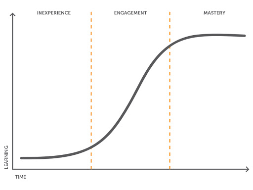

<!-- _class: title -->
<!-- _transition: coverflow 0.7s -->

###### Why

# Temporal

Durable execution for engineers tired of writing recovery runbooks.

###### Gaurav Agarwal

<!--
Open with energy.

Read the subtitle out loud - it's the hook.

This is a 25-minute talk: aim to land 3 ideas, not 30.

The 3 are: (1) state drifts across systems, (2) durable execution is application
code that survives process death, (3) you'd use it where you write runbooks today.

Ask for a show of hands: "who's been paged for a half-finished workflow?"
-->

---

<!-- _class: cols-photo -->

<div class="cols">
<div class="col-media">


</div>
<div class="col-body">

## Gaurav Agarwal

Software Engineer & Product Developer

Director of Engineering & Founder @ https://codermana.com

ex-Tarka Labs, ex-BrowserStack, ex-ThoughtWorks

</div>
</div>

<!--
30 seconds max.

Establish credibility, then move on.

If the room is mixed (engineers + managers), mention you've shipped Temporal to
production at companies with both Java and Go stacks - it lands trust faster.
-->

---

<!-- _class: cols-photo media-right center-body -->

<div class="cols">
<div class="col-media">


</div>
<div class="col-body">

*What we wanted*

</div>
</div>

---

<!-- _class: cols-photo center-body -->

<div class="cols">
<div class="col-media">


</div>
<div class="col-body">

*What we got*

</div>
</div>

---

## As an instructor

* I promise to make this class as interactive as possible
* I will use as many resources as available to keep you engaged
* I will ensure everyone's questions are addressed

---

## What I need from you

* Be vocal
  - Let me know if there are any audio/video issues ASAP
  - Feel free to interrupt me and ask questions
* Be punctual
* Give feedback
* Work on the exercises
* Be *on mute* unless you are speaking

---

<!-- _class: center middle intro-photo -->

## Class progression



---

<!-- _class: center middle -->

Here you are trying to *learn* something, while here your **brain** is doing you a favor by making sure the learning doesn't stick.

---

### Some tips

* Slow down: stop and think
  - Listen for the questions and answer
* Do the exercises
  - They are not add-ons; they are not optional
* There are no dumb questions
* Drink water. Lots of it.

---

### Some tips (continued)

* Take notes
  - Try repetitive, spaced-out learning
* Talk about it out loud
* Listen to your brain
* *Experiment*

---

<!-- _class: center middle content-time -->

<div class="content-time-rule" aria-label="Content is greater than time">
  <span class="content-time-item">
    
    <span>Content</span>
  </span>
  <span class="content-time-symbol">&gt;</span>
  <span class="content-time-item">
    
    <span>Time</span>
  </span>
</div>

---

<!-- _class: center middle -->

## Show of hands

*Yay's in chat*

<!--
Use these as quick chat prompts.

Ask for "yes" / "no" or a one-word answer; do not discuss every response.

- Have you ever been paged for a half-finished business process?
- Have you had to manually reconcile whether an external API call succeeded?
- Have you written retry logic that later needed a retry limit, timeout, or
  backoff policy?
- Have you debugged a stuck cron, queue consumer, or scheduled job after it was
  already too late?
- Have you used a workflow/orchestration tool before: Airflow, Step Functions,
  Camunda, Conductor, Argo, or something homegrown?
- If you already use Temporal, where: local experiments, one service, or
  production-critical workflows?
-->

---

# Agenda

1. The orchestration problem
2. Where today's tools break
3. What Temporal does differently
4. The mental model in one slide
5. Real-world use cases
6. When (not) to pick Temporal
7. Where to start

<!--
Don't dwell. ~20 seconds.

The agenda is signposting so the audience can locate themselves later.

Keep it short - orientation, not detail.
-->

---

<!-- _class: section -->
<!-- _transition: slide 0.5s -->

###### Setup

# The orchestration problem

What you actually shipped last quarter, and what broke at 2 AM.

<!--
Section divider.

Pause for 2-3 seconds.

The next 3 slides set up the pain the rest of the talk resolves.

Tone shift: slow down, get serious about real outages the audience has lived
through.
-->

---

# Every backend has these

* "Charge the card, ship the order, send the receipt."
* "Pull from S3, transform with Spark, write to Snowflake."
* "Wait for the human approval, then provision the tenant."
* "Retry the flaky API for an hour, then page the on-call."

These are **workflows**. They look easy until one step fails.

<!--
Read the bullets in voices.

The first sounds like an e-commerce backend, the second like a data team, the
third like an ops/devex flow.

The audience will recognize at least one - that's the point.

Land the final line with weight: "look easy until one step fails."
-->

---

# What goes wrong

* The third call timed out. Did it succeed?
* The Lambda was killed at minute 14 of 15.
* The Kafka consumer crashed *between* the database write and the publish.
* The cron didn't fire. Nobody noticed for two days.
* The retry loop never had a budget.

> Recovery is a **runbook**, not a button.

<!--
Pace yourself - each bullet is a real incident shape.

After the third one ("crashed between DB write and publish") pause; that's the
moment people nod because they remember a specific outage.

Closing line is the slogan to repeat: "runbook, not a button."
-->

---

<!-- _class: section -->
<!-- _transition: slide 0.5s -->

###### Today

# Where today's tools break

A quick tour of the four common stacks and the seams they leave open.

<!--
About 5 minutes for the four stacks combined.

Don't bash any tool - each solves a real problem.

The framing is "what each leaves to you."
-->

---

<!-- _class: code -->

## Cron + scripts

```
0 */4 * * * /opt/scripts/sync-orders.sh
```

- Scheduler decides *when*. **You** decide what to do when it fails.
- No state between runs. No retries. No timeouts.
- "Did the 04:00 run finish?" → grep logs.

> Fine for the first month. Not for the third year.

<!--
Quick.

Cron isn't a strawman - it's where many teams start.

The reason it breaks is incidental complexity that nobody owns: logs scattered,
lock files invented, monitoring bolted on.
-->

---

<!-- _class: code -->

## Airflow

```python
extract >> transform >> load
```

- Solves *scheduling*. Doesn't solve *failure*.
- Cross-task state in XCom + S3.
- Recovery is a UI button and tribal knowledge.

> Great for batch ETL on a fixed cadence. Painful for cross-system flows with retries and human steps.

<!--
For Airflow users in the room, validate that Airflow IS great for what it was
built for.

The pitch is: don't replace your DAGs - move the cross-system flows out of
Airflow into Temporal, keep the data DAGs in Airflow.
-->

---

<!-- _class: code -->

## AWS Step Functions

```json
{ "StartAt": "Validate", "States": { ... } }
```

- State machine in **JSON**. Try code review.
- Lambdas have 15-minute caps. Workflows often need hours.
- State across Lambda + Step Functions + S3 + DynamoDB.
- Vendor-coupled. Cost surprises at scale.

<!--
The JSON-state-machine point lands hardest with engineers.

Ask: "would you review a 4000-line YAML for an order workflow as readily as Java?"
The Lambda 15-min cap is the sneaky one - many teams hit it and don't realize it
for months.
-->

---

## Kafka by itself

* Excellent **transport**.
* Bad place to keep *the state of order #4711*.
* Consumers re-derive workflow state from scratch on every restart.
* Out-of-order events + retries + idempotency = bespoke per-team code.

> Kafka tells you *what happened*. Temporal tells you *where we are*.

<!--
Don't position as Kafka vs Temporal.

Position as Kafka + Temporal: Kafka is the bus between teams, Temporal is the
brain inside a team.

The quote at the bottom is the line they'll quote back at you - say it slowly.
-->

---

<!-- _class: cards -->

# What they share

| State | Drift | Cost |
| --- | --- | --- |
| Lives in scheduler DB, app DB, S3, Kafka, operator memory. | Every handoff is a chance for the systems to disagree. | Drift is what the 2 AM page is. |

<!--
The reframe.

The problem isn't any single tool - it's that workflow state is scattered across
N+1 places.

Make eye contact, lean into "drift is what the 2 AM page is." It's the bridge to
the Temporal section.
-->

---

<!-- _class: section -->
<!-- _transition: slide 0.5s -->

###### Durable Execution

# What Temporal does differently

Application code that survives process death.

<!--
Tone shift again - from problem to solution.

Energy back up.

The talk inflects here; if you're 11 minutes in, you're on schedule.
-->

---

## Durable execution

> **Durable Execution:** your code's progress is persisted automatically. Crashes, restarts, and deploys don't lose state - execution resumes exactly where it left off.

A **Workflow** is application code (Java, Go, Python, TS, .NET, PHP, Ruby).

It reads like a normal function - no special framework, just method calls.

<!--
THIS IS THE CENTRAL CONCEPT - this slide defines the term, the next one shows it.

Spend ~30 seconds here on the definition. The persistence is automatic; you don't
write checkpoint/restore code.

Then advance to the code.
-->

---

<!-- _class: code -->

## A Workflow, in code

```java
@WorkflowMethod
public String processOrder(String orderId) {
  String paymentId = activities.authorizePayment(orderId);
  String reservationId = activities.reserveInventory(orderId);
  activities.ship(orderId);
  return "OK";
}
```

If the Worker dies after `authorizePayment`, `reserveInventory` still runs - on **a different process, hours later**, from where it left off.

<!--
Spend ~60 seconds here.

Walk the code: this is normal Java. There's no special framework. The methods are
just method calls.

The MAGIC is the last line.

Then say: "the Workflow doesn't care which JVM is running it. The state lives in
the cluster, not on a host."
-->

---

<!-- _class: code -->

## Same idea in Go

```go
func ProcessOrder(ctx workflow.Context, orderID string) (string, error) {
  var paymentID, reservationID string
  err := workflow.ExecuteActivity(ctx, AuthorizePayment, orderID).Get(ctx, &paymentID)
  if err != nil { return "", err }
  err = workflow.ExecuteActivity(ctx, ReserveInventory, orderID).Get(ctx, &reservationID)
  if err != nil { return "", err }
  err = workflow.ExecuteActivity(ctx, Ship, orderID).Get(ctx, nil)
  if err != nil { return "", err }
  return "OK", nil
}
```

Same contract: Workflow code is deterministic; Activities own side effects.

<!--
Go is often the clearest SDK for engineers coming from backend services.

Point out the shape: ExecuteActivity records a command in history, and Get waits
for the durable result.

If a Worker dies after reserveInventory, replay rebuilds paymentID and
reservationID from history before scheduling ship.
-->

---

<!-- _class: code -->

## Same idea in Python

```python
@workflow.defn
class OrderWorkflow:
    @workflow.run
    async def process_order(self, order_id: str) -> str:
        opts = dict(start_to_close_timeout=timedelta(minutes=2))
        payment_id = await workflow.execute_activity(authorize_payment, order_id, **opts)
        reservation_id = await workflow.execute_activity(reserve_inventory, order_id, **opts)
        await workflow.execute_activity(ship, order_id, **opts)
        return "OK"
```

Async syntax, same durable execution model.

<!--
Use this to defuse "is this Java-only?" concerns.

Python is async-first, but the mental model is the same: durable Workflow
decisions, side effects in Activities, result replay from history.
-->

---

## The trick: event history

1) Every decision the Workflow makes is recorded.
2) When a Worker resumes, it replays history to reconstruct state.
3) Reaches the next undecided point.
4) Continues from there.

> You write code. The runtime writes the journal.

<!--
The 4 steps are the entire model.

If they only remember this one slide, the rest follows.

Use a whiteboard metaphor: "imagine someone took notes of every decision your
program made; you can replay those notes to recreate the program's state."
-->

---

# What Durable Execution gives you - for free

- **Retries** with backoff per Activity
- **Timeouts** with semantic names (start-to-close, schedule-to-close)
- **Heartbeats** for long Activities - crash recovery resumes from the last checkpoint
- **Long sleeps** that survive deploys (`Workflow.sleep(Duration.ofDays(30))`)
- **Versioning** so in-flight executions don't break when you ship new code
- **History** as the audit trail. The Web UI is your first debugging stop.

<!--
Quick fly-through - 90 seconds.

Don't go deep on any one.

The point is breadth: ALL of these are built-in.

Each bullet represents code your team currently writes and maintains.

The "Workflow.sleep(Duration.ofDays(30))" line gets a chuckle from people who have
written cron-replacement logic.
-->

---

<!-- _class: split -->

###### Mental Model

## Four primitives

**Workflow** - durable, deterministic function. State is history.

**Activity** - unrestricted side-effecting code with retries.

**Worker** - long-lived process polling task queues.

**Task Queue** - a string name. Routes work to a pool.

<!--
30 seconds.

This is the mental model summary.

Most important: Task Queue is JUST a string - it's not Kafka.

It's not a database.

It's a routing key.

This often confuses people coming from message-queue thinking.
-->

---

<!-- _class: section -->
<!-- _transition: slide 0.5s -->

###### Concretely

# What it looks like

Three examples that show the typical patterns.

<!--
Section divider.

The next 3 slides are the "show, don't tell" moment.

Each slide is a complete pattern in ~15 lines of Java.
-->

---

<!-- _class: code -->

## A Saga, end to end

```java
public String process(String orderId) {
  Saga saga = new Saga(new Saga.Options.Builder().build());
  try {
    String paymentId = activities.authorizePayment(orderId);
    saga.addCompensation(activities::cancelPayment, paymentId);
    String reservationId = activities.reserveInventory(orderId);
    saga.addCompensation(activities::restoreInventory, reservationId);
    activities.ship(orderId);
    return "COMPLETED";
  } catch (RuntimeException failure) {
    saga.compensate();
    return "COMPENSATED";
  }
}
```

<!--
Walk top to bottom.

Stop on `saga.addCompensation(...)` - explain that this is registered IMMEDIATELY
after the forward step succeeds.

If the Workflow dies between the forward step and the compensation registration,
the compensation is lost.

So you write them paired.

The catch handler runs in LIFO order.

Compensations also retry.
-->

---

<!-- _class: code -->

## A schedule that survives deploys

```java
Schedule.newBuilder()
    .setAction(ScheduleActionStartWorkflow.newBuilder()
        .setWorkflowType(OrdersWorkflow.class)
        .setOptions(WorkflowOptions.newBuilder().setTaskQueue("orders").build())
        .build())
    .setSpec(ScheduleSpec.newBuilder()
        .setIntervals(List.of(new ScheduleIntervalSpec(Duration.ofHours(1))))
        .setJitter(Duration.ofMinutes(5))
        .build())
    .build();
```

> Durable Temporal object, not a cron line. Survives the redeploy you forgot about.

<!--
The point is at the bottom.

Don't read the whole builder - point at `setIntervals(Duration.ofHours(1))` and
`setJitter(...)` and say: "this is what your cron line wished it was." For Airflow
users: this replaces the scheduler, not your DAG logic.
-->

---

<!-- _class: code -->

## A human step, no plumbing

```java
@WorkflowMethod
public String run(String orderId) {
  activities.requestApproval(orderId);
  Workflow.await(() -> approved);   // hours, days, weeks
  return activities.fulfil(orderId);
}

@SignalMethod
public void approve(String approver) { this.approved = true; }
```

> No polling. No queue. Sleeps on the server until the Signal arrives.

<!--
This is the killer slide for product teams.

The "wait for human approval" pattern is often a custom-built monstrosity.

Here it's three lines.

The Workflow doesn't poll.

The Worker doesn't keep a thread.

The state lives in the cluster; when the Signal arrives, a Worker (maybe a
different one) picks up the Workflow and the await unblocks.
-->

---

<!-- _class: section -->
<!-- _transition: slide 0.5s -->

###### Production

# Real-world use cases

Where Temporal earns its keep today.

<!--
Pivot to credibility/social proof.

The next two slides answer the implicit question: "who else is using this and what
for?"
-->

---

# Where it earns its keep

- **Payments & orders** - Saga, compensation, idempotency
- **User onboarding** - multi-system provisioning with human steps
- **AI agents** - long-lived agent loops, tool calls, retries
- **Data pipelines** - replace Glue/Step Functions glue while keeping Spark
- **Infrastructure provisioning** - Terraform-grade flows in code
- **Long-running monitors** - watch something for a year; survive deploys
- **Subscription lifecycles** - billing cycles measured in months

<!--
Pick the one that matches the audience.

If they're in fintech, dwell on payments.

If they're a platform team, dwell on infrastructure provisioning.

The AI agents bullet is newest and lands hardest in 2024+ rooms.
-->

---

# Who's running it

A sample of companies that publicly run Durable Execution in production:

- Snap (payments + ads)
- Stripe (Workflow Engine)
- Netflix (data platform)
- Box (collaboration features)
- HashiCorp (HCP Boundary)
- Coinbase (transaction flows)
- Yum! Brands (order orchestration)
- Datadog (internal automation)

<!--
Skim.

The point is breadth - this isn't a niche tool.

Stripe and Snap are the strongest names for fintech.

Netflix for data platforms.

Datadog for SRE-leaning teams.

If the audience asks for case studies later, point them at
https://temporal.io/case-studies.
-->

---

# Pick your poison

| Concern | Cron | Airflow | Step Fns | Kafka alone | Temporal |
| --- | :---: | :---: | :---: | :---: | :---: |
| Durable state | ✗ | partial | ✓ | ✗ | ✓ |
| Retries built-in | ✗ | ✓ | ✓ | ✗ | ✓ |
| Long human waits | ✗ | ✗ | partial | ✗ | ✓ |
| Code, not config | shell | Python | JSON | ✗ | ✓ |
| Multi-language SDK | ✗ | Python | n/a | ✓ | ✓ |
| Vendor neutral | ✓ | ✓ | ✗ | ✓ | ✓ |
| Years-long runs | ✗ | ✗ | ✗ | n/a | ✓ |

<!--
Don't read the table - point at one row and discuss.

The most useful row is "Long human waits" because it surprises people.

Cron and Airflow are not built for "wait for a human for 3 days." The "Vendor
neutral" row matters for Step Functions skeptics.
-->

---

# Where Temporal is *not* the answer

* **Pure data transformation.** Use Spark / dbt; wrap them only if you need orchestration.
* **Sub-millisecond serving.** Workflows have RPC overhead; not your hot path.
* **Single, never-failing, one-step jobs.** A cron line is fine.
* **Stateless event handlers** where Kafka + a function is the whole story.

> Use Temporal where you would have written a runbook.

<!--
Critical slide for credibility.

If you don't show the limits, the audience suspects you're selling.

The runbook line at the bottom is the test: "if the next person on call would need
a runbook to recover, it's a Workflow."
-->

---

<!-- _class: section -->
<!-- _transition: slide 0.5s -->

###### Operations

# Runbook vs playbook

Both are useful. Only one is a smell for missing durable execution.

<!--
This is a vocabulary reset before the exercise.

Many teams use "runbook" and "playbook" interchangeably.

For this talk, make the distinction operational: runbook is reactive recovery;
playbook is repeatable coordination.
-->

---

# Runbook vs playbook

| Aspect | Runbook | Playbook |
| --- | --- | --- |
| **Purpose** | Execute a specific operational task | Handle a broader operational scenario |
| **Scope** | Narrow and task-focused | Broad and scenario-focused |
| **Structure** | Step-by-step procedure | Workflows, decisions, branches, and runbooks |
| **Decision making** | Minimal; follow prescribed steps | Explicit decision points and branching actions |
| **Example** | "Restart a failed database service" | "Respond to a database outage incident" |
| **Temporal signal** | Repeated manual recovery steps | Repeatable cross-system coordination |

<!--
Do not make either one sound bad.

A good SRE team needs both.

The key point is that repeated runbook execution is evidence that the system has
pushed application state recovery onto humans.
-->

---

# Simple analogy

* **Runbook** = "How to change a tire."
* **Playbook** = "How to handle a roadside breakdown."

The playbook may include the tire-change runbook, calling roadside assistance,
moving passengers to safety, and deciding when to abandon the vehicle.

<!--
Use this as the memory hook.

The important distinction is containment: a playbook can contain runbooks, but it
also carries scenario judgment, branching, and coordination.
-->

---

# What Temporal changes

* A **runbook** often becomes a Workflow when it repairs half-finished state.
* A **playbook** often becomes a Workflow when it is repeatable, cross-system, and auditable.
* Keep the human decision; automate the waiting, retries, timers, and recovery.
* If the steps depend on durable state, Temporal should be in the conversation.

> The goal is not fewer operators. It is fewer manual state machines.

<!--
Use examples:
- Runbook: "payment charged but order not shipped" recovery.
- Playbook: "new enterprise customer onboarding" or "security exception
  approval" where the steps are known but involve humans and systems.
This sets up the discussion exercise: participants should classify their own
workflow as runbook-shaped, playbook-shaped, or not Temporal-shaped.
-->

---

<!-- _class: exercise -->

# Discuss

Take 5 minutes. Post your answer in chat.

1. Pick one workflow in your stack that needs a recovery runbook.
2. Name the failure mode: timeout, crash, duplicate, stuck wait, or manual fix.
3. Decide: Temporal-shaped, or better solved elsewhere?

<!--
Online ILT flow:
1. Set a 5-minute timer and ask everyone to type their answer privately first.
2. At 2 minutes, ask them to paste a short version in chat:
   "<workflow> / <failure mode> / <Temporal-shaped or not>".
3. If the platform supports breakouts and the group is >8 people, use 3-minute
   pairs before chat share-out. Otherwise keep it all in chat.
4. Pick two examples: one strong Temporal fit and one non-fit. Ask each person
   to unmute for 30 seconds only if they are comfortable.
5. Close by tying answers back to the runbook test: if the next on-call would
   need step-by-step recovery instructions, it may be a Workflow.
-->

---

<!-- _class: section -->
<!-- _transition: slide 0.5s -->

###### Adoption

# Where to start

The smallest defensible step.

<!--
We're 20 minutes in.

The last 5 minutes are about giving them an action.

The mistake here is recommending a big migration.

Don't.

Recommend ONE workflow.
-->

---

# A two-week plan

1) **Pick one workflow** that hurts in production.
2) **Map operators / Lambdas → Activities** mechanically.
3) **Run side by side** for a release cycle.
4) **Cut over** when the Temporal version has been clean for two weeks.
5) **Redesign** only after stable - now use Signals, Updates, Schedules.

> Don't migrate everything. Migrate where Temporal earns its keep.

<!--
Step 5 is the lesson.

The biggest mistake teams make is REDESIGNING during the migration.

You don't.

You move first, then improve.

Mechanical migration is faster, easier to verify, and lets you compare apples to
apples.
-->

---

<!-- _class: code -->

## Local dev in 5 minutes

```bash
brew install temporal
temporal server start-dev
```

Web UI: http://localhost:8233

Then pull this repo:

```bash
git clone <this-repo>
make setup-mac
make temporal       # in one terminal
make run-hello      # in another
```

<!--
End with a concrete action.

If the room is on laptops, ask them to run it.

The dev server is genuinely 5 minutes; the brag is fair.

For remote audiences, this is the screen they screenshot.
-->

---

<!-- _class: takeaway -->

# Takeaways

* One model: **Durable Execution** - functions with replay, retries, and timeouts built in.
* One habit: when you write a runbook, write a Workflow instead.
* One resource: docs.temporal.io plus the course repo from today.

<!--
The three things they should remember.

Read them slowly.

Each one maps to the agenda's central claim.

If they only remember the "runbook → Workflow" habit, the talk worked.
-->

---

<!-- _class: quote -->

> Your hardest distributed-transaction bug today is a feature Temporal already solved.

The cost is learning a new model. The reward is fewer runbooks.

<!--
Close strong.

Land on the quote.

Don't immediately segue to Q&A - let it sit.

Then: "Questions?"
-->

---

## Resources

- **Docs** — https://docs.temporal.io
- **Java SDK** — https://github.com/temporalio/sdk-java
- **Slides** — https://temporal-training.slides.algogrit.com/why-temporal/
- **Course repo** — https://github.com/CoderMana/temporal-training

<!--
Leave on screen during Q&A.

The slides URL gets photographed; make sure the QR code works if you've added one
for in-person events.
-->
